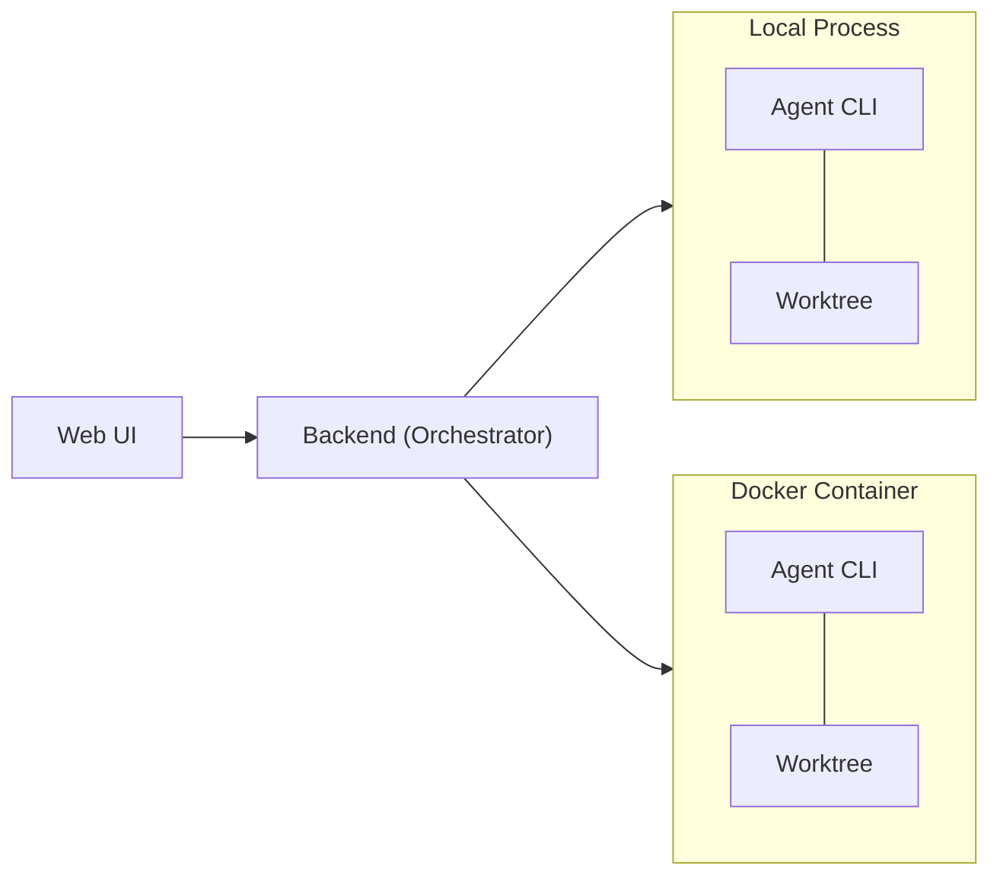

# Kandev

Manage and run tasks in parallel. Orchestrate agents. Review changes. Ship value.

[Workflows](docs/workflow-tips.md) | [Roadmap](docs/roadmap.md) | [Contributing](CONTRIBUTING.md) | [Architecture](docs/ARCHITECTURE.md)

<!-- TODO: add screenshot -->

## What

test


Organize work across kanban and pipeline views with opinionated workflows and execute multiple tasks in parallel. Assign agents from any provider, and review their output in an integrated workspace - file editor, file tree, terminal, browser preview, and git changes in one place. Terminal agent TUIs are great for running agents, but reviewing and iterating on changes there doesn't scale.

Run it locally or self-host it on your own infrastructure and access it from anywhere via [Tailscale](https://tailscale.com/) or any VPN.

Open source, multi-provider, no telemetry, not tied to any cloud.

## Vision

> **Humans stay in control.** Define tasks, build agentic workflows with gates, review every change, decide what ships.

- **Review-first** - Humans support production systems. We need to understand (yet) and trust the code that gets deployed.
- **Your workflow** - Every team is different, and not every developer uses AI the same way. Define workflows once, share them across the team, and give everyone a consistent process for working with agents - regardless of experience level.
- **Remote agents** - Running multiple agents on a large codebase can quickly saturate a local machine. The goal is a single control plane: offload execution to servers, orchestrate from anywhere, including your phone.

<details>
<summary><strong>Where this is heading</strong></summary>

While agents can already plan, implement, test, and deploy autonomously with the right workflows, we don't yet trust their output enough for production-grade software without human review. Crossing that trust threshold will fundamentally transform our industry.

</details>

## Features

- **Multi-agent support** - Claude Code, Codex, GitHub Copilot, Gemini CLI, Amp, Auggie, OpenCode
- **Parallel task execution** – start and manage multiple tasks from different sources simultaneously, boosting efficiency and productivity with AI agents.
- **Integrated workspace** - Built-in terminal, code editor with LSP, git changes panel, and chat in one IDE-like view
- **Kanban task management** - Drag-and-drop boards, columns, and workflow automation
- **Agentic workflows** - Multi-step pipelines that chain agents through automated task routing. See [docs/workflows.md](docs/workflow-tips.md)
- **CLI passthrough** - Drop into raw agent CLI mode for direct terminal interaction with any supported agent, leverage the full power of their TUIs
- **Workspace isolation** - Git worktrees prevent concurrent agents from conflicting
- **Flexible runtimes** - Run agents as local processes or in isolated Docker containers
- **Session management** - Resume and review agent conversations
- **Stats** - Track your productivity with stats on the completed tasks, agent turns, etc

## Supported Agents

| Agent | Default Model | Other Models | Protocol |
|:-------:|:--------------:|--------------|:----------:|
| **Claude Code** | Sonnet 4.5 | Opus 4.6, Opus 4.5, Haiku 4.5 | stream-json |
| **Codex** | GPT-5.2 Codex | GPT-5.1 Codex Max, GPT-5.1 Codex Mini, GPT-5.2 | Codex |
| **GitHub Copilot** | GPT-4.1 | GPT-5.2, Claude Sonnet 4.5, Gemini 3 Pro, +10 more | Copilot SDK |
| **Gemini CLI** | Gemini 3 Flash | Gemini 3 Pro | ACP |
| **Amp** | Smart Mode | Deep Mode | stream-json |
| **Auggie** | Sonnet 4.5 | Opus 4.5, GPT-5.1, GPT-5, Haiku 4.5 (dynamic) | ACP |
| **OpenCode** | GPT-5 Nano | Claude Sonnet 4, Opus 4, etc (dynamic) | REST/SSE |

> **CLI Passthrough mode** - we should be able to support any agent that has a CLI interface, even if they don't have an official API or SDK. The agent runs in a terminal session and we pass input/output through a websocket connection. If your agent isn't supported yet, open an issue or submit a PR with the integration. See [Adding a New Agent CLI](docs/add-agent-cli.md) for a step-by-step guide.

## Quick Start

> **Beta** - Under active development. Expect rough edges and breaking changes. Contributions welcome! See [CONTRIBUTING.md](CONTRIBUTING.md) for details.

### NPX (recommended)

```bash
npx kandev
```

This downloads pre-built backend + frontend bundles and starts them locally. The worktrees and sqlite db will be created in `~/.kandev` by default. Should work on macOS, Linux, and Windows (WSL or native).

### From Source

```bash
# Clone the repository
git clone git@github.com:kdlbs/kandev.git
cd kandev

# Start in production mode
make start
```

**Prerequisites:** Go 1.26+, Node.js 18+, pnpm, Docker (optional - needed for container runtimes)

## High level architecture



We also want to add support for these remote runtimes:
- Remote SSH - run agents on remote servers over SSH, using docker or local processes with workspace isolation
- K8s operator - run agents in a Kubernetes cluster, with auto-scaling and resource management.

<details>
<summary><strong>Development</strong></summary>

### Project Structure

```
apps/
├── backend/    # Go backend (orchestrator, lifecycle, agentctl, WS gateway)
├── web/        # Next.js frontend (SSR, Zustand, real-time subscriptions)
├── cli/        # CLI tool (npx kandev launcher)
└── packages/   # Shared UI components & types
```

### Prerequisites

- Go 1.21+
- Node.js 18+
- pnpm
- Docker (optional)

### Running Dev Servers

```bash
# Start everything (backend + frontend with auto ports)
make dev

# Or run separately
make dev-backend    # Backend on :8080
make dev-web        # Frontend on :3000
```

### Testing & Linting

```bash
make test           # Run all tests (backend + web)
make lint           # Run all linters
make typecheck      # TypeScript type checking
make fmt            # Format all code
```

### Pre-commit Hooks

```bash
# Install pre-commit (https://pre-commit.com/#install)
pipx install pre-commit

# Install git hooks
pre-commit install
```

</details>

## Comparison to Other Tools

There are a few similar tools in this space, and new ones appearing everyday. Here's what sets this one apart:

- **Server-first architecture** - Not a desktop app. Runs as a server you can access from any device, including your phone. Start a task away from your computer and check in on it later.
- **Remote runtimes** - Run agents on remote servers and Docker hosts, not just your local machine.
- **Multi-provider** - Use Claude Code, Codex, Copilot, Gemini, Amp, Auggie, and OpenCode side by side. Not locked to one vendor.
- **CLI passthrough and chat** - Interact with agents through structured chat messages or drop into raw CLI mode for full agent TUI capabilities.
- **Open source and self-hostable** - No vendor lock-in, no telemetry, runs on your infrastructure.

## Contributing

Contributions are welcome! Please read [CONTRIBUTING.md](CONTRIBUTING.md) before opening a PR.

See the [issue tracker](https://github.com/kdlbs/kandev/issues) for open tasks.

## Acknowledgments

Built with these excellent open-source projects:

[Monaco Editor](https://microsoft.github.io/monaco-editor/) · [Tiptap](https://tiptap.dev/) · [xterm.js](https://xtermjs.org/) · [dockview](https://dockview.dev/) · [CodeMirror](https://codemirror.net/) · [dnd-kit](https://dndkit.com/) · [Mermaid](https://mermaid.js.org/) · [Recharts](https://recharts.org/) · [TanStack Table](https://tanstack.com/table) · [Zustand](https://zustand.docs.pmnd.rs/) · [Shadcn/UI](https://ui.shadcn.com/) · [Radix UI](https://www.radix-ui.com/) · [Tailwind CSS](https://tailwindcss.com/)

## License

[AGPL-3.0](LICENSE)
