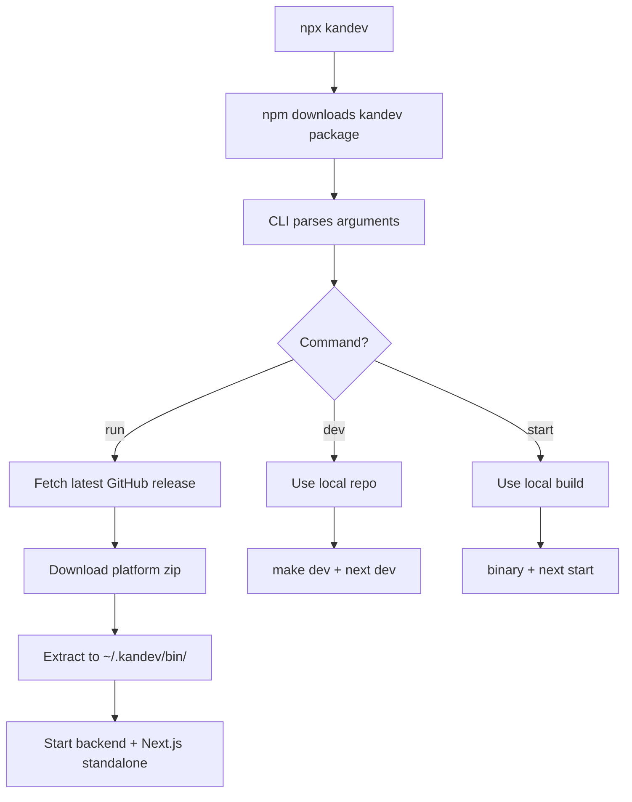

# Kandev Launcher (npx)

## Architecture



## Overview

This package powers `npx kandev` by downloading prebuilt release bundles from GitHub Releases and running them locally. It:

- Detects OS/arch and fetches the matching bundle ZIP.
- Verifies the SHA256 checksum when available.
- Extracts the bundle into `~/.kandev/bin/<version>/<platform>/`.
- Starts the backend binary and waits for the `/health` endpoint.
- Starts the Next.js standalone server with runtime `KANDEV_API_BASE_URL`.
- Uses the latest GitHub Release by default, so runtime bundles update automatically.

It also supports local dev and production runs from a repo checkout.

## Commands

| Command                  | Description                                              |
| ------------------------ | -------------------------------------------------------- |
| `kandev` or `kandev run` | Download and run release bundles (default)               |
| `kandev dev`             | Run local repo with hot-reload (requires repo checkout)  |
| `kandev start`           | Run local production build (requires `make build` first) |

## Updates

On `run`, the launcher checks npm for the latest `kandev` CLI version and prompts:

```
Update available: <current> -> <latest>. Update now? [y/N]
```

If you accept, it re-runs `npx kandev@latest` with the same arguments.
This check is skipped in `dev` and `start` modes.

Note: the runtime bundles are pulled from the latest GitHub Release by default, even if the CLI version is unchanged. So:

- **New runtime release without CLI publish**: users get new runtime automatically, but no update prompt.
- **New CLI publish**: users get an update prompt and then re-run with the new CLI.

You can disable the prompt with:

```bash
KANDEV_NO_UPDATE_PROMPT=1 npx kandev
```

## Usage

```bash
# Run the latest release bundle
npx kandev

# Run a specific release tag
npx kandev run --version v0.1.0

# Override ports
npx kandev --backend-port 18080 --web-port 13000

# Local dev with hot-reload (from repo)
npx kandev dev

# Local production build (from repo, after `make build`)
npx kandev start

# Local test the built CLI (from repo root)
pnpm -C apps/cli build
pnpm -C apps/cli start
```

## CLI Options

| Option                  | Description                              |
| ----------------------- | ---------------------------------------- |
| `run`                   | Use release bundles (default)            |
| `dev`                   | Use local repo with hot-reload           |
| `start`                 | Use local production build               |
| `--version <tag>`       | Release tag to install (default: latest) |
| `--backend-port <port>` | Override backend port                    |
| `--web-port <port>`     | Override web port                        |
| `--help`, `-h`          | Show help                                |

## Local Development

```bash
# Run CLI in dev mode
pnpm -C apps/cli dev

# Run with arguments
pnpm -C apps/cli dev -- start
pnpm -C apps/cli dev -- --backend-port 9000
```

## Build / Publish

```bash
pnpm -C apps/cli build
npm publish --access public
```

The published package name is `kandev`, with a bin entry `kandev`.

## Release

```bash
scripts/release/publish-launcher.sh 0.1.0
```

## Environment Overrides

| Variable                    | Description                                    |
| --------------------------- | ---------------------------------------------- |
| `KANDEV_GITHUB_OWNER`       | Override GitHub repo owner (default: `kandev`) |
| `KANDEV_GITHUB_REPO`        | Override GitHub repo name (default: `kandev`)  |
| `KANDEV_GITHUB_TOKEN`       | Optional token for GitHub API rate limits      |
| `KANDEV_NO_UPDATE_PROMPT=1` | Disable the CLI update prompt                  |
| `KANDEV_SKIP_UPDATE=1`      | Internal guard to avoid update loops           |
| `KANDEV_HEALTH_TIMEOUT_MS`  | Override health check timeout in milliseconds  |

## Supported Platforms

| Platform              | Asset Name                                  |
| --------------------- | ------------------------------------------- |
| macOS (Apple Silicon) | `kandev-macos-arm64.zip`                    |
| macOS (Intel)         | `kandev-macos-x64.zip`                      |
| Linux (x64)           | `kandev-linux-x64.zip`                      |
| Linux (ARM64)         | `kandev-linux-arm64.zip`                    |
| Windows (x64)         | `kandev-windows-x64.zip`                    |
| Windows (ARM64)       | Falls back to `windows-x64` (x64 emulation) |
