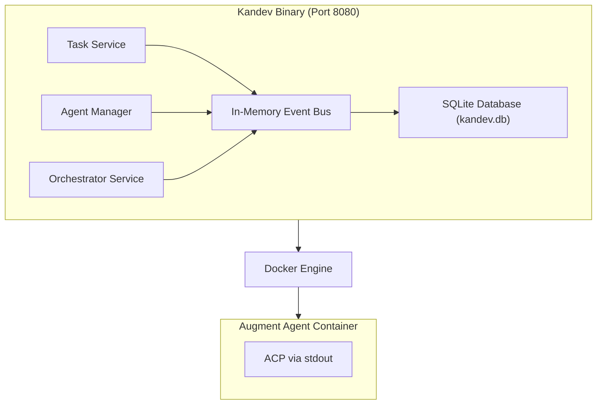
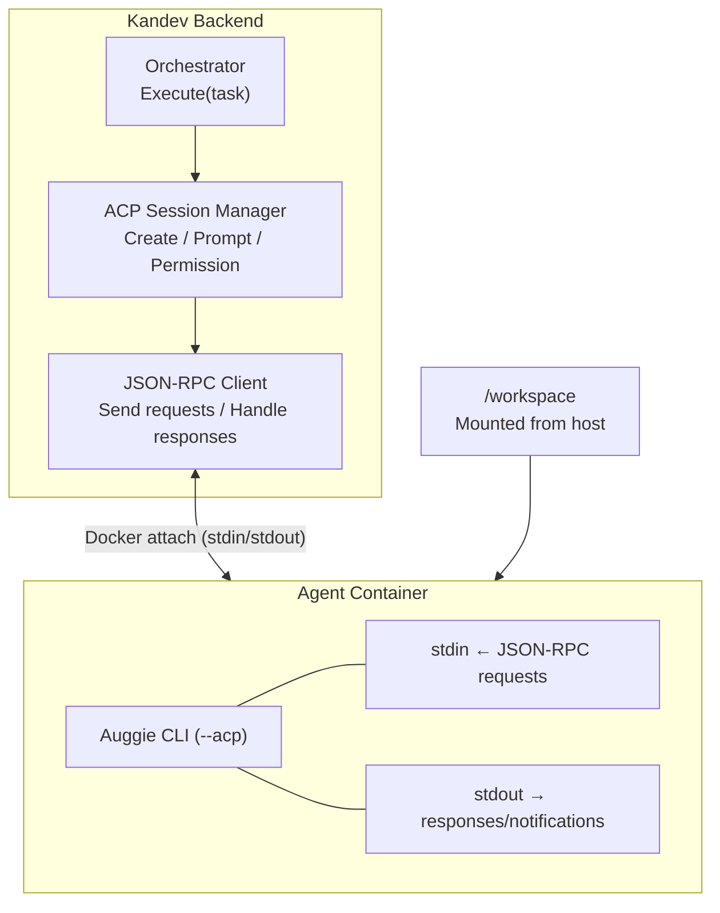
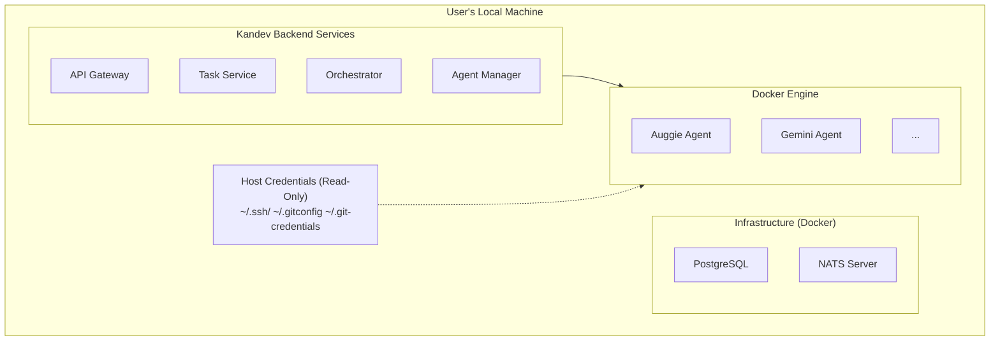

# Kandev System Architecture

> **Note:** This document describes both the current implementation and the planned architecture.
> Sections marked with ✅ are implemented, while sections marked with 📋 are planned for future development.

## Current Implementation Status

The current implementation uses a **unified binary architecture** instead of separate microservices:

- ✅ **Single Go binary** (`cmd/kandev/main.go`) running all services
- ✅ **SQLite database** for persistence (instead of PostgreSQL)
- ✅ **In-memory event bus** (instead of NATS)
- ✅ **Docker-based agent execution** with ACP streaming
- ✅ **Native ACP (Agent Communication Protocol)** - JSON-RPC 2.0 over stdin/stdout
- ✅ **Permission request handling** - Auto-approval of workspace indexing and tool permissions
- ✅ **Session resumption** for multi-turn agent conversations
- ✅ WebSocket-first API for all operations (replacing REST)

---

## Overview

Kandev uses an event-driven architecture with **Agent Communication Protocol (ACP)** for real-time streaming between AI agents and the backend. The system is designed for deployment on client machines (local workstations) with future cloud scalability.

## Current Architecture (Unified Binary)



---


### 3. Orchestrator Service
**Port:** 8082
**Purpose:** Automated task orchestration, agent coordination, and real-time ACP streaming

**Responsibilities:**
- Subscribe to task state change events
- Determine when to launch AI agents
- Manage task queue with priority
- Coordinate with Agent Manager for container launches
- **Aggregate ACP messages from NATS event bus**
- **Provide WebSocket endpoints for real-time ACP streaming to frontend**
- **Expose comprehensive REST API for task execution control**
- Implement retry logic for failed tasks
- Monitor agent execution

**Dependencies:**
- NATS (event subscription + ACP message aggregation)
- Agent Manager (gRPC calls)
- PostgreSQL (read task details, store ACP messages)

**Events Subscribed:**
- `task.state_changed`
- `agent.completed`
- `agent.failed`
- **`acp.message.*` - All ACP messages from agents**

**WebSocket Actions:**
- `orchestrator.subscribe` - Subscribe to real-time ACP streaming for a task
- `orchestrator.unsubscribe` - Unsubscribe from ACP streaming
- `orchestrator.start` - Start agent execution for a task
- `orchestrator.stop` - Stop agent execution for a task
- `orchestrator.status` - Get execution status for a task

**Orchestration Logic:**
```
When task.state_changed to "TODO" with agent_type set:
  1. Add task to priority queue
  2. Check available resources
  3. Request Agent Manager to launch container
  4. Update task state to "IN_PROGRESS"
  5. Subscribe to ACP messages for this task
  6. Stream ACP messages to connected WebSocket clients

When acp.message received:
  1. Store message in database
  2. Broadcast to WebSocket clients subscribed to this task
  3. Update task progress/status

When agent.completed:
  1. Update task state to "COMPLETED"
  2. Record completion time
  3. Send final ACP result message
  4. Clean up resources

When agent.failed:
  1. Check retry count
  2. If retries available: re-queue task
  3. Else: Update task state to "FAILED"
  4. Send ACP error message
```

---

### 4. Agent Manager Service
**Port:** 8083
**Purpose:** Docker container lifecycle management with ACP streaming and credential mounting

**Responsibilities:**
- Launch Docker containers for AI agents
- **Mount host credentials (SSH keys, Git config) into containers**
- **Capture and parse ACP messages from container stdout**
- **Publish ACP messages to NATS event bus**
- Monitor container health and status
- Stream and store container logs
- Manage agent type registry
- Resource allocation and limits
- Container cleanup

**Dependencies:**
- Docker Engine (container operations)
- PostgreSQL (agent_instances, agent_logs, agent_types tables)
- NATS (event publishing + ACP message publishing)
- **Host filesystem (for credential mounting)**

**Events Published:**
- `agent.started`
- `agent.running`
- `agent.completed`
- `agent.failed`
- `agent.stopped`
- **`acp.message.{task_id}` - Real-time ACP messages from agents**

**Container Launch Flow with ACP:**
```
1. Receive launch request (task_id, agent_type)
2. Lookup agent_type configuration
3. Create agent_instance record (status: PENDING)
4. Pull Docker image if needed
5. **Prepare host credential mounts (SSH, Git config)**
6. **Checkout repository on host (if repository_url provided)**
7. Prepare volume mounts (workspace, credentials)
8. Create container with resource limits and mounts
9. Start container
10. Update agent_instance (status: RUNNING, container_id)
11. **Attach to container stdout for ACP message capture**
12. **Parse ACP messages from stdout**
13. **Publish ACP messages to NATS (acp.message.{task_id})**
14. Store ACP messages in database
15. Publish agent.started event
16. Monitor container until completion
17. Collect exit code and final logs
18. Update agent_instance (status: COMPLETED/FAILED)
19. Publish completion event
20. Cleanup container and workspace
```

**Credential Mounting Strategy:**
```
Mounts (Read-Only):
- ~/.ssh → /root/.ssh (SSH keys)
- ~/.gitconfig → /root/.gitconfig (Git configuration)
- ~/.git-credentials → /root/.git-credentials (HTTPS credentials)

Environment Variables:
- GITHUB_TOKEN (from host environment)
- GITLAB_TOKEN (from host environment)
- GEMINI_API_KEY (from host environment)

Workspace Mount (Read-Write):
- /tmp/kandev/workspaces/{task_id} → /workspace
```

---

## Data Flow Examples

### Example 1: User Creates a Task with AI Agent (with Real-time ACP Streaming)

```
1. User → API Gateway: WebSocket message: task.create
   {
     "action": "task.create",
     "payload": {
       "boardId": "{id}",
       "title": "Fix login bug",
       "description": "Users can't login with email",
       "agent_type": "auggie-cli",
       "repository_url": "https://github.com/user/repo",
       "branch": "main"
     }
   }

2. API Gateway → Task Service: Forward request

3. Task Service:
   - Validate request
   - Create task in database (state: TODO)
   - Publish event to NATS: task.created

4. Orchestrator (subscribed to task.created):
   - Receive event
   - Check if agent_type is set
   - Add task to priority queue
   - Process queue

5. Orchestrator → Agent Manager (gRPC):
   LaunchAgent(task_id, agent_type="auggie-cli")

6. Agent Manager:
   - Create agent_instance record
   - Pull docker image "augmentcode/auggie-cli:latest"
   - **Mount host credentials (SSH keys, Git config)**
   - **Clone repository to /tmp/kandev/workspaces/{task_id}**
   - Create container with volume mounts:
     * /tmp/kandev/workspaces/{task_id} → /workspace
     * ~/.ssh → /root/.ssh (read-only)
     * ~/.gitconfig → /root/.gitconfig (read-only)
   - Start container
   - **Attach to container stdout for ACP capture**
   - Publish agent.started event

7. Orchestrator (subscribed to agent.started):
   - Update task state to IN_PROGRESS
   - **Subscribe to acp.message.{task_id}**

8. Frontend → API Gateway: WebSocket connection
   WS /api/v1/orchestrator/tasks/{task_id}/stream

9. API Gateway → Orchestrator: Proxy WebSocket connection

10. Agent Container → stdout:
    **Writes ACP messages in JSON format:**
    {"type":"progress","timestamp":"...","agent_id":"...","task_id":"...","data":{"progress":10,"message":"Analyzing codebase..."}}

11. Agent Manager:
    - **Captures ACP message from container stdout**
    - **Parses JSON ACP message**
    - **Publishes to NATS: acp.message.{task_id}**
    - Stores ACP message in database

12. Orchestrator (subscribed to acp.message.{task_id}):
    - **Receives ACP message from NATS**
    - **Broadcasts to all WebSocket clients for this task**

13. Frontend (via WebSocket):
    - **Receives real-time ACP message**
    - **Updates UI with progress: "Analyzing codebase... 10%"**

14. [Steps 10-13 repeat for each ACP message from agent]

15. Agent Container completes:
    - Writes final ACP result message
    - Exits with code 0

16. Agent Manager:
    - Captures final ACP message
    - Publishes to NATS
    - Collects exit code
    - Publishes agent.completed event

17. Orchestrator (subscribed to agent.completed):
    - Update task state to COMPLETED
    - Record completion time
    - **Send final ACP result to WebSocket clients**
    - Close ACP subscription

18. Frontend:
    - **Receives completion notification**
    - **Displays final results**
    - Closes WebSocket connection
```

### Example 2: Manual Task State Change

```
1. User → API Gateway: WebSocket message: task.state
   {
     "action": "task.state",
     "payload": {
       "taskId": "{id}",
       "state": "IN_PROGRESS"
     }
   }

2. API Gateway → Task Service: Forward request

3. Task Service:
   - Validate state transition
   - Update task state
   - Create task_event record
   - Publish task.state_changed event

4. Orchestrator (subscribed to task.state_changed):
   - Check if agent should be launched
   - If no agent_type set: ignore
   - If agent_type set: add to queue
```

---

## Agent Communication Protocol (ACP)

### Protocol Overview

Kandev uses the **Agent Communication Protocol (ACP)** - an open protocol for communication between AI agents and client applications. The implementation follows the official ACP specification using **JSON-RPC 2.0 over stdin/stdout**.

**Reference:** https://agentclientprotocol.com

**Key Characteristics:**
- **JSON-RPC 2.0**: Standard request/response/notification format
- **Bidirectional**: Client sends requests, agent sends responses/notifications/requests
- **Session-based**: All communication happens within a session context
- **Permission model**: Agent requests permissions before tool execution

### Current Implementation ✅

The backend implements full ACP support with:

1. **Session Management** (`apps/backend/internal/agent/acp/session.go`)
   - Create sessions with `session/new`
   - Send prompts with `session/prompt`
   - Resume sessions with stored session IDs

2. **JSON-RPC Client** (`apps/backend/pkg/acp/jsonrpc/client.go`)
   - Handles responses to client requests
   - Handles notifications from agent (`session/update`)
   - Handles requests from agent (`session/request_permission`)

3. **Permission Handling**
   - Auto-approves workspace indexing permissions
   - Auto-approves tool execution permissions (selects first "allow" option)

### ACP Message Types

**1. Client → Agent Requests**

```json
// session/new - Create a new session
{
  "jsonrpc": "2.0",
  "id": 1,
  "method": "session/new",
  "params": {
    "cwd": "/workspace",
    "mcpServers": []
  }
}

// session/prompt - Send a prompt to the agent
{
  "jsonrpc": "2.0",
  "id": 2,
  "method": "session/prompt",
  "params": {
    "sessionId": "uuid",
    "content": [{"type": "text", "text": "Analyze this code"}]
  }
}
```

**2. Agent → Client Responses**

```json
{
  "jsonrpc": "2.0",
  "id": 1,
  "result": {
    "sessionId": "uuid",
    "status": "ok"
  }
}
```

**3. Agent → Client Notifications**

```json
// session/update - Progress updates
{
  "jsonrpc": "2.0",
  "method": "session/update",
  "params": {
    "sessionId": "uuid",
    "content": [{"type": "text", "text": "Analyzing..."}],
    "stopReason": null
  }
}

// session/update - Completion
{
  "jsonrpc": "2.0",
  "method": "session/update",
  "params": {
    "sessionId": "uuid",
    "content": [{"type": "text", "text": "Done!"}],
    "stopReason": "end_turn"
  }
}
```

**4. Agent → Client Requests (Permissions)**

```json
// session/request_permission - Agent requests permission
{
  "jsonrpc": "2.0",
  "id": 5,
  "method": "session/request_permission",
  "params": {
    "sessionId": "uuid",
    "toolCall": {
      "toolCallId": "workspace-indexing-permission",
      "title": "Workspace Indexing Permission"
    },
    "options": [
      {"optionId": "enable", "name": "Enable indexing", "kind": "allow_always"},
      {"optionId": "disable", "name": "Disable indexing", "kind": "reject_always"}
    ]
  }
}

// Client responds with selected option
{
  "jsonrpc": "2.0",
  "id": 5,
  "result": {
    "outcome": {
      "outcome": "selected",
      "optionId": "enable"
    }
  }
}
```

### ACP Flow Through System (Current Implementation)



### Initial Agent Types

**1. Auggie CLI Agent**
- **Image**: `augmentcode/auggie-cli:latest`
- **Capabilities**: Code analysis, generation, debugging, refactoring
- **ACP Support**: Native
- **Resources**: 2 CPU, 2GB RAM

**2. Gemini Agent**
- **Image**: `kandev/gemini-agent:latest`
- **Capabilities**: Code review, documentation, testing
- **ACP Support**: Wrapper implementation
- **Resources**: 1.5 CPU, 1.5GB RAM

---

## Database Schema Summary

**Tables:**
- `users` - User accounts
- `boards` - Kanban boards
- `tasks` - Tasks on boards
- `task_events` - Audit log of task changes
- `agent_types` - Registry of available agent types
- `agent_instances` - Running/completed agent containers
- `agent_logs` - Logs from agent execution

**Key Relationships:**
- Board → Tasks (1:N)
- Task → Agent Instances (1:N)
- Agent Instance → Agent Logs (1:N)
- User → Boards (1:N)
- User → Tasks (created_by)

---

## Technology Stack

**Backend Services:**
- Language: Go 1.21+
- Web Framework: Gin
- Database: PostgreSQL 15+
- Event Bus: NATS
- Container Runtime: Docker

**Key Libraries:**
- `github.com/docker/docker` - Docker SDK
- `github.com/gin-gonic/gin` - HTTP framework
- **`github.com/gorilla/websocket` - WebSocket support**
- `github.com/jackc/pgx/v5` - PostgreSQL driver
- `github.com/nats-io/nats.go` - NATS client
- `github.com/golang-jwt/jwt/v5` - JWT auth
- `go.uber.org/zap` - Structured logging
- `google.golang.org/grpc` - gRPC communication

---

## Deployment Architecture

### Primary Target: Client Machines (Local Workstations)

The system is designed for deployment on **client machines** (developer workstations, local servers) with direct access to user credentials.

**Architecture:**



**Deployment Methods:**

1. **Docker Compose** (Development)
   ```bash
   docker compose up -d
   ```

2. **Native Binaries** (Production)
   ```bash
   systemctl start kandev-gateway
   systemctl start kandev-task-service
   systemctl start kandev-orchestrator
   systemctl start kandev-agent-manager
   ```

**System Requirements:**
- OS: Linux (Ubuntu 20.04+) or macOS 12+
- CPU: 4+ cores (8+ recommended)
- RAM: 8GB minimum (16GB recommended)
- Disk: 50GB free space
- Docker: 20.10+

### Future Deployment Options (Roadmap)

**Cloud Deployment (Phase 7+):**
```
- Deploy to AWS/GCP/Azure
- Managed PostgreSQL and NATS
- Cloud secret managers for credentials
- Horizontal scaling with load balancers
```

**Kubernetes (Phase 8+):**
```
- Helm charts for deployment
- StatefulSets for databases
- Deployments for services
- Horizontal Pod Autoscaling
- Ingress for external access
```

**Multi-User SaaS (Phase 9+):**
```
- Tenant isolation
- Centralized credential management
- Usage-based billing
```

