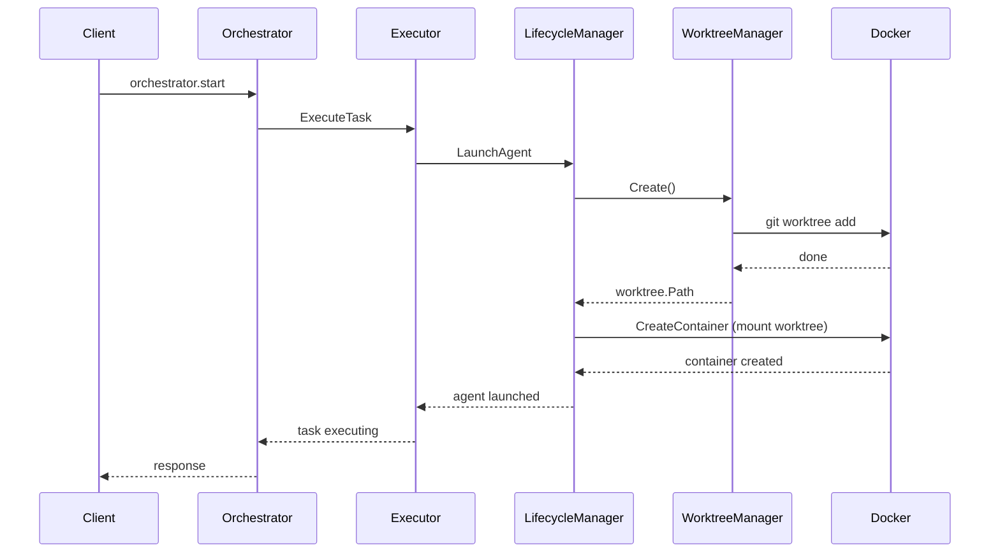

# Git Worktree Implementation Plan

> **Status**: Planning Phase
> **Date**: 2026-01-12
> **Author**: Generated Implementation Plan

## Executive Summary

This document outlines the implementation plan for Git worktrees in Kandev to enable concurrent agent execution on the same repository. Currently, a single repository workspace is mounted into agent containers at `/workspace`, which prevents multiple agents from working simultaneously on the same codebase without file conflicts.

## Current Architecture

### Existing Flow
```
Repository (local_path: /home/user/projects/myapp)
    │
    ▼
Task Creation (repository_url = /home/user/projects/myapp)
    │
    ▼
Orchestrator → Executor → LaunchAgentRequest (RepositoryURL = local_path)
    │
    ▼
Lifecycle Manager → buildContainerConfig()
    │
    ▼
Docker Container with mount:
    /home/user/projects/myapp → /workspace (read-write)
```

### Problem Statement
- Multiple agents mounting the same directory causes file conflicts
- Agents may overwrite each other's changes
- No isolation between concurrent agent file modifications
- Merge conflicts are deferred to agent completion

---

## Proposed Architecture

### Worktree-Based Isolation
```
Repository (local_path: /home/user/projects/myapp)  [MAIN WORKTREE]
    │
    ├── .git/worktrees/
    │       ├── task-abc123/  (worktree metadata, points to ~/.kandev/worktrees/)
    │       └── task-def456/  (worktree metadata)
    │
    ▼
~/.kandev/worktrees/             (persistent storage, survives reboots)
    ├── task-abc123/             (worktree checkout, persists for task lifetime)
    │       └── <repo files on branch: kandev/task-abc123>
    │
    └── task-def456/             (worktree checkout)
            └── <repo files on branch: kandev/task-def456>
```

Each agent container mounts its dedicated worktree instead of the main repository.

---

## 1. Worktree Storage Strategy

### Directory Structure
```
~/.kandev/
├── sessions/             # Augment session data
├── config/               # Configuration files
│
└── worktrees/            # Git worktree checkouts
    └── {task_id}/        # One worktree per task (task ID is globally unique)
        └── <repo files>
```

**Note:** Worktrees are keyed by task ID only (not repository ID) because:
- Task IDs are globally unique UUIDs
- Simplifies lookup: given a task, find its worktree directly
- Repository association is tracked in the database

### Design Decisions

| Decision | Choice | Rationale |
|----------|--------|-----------|
| Base path | `~/.kandev/worktrees` | Persists across reboots, user-accessible for review |
| Grouping | By task ID only | Task IDs are unique, simplifies lookup |
| Naming | Task ID | Direct 1:1 mapping between task and worktree |
| Permissions | 0755 | Agent containers run as root inside |
| Lifetime | Task lifetime | Worktree exists as long as task exists |

### Environment Variable Configuration
```bash
# New configuration options (config.yaml or env vars)
KANDEV_WORKTREE_BASE_PATH=~/.kandev/worktrees  # Expands to $HOME/.kandev/worktrees
KANDEV_WORKTREE_ENABLED=true
# Note: No cleanup-on-complete or max-age settings - cleanup tied to task deletion
```

---

## 2. Worktree Lifecycle Management

### Lifecycle Diagram

```mermaid
flowchart TD
    subgraph Lifecycle["WORKTREE LIFECYCLE (Tied to Task Lifetime)"]

        TaskCreated["Task Created"] --> AgentLaunch

        subgraph AgentLaunch["First Agent Launch"]
            Check{"Worktree exists?"}
            Check -->|No| Create["Create new worktree & branch"]
            Check -->|Yes| Reuse["Reuse existing worktree"]
            Create --> Mount["Mount into container"]
            Reuse --> Mount
            Mount --> Running["Agent Running"]
            Running --> Completes["Agent Completes"]
        end

        Completes --> Persists["Worktree PERSISTS<br/>(changes preserved)"]
        Completes --> Followup["User sends follow-up"]
        Followup -->|Relaunch| Mount

        Persists --> TaskClosed

        subgraph TaskClosed["Task Closed/Deleted"]
            Options["User chooses:"]
            Merge["Merge → merge branch to base, cleanup"]
            Discard["Discard → cleanup without merging"]
            Keep["Keep Branch → cleanup worktree, keep branch"]
            Delete["Task deleted → cleanup worktree and branch"]
        end
    end
```



### 2.1 Creation Timing

**Create worktree on FIRST agent launch for a task (if it doesn't exist)**

**Flow:**
1. Agent launch requested for task
2. Check database: does worktree record exist for this task?
3. If YES and path exists on disk → reuse existing worktree
4. If YES but path missing → recreate worktree (recovery)
5. If NO → create new worktree, store in database
6. Mount worktree into container

**Reasons:**
1. Worktree creation requires Git operations that should run on the host
2. Failures should prevent container creation rather than fail inside container
3. Container mounts must be configured before creation
4. Worktree persists for subsequent agent runs on the same task

### 2.2 Task Resumption (Session Resumption)

When an agent is relaunched for a task (e.g., follow-up prompt):

```go
func (m *Manager) Launch(ctx context.Context, req *LaunchRequest) (*AgentInstance, error) {
    var workspacePath string

    if req.UseWorktree && req.RepositoryPath != "" {
        // Check if worktree already exists for this task
        existingWT, exists := m.worktreeMgr.GetByTaskID(req.TaskID)

        if exists && m.worktreeMgr.IsValid(existingWT.Path) {
            // REUSE existing worktree - this is the session resumption case
            m.logger.Info("reusing existing worktree for task",
                zap.String("task_id", req.TaskID),
                zap.String("worktree_path", existingWT.Path),
                zap.String("branch", existingWT.Branch))
            workspacePath = existingWT.Path
        } else if exists && !m.worktreeMgr.IsValid(existingWT.Path) {
            // Worktree record exists but directory is missing/corrupted - recreate
            m.logger.Warn("worktree directory missing, recreating",
                zap.String("task_id", req.TaskID))
            wt, err := m.worktreeMgr.Recreate(ctx, req.TaskID)
            if err != nil {
                return nil, fmt.Errorf("failed to recreate worktree: %w", err)
            }
            workspacePath = wt.Path
        } else {
            // No worktree exists - create new one (first run)
            wt, err := m.worktreeMgr.Create(ctx, worktree.CreateRequest{
                TaskID:         req.TaskID,
                RepositoryID:   req.RepositoryID,
                RepositoryPath: req.RepositoryPath,
                BaseBranch:     req.BaseBranch,
            })
            if err != nil {
                return nil, fmt.Errorf("failed to create worktree: %w", err)
            }
            workspacePath = wt.Path
        }
    } else {
        workspacePath = req.WorkspacePath
    }

    // Continue with container creation using workspacePath...
}
```

**Key Insight:** The agent will see all changes from previous runs because:
- The worktree directory persists between agent runs
- All file modifications are preserved
- Git status will show uncommitted changes from previous agent work
- The agent can commit, amend, or continue working on existing changes

### 2.3 Cleanup Strategy (Updated)

| Scenario | Action | Implementation |
|----------|--------|----------------|
| Agent completes (success/failure) | **Worktree persists** | No cleanup action |
| Task cancelled | **Worktree persists** | No cleanup action |
| User sends follow-up prompt | **Reuse worktree** | Mount same directory |
| Task closed with "Merge" | Merge branch, then cleanup | `worktree.merge` action |
| Task closed with "Discard" | Cleanup worktree and branch | `worktree.discard` action |
| Task deleted | Cleanup worktree and branch | Cascade via task deletion |
| System restart | Reconcile with DB | Keep worktrees for existing tasks |
| Orphaned worktree | Cleanup | Worktree exists but no task in DB |

**Critical Change:** No automatic cleanup based on time or completion status. Worktrees are only cleaned up when:
1. User explicitly closes/deletes the task
2. Repository is deleted (cascade)
3. Orphan cleanup during reconciliation

### 2.4 Crash Recovery

On system restart, the lifecycle manager should:
1. Scan `~/.kandev/worktrees/` for existing directories
2. Cross-reference with tasks in database
3. For each worktree directory:
   - If matching task exists → keep worktree (update status if needed)
   - If no matching task → cleanup orphaned worktree
4. For each worktree record in DB:
   - If directory exists → verify it's valid, mark active
   - If directory missing → mark for recreation on next agent launch

---

## 3. Integration Points

### 3.1 New Package: `internal/agent/worktree/`

```
internal/agent/worktree/
├── manager.go       # Worktree lifecycle operations
├── manager_test.go  # Unit tests
├── config.go        # Configuration
└── errors.go        # Error types
```

### 3.2 Key Interfaces

```go
// internal/agent/worktree/manager.go

// WorktreeManager handles Git worktree operations
type WorktreeManager interface {
    // Create creates a new worktree for a task
    Create(ctx context.Context, req CreateRequest) (*Worktree, error)

    // Get returns worktree info for a task
    Get(taskID string) (*Worktree, bool)

    // Remove removes a worktree and optionally its branch
    Remove(ctx context.Context, taskID string, removeBranch bool) error

    // Cleanup removes all worktrees older than maxAge
    Cleanup(ctx context.Context, maxAge time.Duration) error

    // Reconcile syncs worktree state with active tasks
    Reconcile(ctx context.Context, activeTasks []string) error
}

// CreateRequest contains parameters for worktree creation
type CreateRequest struct {
    TaskID        string
    RepositoryID  string
    RepositoryPath string  // Main repository local path
    BaseBranch    string   // Branch to base worktree on
    BranchName    string   // New branch name for worktree (optional)
}

// Worktree represents a git worktree
type Worktree struct {
    ID            string    // Unique worktree ID
    TaskID        string    // Associated task (1:1 relationship)
    RepositoryID  string    // Associated repository
    Path          string    // Absolute path to worktree directory
    Branch        string    // Branch name in the worktree
    BaseBranch    string    // Branch it was created from
    Status        string    // active, merged, deleted
    CreatedAt     time.Time
    UpdatedAt     time.Time
}

// Additional methods for task resumption
type WorktreeManager interface {
    // ... existing methods ...

    // GetByTaskID returns the worktree for a specific task (if exists)
    GetByTaskID(taskID string) (*Worktree, bool)

    // IsValid checks if a worktree directory is valid and usable
    IsValid(path string) bool

    // Recreate recreates a worktree from stored metadata
    Recreate(ctx context.Context, taskID string) (*Worktree, error)

    // OnTaskDeleted cleans up worktree when task is deleted
    OnTaskDeleted(ctx context.Context, taskID string) error
}
```

### 3.3 Modified Files

#### `internal/agent/lifecycle/manager.go`

```go
// Current LaunchRequest
type LaunchRequest struct {
    TaskID          string
    AgentType       string
    WorkspacePath   string  // Currently: direct mount path
    TaskDescription string
    Env             map[string]string
    Metadata        map[string]interface{}
}

// Enhanced LaunchRequest (add new fields)
type LaunchRequest struct {
    TaskID          string
    AgentType       string
    WorkspacePath   string                 // CHANGED: Will be worktree path
    RepositoryID    string                 // NEW: For worktree grouping
    RepositoryPath  string                 // NEW: Original repo path
    BaseBranch      string                 // NEW: Branch to base worktree on
    UseWorktree     bool                   // NEW: Enable worktree mode
    TaskDescription string
    Env             map[string]string
    Metadata        map[string]interface{}
}
```

#### `internal/agent/lifecycle/manager.go` - Launch Method Changes

```go
func (m *Manager) Launch(ctx context.Context, req *LaunchRequest) (*AgentInstance, error) {
    // ... existing validation ...

    // NEW: Create worktree if enabled
    var workspacePath string
    if req.UseWorktree && req.RepositoryPath != "" {
        wt, err := m.worktreeMgr.Create(ctx, worktree.CreateRequest{
            TaskID:         req.TaskID,
            RepositoryID:   req.RepositoryID,
            RepositoryPath: req.RepositoryPath,
            BaseBranch:     req.BaseBranch,
        })
        if err != nil {
            return nil, fmt.Errorf("failed to create worktree: %w", err)
        }
        workspacePath = wt.Path

        // Store worktree info in instance metadata
        if req.Metadata == nil {
            req.Metadata = make(map[string]interface{})
        }
        req.Metadata["worktree_path"] = wt.Path
        req.Metadata["worktree_branch"] = wt.Branch
    } else {
        workspacePath = req.WorkspacePath
    }

    // Update req.WorkspacePath for container config
    req.WorkspacePath = workspacePath

    // ... rest of existing Launch logic ...
}
```

### 3.4 Orchestrator Changes

#### `internal/orchestrator/executor/executor.go`

```go
// Update LaunchAgentRequest
type LaunchAgentRequest struct {
    TaskID          string
    AgentType       string
    RepositoryURL   string  // Rename to RepositoryPath for clarity
    RepositoryID    string  // NEW
    Branch          string
    UseWorktree     bool    // NEW: defaults to true
    TaskDescription string
    Priority        int
    Metadata        map[string]interface{}
}
```

---

## 4. Branch Management

### 4.1 Branch Naming Convention

```
kandev/{task_id}

Examples:
- kandev/abc123def456
- kandev/789xyz012345
```

**Benefits:**
- Unique per task (no conflicts)
- Easy to identify Kandev-managed branches
- Simple cleanup (delete branches matching `kandev/*`)

### 4.2 Branch Creation Strategy

```go
func (m *Manager) createWorktreeBranch(repoPath, taskID, baseBranch string) (string, error) {
    branchName := fmt.Sprintf("kandev/%s", taskID)
    worktreePath := filepath.Join(m.config.BasePath, taskID)

    // Create worktree with new branch from base
    cmd := exec.Command("git", "worktree", "add",
        "-b", branchName,  // Create new branch
        worktreePath,      // Worktree path
        baseBranch)        // Base branch (e.g., "main")
    cmd.Dir = repoPath

    if err := cmd.Run(); err != nil {
        return "", fmt.Errorf("git worktree add failed: %w", err)
    }

    return branchName, nil
}
```

### 4.3 Conflict Prevention

Since each task gets a unique branch name based on task ID, there are no naming conflicts between concurrent agents.

### 4.4 Merge Strategy

After agent completion, the user can:
1. **Auto-merge**: Merge worktree branch to base branch (if no conflicts)
2. **Manual review**: Keep worktree for manual review and merge
3. **Discard**: Delete worktree and branch without merging

```go
// MergeOptions for completing a worktree
type MergeOptions struct {
    TaskID      string
    MergeMethod string  // "merge", "rebase", "squash"
    AutoCleanup bool    // Delete worktree after merge
}

func (m *Manager) MergeAndCleanup(ctx context.Context, opts MergeOptions) error {
    wt, ok := m.Get(opts.TaskID)
    if !ok {
        return fmt.Errorf("worktree not found for task: %s", opts.TaskID)
    }

    // Switch to base branch in main repo
    // Merge/rebase the worktree branch
    // Delete worktree if AutoCleanup

    return nil
}
```

---

## 5. Concurrency Considerations

### 5.1 Race Condition Prevention

**Problem**: Multiple agents creating worktrees simultaneously for the same repository.

**Solution**: Repository-level mutex lock

```go
type Manager struct {
    config     Config
    logger     *logger.Logger
    worktrees  map[string]*Worktree  // taskID -> worktree
    mu         sync.RWMutex          // Protects worktrees map
    repoLocks  map[string]*sync.Mutex // repoPath -> mutex
    repoLockMu sync.Mutex             // Protects repoLocks map
}

func (m *Manager) getRepoLock(repoPath string) *sync.Mutex {
    m.repoLockMu.Lock()
    defer m.repoLockMu.Unlock()

    if lock, exists := m.repoLocks[repoPath]; exists {
        return lock
    }

    lock := &sync.Mutex{}
    m.repoLocks[repoPath] = lock
    return lock
}

func (m *Manager) Create(ctx context.Context, req CreateRequest) (*Worktree, error) {
    // Get repository-specific lock
    repoLock := m.getRepoLock(req.RepositoryPath)
    repoLock.Lock()
    defer repoLock.Unlock()

    // Safe to create worktree now
    // ...
}
```

### 5.2 Git Object Sharing

Git worktrees share the object database (`.git/objects/`) with the main repository. This is safe because:
- Git uses content-addressable storage (SHA hashes)
- Objects are immutable once created
- Git handles concurrent access internally

### 5.3 Worktree Limits

```go
const MaxWorktreesPerRepo = 10

func (m *Manager) Create(ctx context.Context, req CreateRequest) (*Worktree, error) {
    // Check current worktree count for repository
    count := m.countWorktreesForRepo(req.RepositoryID)
    if count >= MaxWorktreesPerRepo {
        return nil, fmt.Errorf("maximum worktrees (%d) reached for repository", MaxWorktreesPerRepo)
    }
    // ...
}
```

---

## 6. Error Handling

### 6.1 Error Types

```go
// internal/agent/worktree/errors.go

var (
    ErrWorktreeExists     = errors.New("worktree already exists for task")
    ErrWorktreeNotFound   = errors.New("worktree not found")
    ErrRepoNotGit         = errors.New("repository is not a git repository")
    ErrBranchExists       = errors.New("branch already exists")
    ErrMaxWorktrees       = errors.New("maximum worktrees reached for repository")
    ErrWorktreeLocked     = errors.New("worktree is locked by another process")
    ErrInvalidBaseBranch  = errors.New("base branch does not exist")
)
```

### 6.2 Worktree Creation Failure

```go
func (m *Manager) Create(ctx context.Context, req CreateRequest) (*Worktree, error) {
    // Validate repository is a git repo
    if !m.isGitRepo(req.RepositoryPath) {
        return nil, ErrRepoNotGit
    }

    // Validate base branch exists
    if !m.branchExists(req.RepositoryPath, req.BaseBranch) {
        return nil, fmt.Errorf("%w: %s", ErrInvalidBaseBranch, req.BaseBranch)
    }

    // Attempt worktree creation
    wt, err := m.createWorktree(ctx, req)
    if err != nil {
        // Cleanup any partial state
        m.cleanupPartialWorktree(req.TaskID)
        return nil, err
    }

    return wt, nil
}
```

### 6.3 Corrupted Worktree Recovery

```go
func (m *Manager) Repair(ctx context.Context, taskID string) error {
    wt, ok := m.Get(taskID)
    if !ok {
        return ErrWorktreeNotFound
    }

    // Check if worktree is corrupted
    if !m.isWorktreeValid(wt.Path) {
        // Remove corrupted worktree
        m.Remove(ctx, taskID, false)

        // Recreate from stored metadata
        // (requires storing CreateRequest in worktree record)

        return m.recreateWorktree(ctx, taskID)
    }

    return nil
}

func (m *Manager) isWorktreeValid(path string) bool {
    // Check .git file exists and points to valid location
    gitFile := filepath.Join(path, ".git")
    content, err := os.ReadFile(gitFile)
    if err != nil {
        return false
    }

    // Parse gitdir: path and verify it exists
    // ...
    return true
}
```

### 6.4 Fallback for Non-Git Repositories

If a repository doesn't support worktrees (e.g., not a Git repo), fall back to current behavior:

```go
func (m *Manager) Launch(ctx context.Context, req *LaunchRequest) (*AgentInstance, error) {
    if req.UseWorktree && req.RepositoryPath != "" {
        if !m.worktreeMgr.IsGitRepo(req.RepositoryPath) {
            m.logger.Warn("repository is not a git repo, falling back to direct mount",
                zap.String("path", req.RepositoryPath))
            req.UseWorktree = false
        }
    }

    // Continue with either worktree or direct mount...
}
```

---

## 7. Database Schema Changes

### 7.1 New Table: `worktrees`

```sql
CREATE TABLE IF NOT EXISTS worktrees (
    id TEXT PRIMARY KEY,
    task_id TEXT NOT NULL UNIQUE,          -- 1:1 relationship with task
    repository_id TEXT NOT NULL,
    repository_path TEXT NOT NULL,          -- Store for recreation
    path TEXT NOT NULL,                     -- Worktree directory path
    branch TEXT NOT NULL,                   -- Branch name (kandev/{task_id})
    base_branch TEXT NOT NULL,              -- Original branch it was based on
    status TEXT NOT NULL DEFAULT 'active',  -- active, merged, deleted
    created_at DATETIME NOT NULL,
    updated_at DATETIME NOT NULL,
    merged_at DATETIME,
    deleted_at DATETIME,
    FOREIGN KEY (task_id) REFERENCES tasks(id) ON DELETE CASCADE,
    FOREIGN KEY (repository_id) REFERENCES repositories(id) ON DELETE CASCADE
);

CREATE INDEX IF NOT EXISTS idx_worktrees_task_id ON worktrees(task_id);
CREATE INDEX IF NOT EXISTS idx_worktrees_repository_id ON worktrees(repository_id);
CREATE INDEX IF NOT EXISTS idx_worktrees_status ON worktrees(status);
```

**Key Points:**
- `task_id UNIQUE` ensures 1:1 relationship between task and worktree
- `ON DELETE CASCADE` automatically cleans up worktree record when task is deleted
- `repository_path` stored for worktree recreation if directory is lost
- `updated_at` tracks last access/modification

### 7.2 Task Deletion Hook

When a task is deleted, the worktree cleanup is triggered:

```go
// internal/task/service/service.go

func (s *Service) DeleteTask(ctx context.Context, taskID string) error {
    // Get worktree info before deleting task
    wt, exists := s.worktreeMgr.GetByTaskID(taskID)

    // Delete task (cascades to worktrees table)
    if err := s.repo.DeleteTask(ctx, taskID); err != nil {
        return err
    }

    // Clean up worktree directory and git branch
    if exists {
        if err := s.worktreeMgr.Cleanup(ctx, wt); err != nil {
            s.logger.Warn("failed to cleanup worktree directory",
                zap.String("task_id", taskID),
                zap.Error(err))
            // Don't fail the deletion - worktree cleanup is best-effort
        }
    }

    return nil
}
```

### 7.3 Task Metadata Enhancement

Store worktree information in task metadata for API access:

```go
// After worktree creation, update task metadata
task.Metadata["worktree"] = map[string]interface{}{
    "id":          wt.ID,
    "path":        wt.Path,
    "branch":      wt.Branch,
    "base_branch": wt.BaseBranch,
    "status":      wt.Status,
    "created_at":  wt.CreatedAt.Format(time.RFC3339),
}
```

### 7.4 Close Task API

New API for closing a task with merge options:

```go
// CloseTaskRequest represents options for closing a task
type CloseTaskRequest struct {
    TaskID      string `json:"task_id"`
    MergeOption string `json:"merge_option"` // "merge", "squash", "discard", "keep_branch"
}

// CloseTask closes a task and handles worktree according to merge option
func (s *Service) CloseTask(ctx context.Context, req CloseTaskRequest) error {
    wt, exists := s.worktreeMgr.GetByTaskID(req.TaskID)
    if !exists {
        // No worktree - just close the task
        return s.repo.UpdateTaskStatus(ctx, req.TaskID, "closed")
    }

    switch req.MergeOption {
    case "merge", "squash":
        if err := s.worktreeMgr.MergeToBase(ctx, wt, req.MergeOption); err != nil {
            return fmt.Errorf("failed to merge: %w", err)
        }
        fallthrough
    case "discard":
        if err := s.worktreeMgr.Cleanup(ctx, wt); err != nil {
            return fmt.Errorf("failed to cleanup: %w", err)
        }
    case "keep_branch":
        // Delete worktree directory but keep the branch for manual merge
        if err := s.worktreeMgr.RemoveWorktreeOnly(ctx, wt); err != nil {
            return fmt.Errorf("failed to remove worktree: %w", err)
        }
    }

    return s.repo.UpdateTaskStatus(ctx, req.TaskID, "closed")
}
```

---

## 8. Implementation Steps

### Phase 1: Core Worktree Package (2-3 days)

1. Create `internal/agent/worktree/` package
2. Implement `Manager` with Create, Remove, Get operations
3. Add repository-level locking
4. Write unit tests with mock git operations

### Phase 2: Lifecycle Integration (2 days)

1. Add `WorktreeManager` to lifecycle `Manager`
2. Modify `LaunchRequest` to include worktree options
3. Update `Launch()` to create worktree before container
4. Update `StopAgent()` to handle worktree cleanup
5. Update container labels to track worktree path

### Phase 3: Orchestrator Integration (1-2 days)

1. Update `LaunchAgentRequest` in executor
2. Pass repository information through the chain
3. Add configuration for worktree mode (enabled/disabled)

### Phase 4: Cleanup & Recovery (1-2 days)

1. Implement periodic cleanup job
2. Add reconciliation on startup
3. Handle crash recovery scenarios

### Phase 5: Branch Management API (2 days)

1. Add merge/discard endpoints
2. Implement WebSocket actions for worktree management
3. Add frontend support for merge decisions

### Phase 6: Testing & Documentation (1-2 days)

1. Integration tests with real Git operations
2. Performance testing with concurrent agents
3. Update ARCHITECTURE.md and AGENTS.md

---

## 9. Configuration

### 9.1 New Configuration Options

```go
// internal/common/config/config.go

type WorktreeConfig struct {
    Enabled           bool   `yaml:"enabled" env:"KANDEV_WORKTREE_ENABLED" default:"true"`
    BasePath          string `yaml:"base_path" env:"KANDEV_WORKTREE_BASE_PATH" default:"~/.kandev/worktrees"`
    MaxPerRepo        int    `yaml:"max_per_repo" env:"KANDEV_WORKTREE_MAX_PER_REPO" default:"10"`
    BranchPrefix      string `yaml:"branch_prefix" env:"KANDEV_WORKTREE_BRANCH_PREFIX" default:"kandev/"`
}
// Note: No cleanup_on_complete or max_age - cleanup is tied to task deletion
```

### 9.2 Example Configuration

```yaml
# config.yaml
worktree:
  enabled: true
  base_path: ~/.kandev/worktrees  # Expands $HOME at runtime
  max_per_repo: 10
  branch_prefix: kandev/
```

---

## 10. API Changes

### 10.1 New WebSocket Actions

```go
// Worktree management actions
"worktree.list"     // List worktrees for a repository
"worktree.get"      // Get worktree details for a task
"worktree.merge"    // Merge worktree branch to base
"worktree.discard"  // Delete worktree and branch
"worktree.diff"     // Get diff between worktree and base
```

### 10.2 Example Messages

**List Worktrees:**
```json
{
  "id": "uuid",
  "type": "request",
  "action": "worktree.list",
  "payload": {
    "repository_id": "repo-uuid"
  }
}
```

**Merge Worktree:**
```json
{
  "id": "uuid",
  "type": "request",
  "action": "worktree.merge",
  "payload": {
    "task_id": "task-uuid",
    "merge_method": "squash",
    "cleanup_after": true
  }
}
```

---

## 11. Testing Strategy

### Unit Tests
- Worktree creation/removal
- Locking mechanisms
- Error handling
- Configuration parsing

### Integration Tests
- Real Git operations with test repositories
- Concurrent worktree creation
- Cleanup scenarios
- Recovery from crashes

### E2E Tests
- Full task execution with worktree
- Multiple concurrent agents on same repo
- Merge workflow

---

## 12. Rollback Plan

If issues arise with worktrees:

1. Set `KANDEV_WORKTREE_ENABLED=false` in configuration
2. System falls back to direct mount mode
3. Existing worktrees can be cleaned up manually
4. No data loss - main repository remains unchanged

---

## Appendix A: Git Worktree Commands Reference

```bash
# Create worktree with new branch
git worktree add -b kandev/task-123 /tmp/kandev/worktrees/task-123 main

# List worktrees
git worktree list

# Remove worktree
git worktree remove /tmp/kandev/worktrees/task-123

# Prune stale worktree entries (after manual deletion)
git worktree prune

# Lock worktree (prevent garbage collection)
git worktree lock /tmp/kandev/worktrees/task-123

# Unlock worktree
git worktree unlock /tmp/kandev/worktrees/task-123
```

## Appendix B: Sequence Diagram - Agent Launch with Worktree



