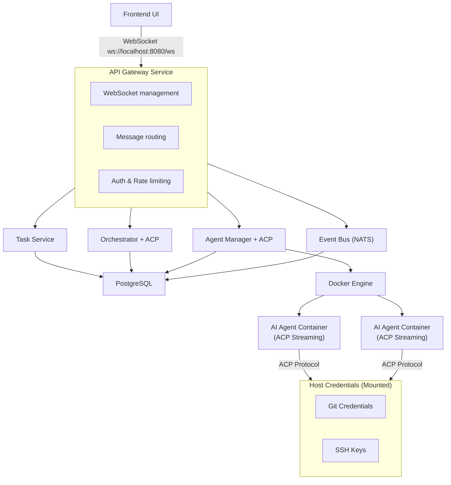

# Kandev Backend Implementation Plan

> **Note:** This is the original planning document for the microservices architecture.
> The current implementation uses a simplified unified binary approach with SQLite.
> The current implementation uses a WebSocket-only API (no REST endpoints).
> See [GETTING_STARTED.md](GETTING_STARTED.md) for the current implementation details.
> This document is preserved for reference and future scaling considerations.

---

## 1. System Architecture Overview

### High-Level Architecture



### Agent Communication Protocol (ACP)

**ACP** is a streaming protocol that enables real-time bidirectional communication between AI agents and the backend services. Unlike traditional batch processing, ACP provides:

- **Real-time feedback**: Agents stream progress updates, logs, and results as they work
- **Bidirectional communication**: Backend can send commands and receive responses
- **Structured messaging**: JSON-based message format for consistency
- **Connection persistence**: Long-lived connections for the duration of agent execution

**ACP Message Format:**
```json
{
  "type": "progress|log|result|error|status",
  "timestamp": "2026-01-09T10:30:00Z",
  "agent_id": "uuid",
  "task_id": "uuid",
  "data": {
    "message": "Processing file main.go...",
    "progress": 45,
    "metadata": {}
  }
}
```

## 2. Core Backend Services

### 2.1 API Gateway Service
**Package:** `cmd/api-gateway`

**Responsibilities:**
- WebSocket connection management and message routing
- WebSocket message dispatching to appropriate services
- JWT-based authentication via connection handshake
- Message validation and rate limiting
- Real-time notification broadcasting
- ACP stream proxying to connected clients

**Key Components:**
- `internal/gateway/websocket` - WebSocket connection and message handling
- `internal/gateway/dispatcher` - Message routing to services
- `internal/gateway/middleware` - Auth, logging, rate limiting
- `internal/gateway/broadcast` - Notification broadcasting to clients
- `internal/gateway/streaming` - ACP stream multiplexing

### 2.2 Task Service
**Package:** `cmd/task-service`

**Responsibilities:**
- CRUD operations for tasks via WebSocket messages
- Task state management (TODO, IN_PROGRESS, BLOCKED, COMPLETED, FAILED)
- Task assignment to agents
- Task priority and scheduling
- Task history and audit logs

**Key Components:**
- `internal/task/repository` - Database operations
- `internal/task/service` - Business logic
- `internal/task/handlers` - WebSocket message handlers
- `internal/task/models` - Data structures

### 2.3 Orchestrator Service
**Package:** `cmd/orchestrator`

**Responsibilities:**
- Monitor task state changes via event bus
- Determine when to launch AI agents
- Task queue management
- Retry logic for failed tasks
- Agent workload balancing
- Health monitoring of running agents
- **ACP stream aggregation and distribution**
- **Real-time agent status tracking**
- **WebSocket notification publishing**

**Key Components:**
- `internal/orchestrator/watcher` - Event monitoring
- `internal/orchestrator/scheduler` - Task scheduling
- `internal/orchestrator/executor` - Agent execution coordination
- `internal/orchestrator/acp` - ACP protocol handler
- `internal/orchestrator/streaming` - Real-time stream management
- `internal/orchestrator/handlers` - WebSocket message handlers

### 2.4 Agent Manager Service
**Package:** `cmd/agent-manager`

**Responsibilities:**
- Docker container lifecycle management
- Agent type registry and configuration
- Container resource allocation
- Agent health checks
- Container cleanup
- **ACP stream handling from agent containers**
- **Host credential mounting (SSH keys, Git config)**
- **Real-time log streaming via ACP**

**Key Components:**
- `internal/agent/docker` - Docker SDK integration
- `internal/agent/registry` - Agent type definitions
- `internal/agent/lifecycle` - Container management
- `internal/agent/monitor` - Health and metrics
- `internal/agent/acp` - ACP protocol implementation
- `internal/agent/credentials` - Host credential management
- `internal/agent/handlers` - WebSocket message handlers

## 3. Database Schema

### 3.1 Tables

#### `users`
```sql
CREATE TABLE users (
    id UUID PRIMARY KEY DEFAULT gen_random_uuid(),
    email VARCHAR(255) UNIQUE NOT NULL,
    username VARCHAR(100) UNIQUE NOT NULL,
    password_hash VARCHAR(255) NOT NULL,
    created_at TIMESTAMP NOT NULL DEFAULT NOW(),
    updated_at TIMESTAMP NOT NULL DEFAULT NOW()
);
```

#### `boards`
```sql
CREATE TABLE boards (
    id UUID PRIMARY KEY DEFAULT gen_random_uuid(),
    name VARCHAR(255) NOT NULL,
    description TEXT,
    owner_id UUID NOT NULL REFERENCES users(id) ON DELETE CASCADE,
    created_at TIMESTAMP NOT NULL DEFAULT NOW(),
    updated_at TIMESTAMP NOT NULL DEFAULT NOW()
);
```

#### `tasks`
```sql
CREATE TABLE tasks (
    id UUID PRIMARY KEY DEFAULT gen_random_uuid(),
    board_id UUID NOT NULL REFERENCES boards(id) ON DELETE CASCADE,
    title VARCHAR(500) NOT NULL,
    description TEXT NOT NULL,
    state VARCHAR(50) NOT NULL DEFAULT 'TODO',
    priority INTEGER NOT NULL DEFAULT 0,
    agent_type VARCHAR(100),
    repository_url VARCHAR(500),
    branch VARCHAR(255),
    assigned_agent_id UUID,
    created_by UUID NOT NULL REFERENCES users(id),
    created_at TIMESTAMP NOT NULL DEFAULT NOW(),
    updated_at TIMESTAMP NOT NULL DEFAULT NOW(),
    started_at TIMESTAMP,
    completed_at TIMESTAMP,
    
    CONSTRAINT valid_state CHECK (state IN ('TODO', 'IN_PROGRESS', 'BLOCKED', 'COMPLETED', 'FAILED', 'CANCELLED'))
);

CREATE INDEX idx_tasks_board_id ON tasks(board_id);
CREATE INDEX idx_tasks_state ON tasks(state);
CREATE INDEX idx_tasks_assigned_agent ON tasks(assigned_agent_id);
```

#### `agent_instances`
```sql
CREATE TABLE agent_instances (
    id UUID PRIMARY KEY DEFAULT gen_random_uuid(),
    task_id UUID NOT NULL REFERENCES tasks(id) ON DELETE CASCADE,
    agent_type VARCHAR(100) NOT NULL,
    container_id VARCHAR(255) UNIQUE,
    container_name VARCHAR(255),
    status VARCHAR(50) NOT NULL DEFAULT 'PENDING',
    image_name VARCHAR(255) NOT NULL,
    started_at TIMESTAMP,
    stopped_at TIMESTAMP,
    exit_code INTEGER,
    error_message TEXT,
    resource_limits JSONB,
    created_at TIMESTAMP NOT NULL DEFAULT NOW(),
    updated_at TIMESTAMP NOT NULL DEFAULT NOW(),

    CONSTRAINT valid_status CHECK (status IN ('PENDING', 'STARTING', 'RUNNING', 'COMPLETED', 'FAILED', 'STOPPED'))
);

CREATE INDEX idx_agent_instances_task_id ON agent_instances(task_id);
CREATE INDEX idx_agent_instances_status ON agent_instances(status);
CREATE INDEX idx_agent_instances_container_id ON agent_instances(container_id);
```

#### `agent_logs`
```sql
CREATE TABLE agent_logs (
    id BIGSERIAL PRIMARY KEY,
    agent_instance_id UUID NOT NULL REFERENCES agent_instances(id) ON DELETE CASCADE,
    log_level VARCHAR(20) NOT NULL,
    message TEXT NOT NULL,
    metadata JSONB,
    created_at TIMESTAMP NOT NULL DEFAULT NOW()
);

CREATE INDEX idx_agent_logs_instance_id ON agent_logs(agent_instance_id);
CREATE INDEX idx_agent_logs_created_at ON agent_logs(created_at);
```

#### `task_events`
```sql
CREATE TABLE task_events (
    id BIGSERIAL PRIMARY KEY,
    task_id UUID NOT NULL REFERENCES tasks(id) ON DELETE CASCADE,
    event_type VARCHAR(100) NOT NULL,
    old_state VARCHAR(50),
    new_state VARCHAR(50),
    metadata JSONB,
    created_by UUID REFERENCES users(id),
    created_at TIMESTAMP NOT NULL DEFAULT NOW()
);

CREATE INDEX idx_task_events_task_id ON task_events(task_id);
CREATE INDEX idx_task_events_created_at ON task_events(created_at);
```

#### `agent_types`
```sql
CREATE TABLE agent_types (
    id UUID PRIMARY KEY DEFAULT gen_random_uuid(),
    name VARCHAR(100) UNIQUE NOT NULL,
    description TEXT,
    docker_image VARCHAR(255) NOT NULL,
    docker_tag VARCHAR(100) NOT NULL DEFAULT 'latest',
    default_resources JSONB NOT NULL,
    environment_vars JSONB,
    capabilities JSONB,
    enabled BOOLEAN NOT NULL DEFAULT true,
    created_at TIMESTAMP NOT NULL DEFAULT NOW(),
    updated_at TIMESTAMP NOT NULL DEFAULT NOW()
);
```

### 3.2 Initial Agent Type Configurations

The system will initially support two agent types. These should be seeded into the `agent_types` table during initial setup.

#### Auggie CLI Agent

```sql
INSERT INTO agent_types (name, description, docker_image, docker_tag, default_resources, environment_vars, capabilities, enabled)
VALUES (
    'auggie-cli',
    'Augment CLI agent for code analysis and development tasks',
    'augmentcode/auggie-cli',
    'latest',
    '{"cpu_limit": "2.0", "memory_limit": "2g", "disk_limit": "10g"}',
    '{"AUGGIE_MODE": "acp", "AUGGIE_STREAM": "true"}',
    '["code_analysis", "code_generation", "debugging", "refactoring"]',
    true
);
```

**Configuration Details:**
- **Image**: `augmentcode/auggie-cli:latest`
- **ACP Support**: Native ACP streaming protocol
- **Resource Limits**: 2 CPU cores, 2GB RAM, 10GB disk
- **Capabilities**: Code analysis, generation, debugging, refactoring
- **Required Mounts**:
  - `~/.ssh:/root/.ssh:ro` - SSH keys for Git authentication
  - `~/.gitconfig:/root/.gitconfig:ro` - Git configuration
  - `/workspace:/workspace:rw` - Working directory for repository

#### Gemini Agent

```sql
INSERT INTO agent_types (name, description, docker_image, docker_tag, default_resources, environment_vars, capabilities, enabled)
VALUES (
    'gemini-agent',
    'Google Gemini-powered agent for general development tasks',
    'kandev/gemini-agent',
    'latest',
    '{"cpu_limit": "1.5", "memory_limit": "1.5g", "disk_limit": "10g"}',
    '{"GEMINI_API_KEY": "${GEMINI_API_KEY}", "ACP_ENABLED": "true"}',
    '["code_review", "documentation", "testing", "general_assistance"]',
    true
);
```

**Configuration Details:**
- **Image**: `kandev/gemini-agent:latest` (custom-built)
- **ACP Support**: ACP streaming wrapper around Gemini API
- **Resource Limits**: 1.5 CPU cores, 1.5GB RAM, 10GB disk
- **Capabilities**: Code review, documentation, testing, general assistance
- **Required Environment**:
  - `GEMINI_API_KEY` - API key from host environment
- **Required Mounts**:
  - `~/.ssh:/root/.ssh:ro` - SSH keys for Git authentication
  - `~/.gitconfig:/root/.gitconfig:ro` - Git configuration
  - `/workspace:/workspace:rw` - Working directory for repository

## 4. Initial Agent Types - Docker Image Preparation

### 4.1 Auggie CLI Agent Image

The Auggie CLI agent image should be pre-built and available from Augment's registry. If building locally:

**Dockerfile Reference** (`deployments/docker/auggie-cli/Dockerfile`):
```dockerfile
FROM augmentcode/auggie-base:latest

# Install ACP protocol support
RUN pip install acp-protocol-sdk

# Configure ACP streaming
ENV AUGGIE_MODE=acp
ENV AUGGIE_STREAM=true

# Set up working directory
WORKDIR /workspace

# Entry point for ACP communication
COPY entrypoint.sh /entrypoint.sh
RUN chmod +x /entrypoint.sh

ENTRYPOINT ["/entrypoint.sh"]
```

**Build and Push:**
```bash
cd deployments/docker/auggie-cli
docker build -t augmentcode/auggie-cli:latest .
docker push augmentcode/auggie-cli:latest
```

### 4.2 Gemini Agent Image

The Gemini agent requires a custom wrapper to integrate with ACP protocol.

**Dockerfile** (`deployments/docker/gemini-agent/Dockerfile`):
```dockerfile
FROM python:3.11-slim

# Install dependencies
RUN pip install --no-cache-dir \
    google-generativeai \
    acp-protocol-sdk \
    gitpython \
    requests

# Copy agent implementation
COPY gemini_agent.py /app/gemini_agent.py
COPY acp_wrapper.py /app/acp_wrapper.py
COPY requirements.txt /app/requirements.txt

WORKDIR /app

# Install additional requirements
RUN pip install -r requirements.txt

# Set up working directory for repositories
RUN mkdir -p /workspace

# Entry point
ENTRYPOINT ["python", "/app/gemini_agent.py"]
```

**Build and Push:**
```bash
cd deployments/docker/gemini-agent
docker build -t kandev/gemini-agent:latest .
# For local development, no push needed
# For production: docker push kandev/gemini-agent:latest
```

### 4.3 Agent Image Versioning Strategy

**Version Tags:**
- `latest` - Latest stable version (default)
- `v1.0.0`, `v1.1.0`, etc. - Semantic versioning for releases
- `dev` - Development/testing version
- `nightly` - Automated nightly builds

**Update Process:**
1. Build new image with version tag
2. Test with kandev system
3. Update `agent_types` table with new tag
4. Tag as `latest` when stable
5. Document changes in agent changelog

**Image Registry:**
- **Development**: Local Docker registry or Docker Hub
- **Production**: Private container registry (AWS ECR, Google GCR, or Azure ACR)

## 5. WebSocket API

The backend exposes a single WebSocket endpoint for all client communication. All operations use a unified message envelope format.

### 5.1 Connection

**Endpoint:** `ws://localhost:8080/ws`

**Authentication:** JWT token passed in the initial connection handshake via query parameter or header.

```javascript
const ws = new WebSocket('ws://localhost:8080/ws?token=JWT_TOKEN');
```

### 5.2 Message Envelope

All messages follow a standard envelope format:

```json
{
  "id": "correlation-uuid",
  "type": "request|response|notification|error",
  "action": "action.name",
  "payload": {},
  "timestamp": "2026-01-10T10:30:00Z"
}
```

| Field | Description |
|-------|-------------|
| `id` | Correlation UUID to match requests with responses |
| `type` | Message type: `request`, `response`, `notification`, or `error` |
| `action` | The action being performed (see action tables below) |
| `payload` | Action-specific data |
| `timestamp` | ISO 8601 timestamp |

### 5.3 Request/Response Actions (Client → Server → Client)

#### Health Check
| Action | Description |
|--------|-------------|
| `health.check` | Health check |

#### Board Management
| Action | Description |
|--------|-------------|
| `board.list` | List boards |
| `board.create` | Create board |
| `board.get` | Get board by ID |
| `board.update` | Update board |
| `board.delete` | Delete board |
| `column.list` | List columns for a board |
| `column.create` | Create column |

#### Task Management
| Action | Description |
|--------|-------------|
| `task.list` | List tasks (with filtering) |
| `task.create` | Create task |
| `task.get` | Get task details |
| `task.update` | Update task |
| `task.delete` | Delete task |
| `task.move` | Move task to different column/position |
| `task.state` | Update task state |

#### Agent Management
| Action | Description |
|--------|-------------|
| `agent.list` | List all agent instances |
| `agent.launch` | Launch agent for a task |
| `agent.status` | Get agent status |
| `agent.logs` | Get agent logs |
| `agent.stop` | Stop a running agent |
| `agent.prompt` | Send prompt to agent |
| `agent.cancel` | Cancel agent execution |
| `agent.session` | Get agent session info |
| `agent.types` | List available agent types |

#### Orchestrator Control
| Action | Description |
|--------|-------------|
| `orchestrator.status` | Get orchestrator status and metrics |
| `orchestrator.queue` | View current task queue |
| `orchestrator.trigger` | Manually trigger orchestration for a task |
| `orchestrator.start` | Start agent execution for a task |
| `orchestrator.stop` | Stop agent execution for a task |
| `orchestrator.prompt` | Send prompt to orchestrator |
| `orchestrator.complete` | Mark task as complete |

### 5.4 Notification Types (Server → Client)

Notifications are pushed from the server without a prior request. They use `type: "notification"`.

| Action | Description |
|--------|-------------|
| `acp.progress` | Agent progress update (0-100%) |
| `acp.log` | Agent log message |
| `acp.result` | Agent result (intermediate or final) |
| `acp.error` | Agent error |
| `acp.status` | Agent status change |
| `acp.heartbeat` | Keep-alive heartbeat |
| `task.updated` | Task was updated |
| `agent.updated` | Agent status changed |

### 5.5 Example Messages

**Request: Create Task**
```json
{
  "id": "550e8400-e29b-41d4-a716-446655440000",
  "type": "request",
  "action": "task.create",
  "payload": {
    "board_id": "board-uuid",
    "title": "Implement user authentication",
    "description": "Add JWT-based authentication",
    "priority": 5,
    "agent_type": "auggie-cli"
  },
  "timestamp": "2026-01-10T10:30:00Z"
}
```

**Response: Task Created**
```json
{
  "id": "550e8400-e29b-41d4-a716-446655440000",
  "type": "response",
  "action": "task.create",
  "payload": {
    "task": {
      "id": "task-uuid",
      "board_id": "board-uuid",
      "title": "Implement user authentication",
      "description": "Add JWT-based authentication",
      "state": "TODO",
      "priority": 5,
      "agent_type": "auggie-cli",
      "created_at": "2026-01-10T10:30:00Z"
    }
  },
  "timestamp": "2026-01-10T10:30:01Z"
}
```

**Request: Launch Agent**
```json
{
  "id": "660e8400-e29b-41d4-a716-446655440001",
  "type": "request",
  "action": "agent.launch",
  "payload": {
    "task_id": "task-uuid",
    "agent_type": "auggie-cli"
  },
  "timestamp": "2026-01-10T10:31:00Z"
}
```

**Notification: ACP Progress**
```json
{
  "id": "770e8400-e29b-41d4-a716-446655440002",
  "type": "notification",
  "action": "acp.progress",
  "payload": {
    "agent_id": "agent-uuid",
    "task_id": "task-uuid",
    "progress": 45,
    "message": "Analyzing file: src/main.go",
    "current_file": "src/main.go",
    "files_processed": 23,
    "total_files": 51
  },
  "timestamp": "2026-01-10T10:32:15Z"
}
```

**Notification: ACP Log**
```json
{
  "id": "880e8400-e29b-41d4-a716-446655440003",
  "type": "notification",
  "action": "acp.log",
  "payload": {
    "agent_id": "agent-uuid",
    "task_id": "task-uuid",
    "level": "info",
    "message": "Found 3 potential issues in authentication module",
    "metadata": {
      "module": "auth",
      "issues": 3
    }
  },
  "timestamp": "2026-01-10T10:32:16Z"
}
```

**Notification: ACP Result**
```json
{
  "id": "990e8400-e29b-41d4-a716-446655440004",
  "type": "notification",
  "action": "acp.result",
  "payload": {
    "agent_id": "agent-uuid",
    "task_id": "task-uuid",
    "status": "completed",
    "summary": "Analysis complete. Found 12 issues, suggested 8 improvements.",
    "artifacts": [
      {
        "type": "report",
        "path": "/workspace/analysis_report.md"
      }
    ]
  },
  "timestamp": "2026-01-10T10:35:00Z"
}
```

**Error Response**
```json
{
  "id": "550e8400-e29b-41d4-a716-446655440000",
  "type": "error",
  "action": "task.create",
  "payload": {
    "code": "VALIDATION_ERROR",
    "message": "Title is required",
    "details": {
      "field": "title"
    }
  },
  "timestamp": "2026-01-10T10:30:01Z"
}
```

### 5.6 Connection Flow

```javascript
// 1. Connect to WebSocket
const ws = new WebSocket('ws://localhost:8080/ws?token=JWT_TOKEN');

// 2. Handle connection open
ws.onopen = () => {
  console.log('Connected to Kandev WebSocket');
};

// 3. Send requests
function sendRequest(action, payload) {
  const id = crypto.randomUUID();
  ws.send(JSON.stringify({
    id,
    type: 'request',
    action,
    payload,
    timestamp: new Date().toISOString()
  }));
  return id;
}

// 4. Handle incoming messages
ws.onmessage = (event) => {
  const message = JSON.parse(event.data);

  switch (message.type) {
    case 'response':
      handleResponse(message);
      break;
    case 'notification':
      handleNotification(message);
      break;
    case 'error':
      handleError(message);
      break;
  }
};

// 5. Example: List boards
sendRequest('board.list', {});

// 6. Example: Launch agent and receive streaming updates
sendRequest('agent.launch', { task_id: 'task-uuid', agent_type: 'auggie-cli' });
// Notifications (acp.progress, acp.log, acp.result) will stream automatically
```

## 6. Go Package Structure

```
kandev/
├── cmd/
│   ├── api-gateway/
│   │   └── main.go
│   ├── task-service/
│   │   └── main.go
│   ├── orchestrator/
│   │   └── main.go
│   └── agent-manager/
│       └── main.go
├── internal/
│   ├── common/
│   │   ├── config/          # Configuration management
│   │   ├── logger/          # Structured logging
│   │   ├── database/        # DB connection pooling
│   │   ├── auth/            # JWT authentication
│   │   ├── errors/          # Error types and handling
│   │   └── acp/             # ACP protocol implementation
│   ├── gateway/
│   │   ├── websocket/       # WebSocket connection & message handling
│   │   ├── dispatcher/      # Message routing to services
│   │   ├── middleware/      # Auth, logging, rate limiting
│   │   ├── broadcast/       # Notification broadcasting
│   │   └── streaming/       # ACP stream multiplexing
│   ├── task/
│   │   ├── models/
│   │   ├── repository/
│   │   ├── service/
│   │   ├── handlers/        # WebSocket message handlers
│   │   └── events/
│   ├── orchestrator/
│   │   ├── watcher/
│   │   ├── scheduler/
│   │   ├── executor/
│   │   ├── queue/
│   │   ├── acp/             # ACP protocol handler
│   │   ├── streaming/       # Real-time stream management
│   │   └── handlers/        # WebSocket message handlers
│   ├── agent/
│   │   ├── models/
│   │   ├── docker/
│   │   ├── registry/
│   │   ├── lifecycle/
│   │   ├── monitor/
│   │   ├── acp/             # ACP stream handling
│   │   ├── credentials/     # Host credential management
│   │   └── handlers/        # WebSocket message handlers
│   └── events/
│       ├── bus/             # Event bus abstraction
│       ├── publisher/
│       └── subscriber/
├── pkg/
│   ├── api/
│   │   └── v1/              # API models (shared)
│   ├── websocket/
│   │   ├── message/         # WebSocket message envelope types
│   │   ├── handler/         # Handler interface definitions
│   │   └── router/          # Action routing utilities
│   └── acp/
│       ├── protocol/        # ACP protocol definitions
│       ├── client/          # ACP client library
│       └── server/          # ACP server library
├── migrations/
│   └── postgres/
├── deployments/
│   ├── docker/
│   │   ├── auggie-cli/      # Auggie CLI agent image
│   │   ├── gemini-agent/    # Gemini agent image
│   │   └── compose/         # Docker Compose files
│   └── kubernetes/          # Future K8s deployments
├── scripts/
├── go.mod
└── go.sum
```

## 7. Core Data Structures

### 6.1 Task Models

```go
// pkg/api/v1/task.go
package v1

import "time"

type TaskState string

const (
    TaskStateTODO       TaskState = "TODO"
    TaskStateInProgress TaskState = "IN_PROGRESS"
    TaskStateBlocked    TaskState = "BLOCKED"
    TaskStateCompleted  TaskState = "COMPLETED"
    TaskStateFailed     TaskState = "FAILED"
    TaskStateCancelled  TaskState = "CANCELLED"
)

type Task struct {
    ID             string                 `json:"id"`
    BoardID        string                 `json:"board_id"`
    Title          string                 `json:"title"`
    Description    string                 `json:"description"`
    State          TaskState              `json:"state"`
    Priority       int                    `json:"priority"`
    AgentType      *string                `json:"agent_type,omitempty"`
    RepositoryURL  *string                `json:"repository_url,omitempty"`
    Branch         *string                `json:"branch,omitempty"`
    AssignedAgentID *string               `json:"assigned_agent_id,omitempty"`
    CreatedBy      string                 `json:"created_by"`
    CreatedAt      time.Time              `json:"created_at"`
    UpdatedAt      time.Time              `json:"updated_at"`
    StartedAt      *time.Time             `json:"started_at,omitempty"`
    CompletedAt    *time.Time             `json:"completed_at,omitempty"`
    Metadata       map[string]interface{} `json:"metadata,omitempty"`
}

type CreateTaskRequest struct {
    Title         string                 `json:"title" validate:"required,max=500"`
    Description   string                 `json:"description" validate:"required"`
    Priority      int                    `json:"priority" validate:"min=0,max=10"`
    AgentType     *string                `json:"agent_type,omitempty"`
    RepositoryURL *string                `json:"repository_url,omitempty"`
    Branch        *string                `json:"branch,omitempty"`
    Metadata      map[string]interface{} `json:"metadata,omitempty"`
}

type UpdateTaskRequest struct {
    Title         *string                `json:"title,omitempty" validate:"omitempty,max=500"`
    Description   *string                `json:"description,omitempty"`
    Priority      *int                   `json:"priority,omitempty" validate:"omitempty,min=0,max=10"`
    AgentType     *string                `json:"agent_type,omitempty"`
    RepositoryURL *string                `json:"repository_url,omitempty"`
    Branch        *string                `json:"branch,omitempty"`
    Metadata      map[string]interface{} `json:"metadata,omitempty"`
}

type UpdateTaskStateRequest struct {
    State TaskState `json:"state" validate:"required"`
}
```

### 6.2 Agent Models

```go
// pkg/api/v1/agent.go
package v1

import "time"

type AgentStatus string

const (
    AgentStatusPending  AgentStatus = "PENDING"
    AgentStatusStarting AgentStatus = "STARTING"
    AgentStatusRunning  AgentStatus = "RUNNING"
    AgentStatusCompleted AgentStatus = "COMPLETED"
    AgentStatusFailed   AgentStatus = "FAILED"
    AgentStatusStopped  AgentStatus = "STOPPED"
)

type AgentInstance struct {
    ID             string                 `json:"id"`
    TaskID         string                 `json:"task_id"`
    AgentType      string                 `json:"agent_type"`
    ContainerID    *string                `json:"container_id,omitempty"`
    ContainerName  *string                `json:"container_name,omitempty"`
    Status         AgentStatus            `json:"status"`
    ImageName      string                 `json:"image_name"`
    StartedAt      *time.Time             `json:"started_at,omitempty"`
    StoppedAt      *time.Time             `json:"stopped_at,omitempty"`
    ExitCode       *int                   `json:"exit_code,omitempty"`
    ErrorMessage   *string                `json:"error_message,omitempty"`
    ResourceLimits ResourceLimits         `json:"resource_limits"`
    CreatedAt      time.Time              `json:"created_at"`
    UpdatedAt      time.Time              `json:"updated_at"`
}

type ResourceLimits struct {
    CPULimit    string `json:"cpu_limit"`     // e.g., "1.0" for 1 CPU
    MemoryLimit string `json:"memory_limit"`  // e.g., "512m" or "1g"
    DiskLimit   string `json:"disk_limit"`    // e.g., "10g"
}

type AgentType struct {
    ID               string                 `json:"id"`
    Name             string                 `json:"name"`
    Description      string                 `json:"description"`
    DockerImage      string                 `json:"docker_image"`
    DockerTag        string                 `json:"docker_tag"`
    DefaultResources ResourceLimits         `json:"default_resources"`
    EnvironmentVars  map[string]string      `json:"environment_vars,omitempty"`
    Capabilities     []string               `json:"capabilities,omitempty"`
    Enabled          bool                   `json:"enabled"`
    CreatedAt        time.Time              `json:"created_at"`
    UpdatedAt        time.Time              `json:"updated_at"`
}

type AgentLog struct {
    ID              int64                  `json:"id"`
    AgentInstanceID string                 `json:"agent_instance_id"`
    LogLevel        string                 `json:"log_level"`
    Message         string                 `json:"message"`
    Metadata        map[string]interface{} `json:"metadata,omitempty"`
    CreatedAt       time.Time              `json:"created_at"`
}
```

## 8. Docker Integration Strategy

### 7.1 Docker SDK Usage

**Library:** `github.com/docker/docker/client`

**Key Operations:**
- Container creation with resource limits
- Container lifecycle management (start, stop, remove)
- Log streaming from containers
- Health checks
- Network isolation

### 7.2 Container Configuration

```go
// internal/agent/docker/config.go
package docker

type ContainerConfig struct {
    Image           string
    Tag             string
    Name            string
    Env             []string
    Cmd             []string
    WorkingDir      string
    Volumes         map[string]string  // host:container
    NetworkMode     string
    CPULimit        int64
    MemoryLimit     int64
    AutoRemove      bool
    Labels          map[string]string
}
```

### 7.3 Agent Container Lifecycle

1. **Preparation Phase:**
   - Validate agent type exists
   - Check Docker image availability
   - Pull image if not present
   - Prepare volume mounts (for repository checkout)

2. **Launch Phase:**
   - Create container with configuration
   - Attach log streaming
   - Start container
   - Update agent_instance record

3. **Monitoring Phase:**
   - Stream logs to database
   - Monitor container health
   - Track resource usage
   - Detect completion/failure

4. **Cleanup Phase:**
   - Collect final logs
   - Record exit code
   - Remove container (if auto-remove enabled)
   - Update task state

### 7.4 Repository Checkout and Credential Management

**Strategy: Host-based Credential Mounting**

The system uses the user's local machine credentials for Git authentication, securely mounting them into agent containers.

#### SSH Key Mounting

**Implementation:**
```go
// internal/agent/credentials/ssh.go
func PrepareSSHMount(userHomeDir string) (docker.Mount, error) {
    sshDir := filepath.Join(userHomeDir, ".ssh")

    // Verify SSH directory exists
    if _, err := os.Stat(sshDir); os.IsNotExist(err) {
        return docker.Mount{}, fmt.Errorf("SSH directory not found: %s", sshDir)
    }

    return docker.Mount{
        Type:     "bind",
        Source:   sshDir,
        Target:   "/root/.ssh",
        ReadOnly: true,
    }, nil
}
```

**Security Considerations:**
- Mount as **read-only** to prevent agent from modifying keys
- Only mount necessary files (id_rsa, id_ed25519, known_hosts)
- Set proper file permissions (0600 for private keys)
- Consider using SSH agent forwarding for enhanced security

#### Git Configuration Mounting

**Implementation:**
```go
// internal/agent/credentials/git.go
func PrepareGitConfigMount(userHomeDir string) (docker.Mount, error) {
    gitConfigPath := filepath.Join(userHomeDir, ".gitconfig")

    if _, err := os.Stat(gitConfigPath); os.IsNotExist(err) {
        // Git config is optional
        return docker.Mount{}, nil
    }

    return docker.Mount{
        Type:     "bind",
        Source:   gitConfigPath,
        Target:   "/root/.gitconfig",
        ReadOnly: true,
    }, nil
}
```

#### Git Credential Helper

For HTTPS repositories, mount Git credential helper:

```go
// internal/agent/credentials/git_credentials.go
func PrepareGitCredentialsMount(userHomeDir string) (docker.Mount, error) {
    credPath := filepath.Join(userHomeDir, ".git-credentials")

    if _, err := os.Stat(credPath); os.IsNotExist(err) {
        return docker.Mount{}, nil
    }

    return docker.Mount{
        Type:     "bind",
        Source:   credPath,
        Target:   "/root/.git-credentials",
        ReadOnly: true,
    }, nil
}
```

#### Environment Variable Credentials

For API tokens (GitHub, GitLab, etc.):

```go
// internal/agent/credentials/env.go
func PrepareCredentialEnvVars() []string {
    envVars := []string{}

    // GitHub token
    if token := os.Getenv("GITHUB_TOKEN"); token != "" {
        envVars = append(envVars, fmt.Sprintf("GITHUB_TOKEN=%s", token))
    }

    // GitLab token
    if token := os.Getenv("GITLAB_TOKEN"); token != "" {
        envVars = append(envVars, fmt.Sprintf("GITLAB_TOKEN=%s", token))
    }

    // Gemini API key
    if key := os.Getenv("GEMINI_API_KEY"); key != "" {
        envVars = append(envVars, fmt.Sprintf("GEMINI_API_KEY=%s", key))
    }

    return envVars
}
```

#### Complete Container Configuration with Credentials

```go
// internal/agent/docker/container.go
func CreateAgentContainer(ctx context.Context, config AgentConfig) (*container.CreateResponse, error) {
    userHomeDir, _ := os.UserHomeDir()

    // Prepare credential mounts
    sshMount, _ := credentials.PrepareSSHMount(userHomeDir)
    gitConfigMount, _ := credentials.PrepareGitConfigMount(userHomeDir)
    gitCredsMount, _ := credentials.PrepareGitCredentialsMount(userHomeDir)

    // Prepare workspace mount
    workspaceMount := docker.Mount{
        Type:   "bind",
        Source: config.WorkspacePath,
        Target: "/workspace",
    }

    mounts := []docker.Mount{workspaceMount}
    if sshMount.Source != "" {
        mounts = append(mounts, sshMount)
    }
    if gitConfigMount.Source != "" {
        mounts = append(mounts, gitConfigMount)
    }
    if gitCredsMount.Source != "" {
        mounts = append(mounts, gitCredsMount)
    }

    // Prepare environment variables
    envVars := credentials.PrepareCredentialEnvVars()
    envVars = append(envVars, config.AdditionalEnv...)

    containerConfig := &container.Config{
        Image: config.Image,
        Env:   envVars,
        // ... other config
    }

    hostConfig := &container.HostConfig{
        Mounts: mounts,
        Resources: container.Resources{
            Memory:   config.MemoryLimit,
            NanoCPUs: config.CPULimit,
        },
    }

    return dockerClient.ContainerCreate(ctx, containerConfig, hostConfig, nil, nil, config.Name)
}
```

#### Repository Checkout Strategy

**Pre-checkout on Host (Recommended):**
1. Agent Manager clones repository on host machine
2. Repository is placed in `/tmp/kandev/workspaces/{task_id}`
3. Workspace is mounted into container
4. Agent operates on pre-checked-out code

**Advantages:**
- Uses host's existing Git credentials
- Faster container startup
- Repository persists after container cleanup
- Easier debugging

**Implementation:**
```go
// internal/agent/repository/checkout.go
func CheckoutRepository(taskID, repoURL, branch string) (string, error) {
    workspacePath := filepath.Join("/tmp/kandev/workspaces", taskID)

    // Clone repository
    cmd := exec.Command("git", "clone", "--branch", branch, repoURL, workspacePath)
    if err := cmd.Run(); err != nil {
        return "", fmt.Errorf("failed to clone repository: %w", err)
    }

    return workspacePath, nil
}
```

#### Security Best Practices

1. **Read-only Mounts**: All credential mounts are read-only
2. **Minimal Exposure**: Only mount credentials needed for the task
3. **Cleanup**: Remove workspace directories after task completion
4. **Audit Logging**: Log all credential access attempts
5. **User Isolation**: Each user's credentials are isolated
6. **No Credential Storage**: Never store credentials in database
7. **Container Network Isolation**: Limit network access from containers

## 9. Inter-Service Communication

### 8.1 Event Bus (NATS)

**Library:** `github.com/nats-io/nats.go`

**Event Types:**
- `task.created` - New task created
- `task.updated` - Task updated
- `task.state_changed` - Task state transition
- `task.deleted` - Task deleted
- `agent.started` - Agent container started
- `agent.completed` - Agent finished successfully
- `agent.failed` - Agent execution failed
- `agent.log` - Agent log entry
- `acp.message` - ACP protocol message from agent

**Event Structure:**
```go
type Event struct {
    ID        string                 `json:"id"`
    Type      string                 `json:"type"`
    Source    string                 `json:"source"`
    Timestamp time.Time              `json:"timestamp"`
    Data      map[string]interface{} `json:"data"`
}
```

### 8.2 WebSocket Message Flow

**Client Request Flow:**

```
┌──────────────┐
│ Frontend UI  │
└──────┬───────┘
       │ WebSocket Message (request)
       │ ws://localhost:8080/ws
       ▼
┌──────────────┐
│ API Gateway  │ ← Maintains WebSocket connections
│ (Dispatcher) │   Routes messages by action prefix
└──────┬───────┘
       │ Internal routing
       ├──────────────┬──────────────┐
       ▼              ▼              ▼
┌──────────┐  ┌────────────┐  ┌────────────┐
│ Task     │  │Orchestrator│  │Agent       │
│ Handlers │  │ Handlers   │  │Handlers    │
└──────────┘  └────────────┘  └────────────┘
       │              │              │
       └──────────────┴──────────────┘
                      │
                      ▼
              ┌──────────────┐
              │ API Gateway  │ ← Sends response back
              │ (WebSocket)  │
              └──────┬───────┘
                     │ WebSocket Message (response)
                     ▼
              ┌──────────────┐
              │ Frontend UI  │
              └──────────────┘
```

### 8.3 ACP Notification Flow (Agent → Client)

**Real-time Agent Updates:**

```
┌──────────────┐
│ AI Agent     │
│ Container    │
└──────┬───────┘
       │ ACP Messages (stdout)
       ▼
┌──────────────┐
│ Agent        │
│ Manager      │ ← Captures ACP stream from container
└──────┬───────┘
       │ Publishes to NATS: acp.message.{task_id}
       ▼
┌──────────────┐
│ NATS Event   │
│ Bus          │
└──────┬───────┘
       │ Subscribes: acp.message.{task_id}
       ▼
┌──────────────┐
│ Orchestrator │ ← Aggregates ACP messages
└──────┬───────┘
       │ Publishes notification event
       ▼
┌──────────────┐
│ API Gateway  │ ← Broadcasts to connected WebSocket clients
│ (Broadcast)  │
└──────┬───────┘
       │ WebSocket Notification (acp.progress, acp.log, etc.)
       ▼
┌──────────────┐
│ Frontend UI  │ ← Displays real-time updates
└──────────────┘
```

**ACP Message Publishing:**
```go
// internal/agent/acp/publisher.go
func PublishACPMessage(nc *nats.Conn, taskID string, msg ACPMessage) error {
    subject := fmt.Sprintf("acp.message.%s", taskID)
    data, _ := json.Marshal(msg)
    return nc.Publish(subject, data)
}
```

**WebSocket Notification Broadcasting:**
```go
// internal/gateway/broadcast/broadcaster.go
func BroadcastNotification(action string, payload interface{}) {
    msg := WebSocketMessage{
        ID:        uuid.New().String(),
        Type:      "notification",
        Action:    action,
        Payload:   payload,
        Timestamp: time.Now().UTC(),
    }
    // Send to all connected clients subscribed to this task
    hub.BroadcastToSubscribers(msg)
}
```

### 8.4 Communication Patterns

**Frontend → API Gateway (WebSocket):**
- Single persistent WebSocket connection per client
- Request/response pattern with correlation IDs
- Real-time notifications pushed to client

**API Gateway → Services:**
- Routes messages based on action prefix (`task.*`, `agent.*`, `orchestrator.*`)
- Maintains connection state and authentication context

**Task Service → Event Bus:**
- Publishes task lifecycle events
- Other services subscribe to react

**Orchestrator → Event Bus:**
- Subscribes to `task.state_changed`
- Triggers agent launches based on state
- Subscribes to `acp.message.*` for all agent communications

**Agent Manager → Event Bus:**
- Publishes agent lifecycle events
- Publishes ACP messages from containers
- Streams real-time agent output

**Orchestrator → Agent Manager:**
- Direct gRPC calls for agent operations
- Request agent launch/stop/status

**Orchestrator → API Gateway:**
- Publishes notification events for WebSocket broadcast
- Uses NATS for inter-service notification delivery

**Agent Container → Agent Manager:**
- ACP messages via stdout (captured by Docker logs API)

### 8.4 ACP Protocol Implementation

**ACP Message Structure:**
```go
// pkg/acp/protocol/message.go
package protocol

type ACPMessage struct {
    Type      MessageType            `json:"type"`
    Timestamp time.Time              `json:"timestamp"`
    AgentID   string                 `json:"agent_id"`
    TaskID    string                 `json:"task_id"`
    Data      map[string]interface{} `json:"data"`
}

type MessageType string

const (
    MessageTypeProgress  MessageType = "progress"
    MessageTypeLog       MessageType = "log"
    MessageTypeResult    MessageType = "result"
    MessageTypeError     MessageType = "error"
    MessageTypeStatus    MessageType = "status"
    MessageTypeHeartbeat MessageType = "heartbeat"
)
```

**Agent Container ACP Output:**

Agents write ACP messages to stdout in JSON format:
```bash
# Inside agent container
echo '{"type":"progress","timestamp":"2026-01-09T10:30:00Z","agent_id":"uuid","task_id":"uuid","data":{"progress":25,"message":"Analyzing code..."}}'
```

**Agent Manager Captures ACP:**
```go
// internal/agent/acp/capture.go
func CaptureContainerACP(ctx context.Context, containerID string, taskID string) error {
    // Attach to container logs
    reader, err := dockerClient.ContainerLogs(ctx, containerID, types.ContainerLogsOptions{
        ShowStdout: true,
        ShowStderr: true,
        Follow:     true,
        Timestamps: false,
    })

    scanner := bufio.NewScanner(reader)
    for scanner.Scan() {
        line := scanner.Text()

        // Parse ACP message
        var msg protocol.ACPMessage
        if err := json.Unmarshal([]byte(line), &msg); err != nil {
            // Not an ACP message, treat as regular log
            continue
        }

        // Publish to NATS
        PublishACPMessage(natsConn, taskID, msg)

        // Store in database
        StoreACPMessage(db, msg)
    }

    return scanner.Err()
}
```

## 10. Key Go Dependencies

```go
// go.mod
module github.com/yourusername/kandev

go 1.21

require (
    // Docker integration
    github.com/docker/docker v24.0.0+incompatible
    github.com/docker/go-connections v0.4.0

    // Web framework and WebSocket
    github.com/gin-gonic/gin v1.9.1
    github.com/gorilla/websocket v1.5.1

    // Authentication
    github.com/golang-jwt/jwt/v5 v5.0.0

    // Database
    github.com/jackc/pgx/v5 v5.4.3

    // Event bus
    github.com/nats-io/nats.go v1.31.0

    // Utilities
    github.com/google/uuid v1.3.0
    github.com/spf13/viper v1.16.0

    // Logging
    go.uber.org/zap v1.26.0

    // gRPC
    google.golang.org/grpc v1.59.0
    google.golang.org/protobuf v1.31.0
)
```

## 11. Implementation Phases

### Phase 1: Foundation (Week 1-2)
**Goal:** Set up project structure and core infrastructure

**Tasks:**
1. Initialize Go modules and project structure
2. Set up PostgreSQL database and migrations
3. Implement common packages (config, logger, database, errors)
4. **Implement ACP protocol package (pkg/acp)**
5. Set up NATS event bus
6. Create basic Docker Compose for local development
7. **Build initial agent Docker images (Auggie CLI, Gemini)**

**Deliverables:**
- Working database with migrations
- Configuration management system
- Logging infrastructure
- Event bus connectivity
- **ACP protocol library**
- **Initial agent Docker images**

### Phase 2: Task Service (Week 2-3)
**Goal:** Implement complete task management

**Tasks:**
1. Implement task repository layer
2. Implement task service layer with business logic
3. Create task event publishers
4. Build WebSocket handlers for tasks
5. Add validation and error handling
6. Write unit tests for task service

**Deliverables:**
- Full CRUD API for tasks
- Task state management
- Event publishing on task changes
- Comprehensive tests

### Phase 3: Agent Manager (Week 3-4)
**Goal:** Docker container management with ACP streaming

**Tasks:**
1. Implement Docker client wrapper
2. Create agent type registry
3. Build container lifecycle management
4. **Implement host credential mounting (SSH, Git config)**
5. **Implement ACP stream capture from containers**
6. Implement log streaming and collection
7. Add health monitoring
8. Create agent management API
9. **Seed initial agent types (Auggie CLI, Gemini)**
10. Write integration tests with Docker

**Deliverables:**
- Docker container launch/stop/monitor
- Agent type configuration
- **Host credential mounting system**
- **ACP stream capture and publishing**
- Log collection system
- Agent management API
- **Working Auggie CLI and Gemini agents**

### Phase 4: Orchestrator (Week 4-5)
**Goal:** Automated task orchestration with real-time ACP streaming

**Tasks:**
1. Implement event watcher/subscriber
2. Build task scheduler with priority queue
3. Create executor that coordinates with Agent Manager
4. **Implement ACP message aggregation from NATS**
5. **Build WebSocket endpoint for real-time streaming**
6. **Create comprehensive Orchestrator WebSocket API**
7. Implement retry logic
8. Add workload balancing
9. Write end-to-end tests

**Deliverables:**
- Automated agent launching on task state changes
- Task queue management
- **Real-time ACP streaming to clients**
- **WebSocket API for frontend integration**
- **Complete Orchestrator WebSocket API**
- Retry and error handling
- Orchestration monitoring

### Phase 5: API Gateway (Week 5-6)
**Goal:** Unified API entry point with WebSocket support

**Tasks:**
1. Implement WebSocket router and middleware
2. Add JWT authentication
3. **Implement WebSocket connection management**
4. **Create ACP stream proxying to frontend**
5. Create request routing to services
6. Add rate limiting
7. Implement CORS handling
8. Add API documentation (OpenAPI/Swagger)
9. Performance testing

**Deliverables:**
- Unified API gateway
- Authentication system
- **WebSocket support for real-time streaming**
- **ACP stream multiplexing**
- API documentation
- Performance benchmarks

### Phase 6: Integration & Testing (Week 6-7)
**Goal:** System integration and testing

**Tasks:**
1. End-to-end integration testing
2. Load testing
3. Security audit
4. Documentation completion
5. Deployment scripts
6. Monitoring and alerting setup

**Deliverables:**
- Fully integrated system
- Test coverage reports
- Deployment documentation
- Monitoring dashboards

## 12. Configuration Management

### 11.1 Configuration Structure

```go
// internal/common/config/config.go
package config

type Config struct {
    Server     ServerConfig
    Database   DatabaseConfig
    NATS       NATSConfig
    Docker     DockerConfig
    Auth       AuthConfig
    Logging    LoggingConfig
}

type ServerConfig struct {
    Host         string
    Port         int
    ReadTimeout  int
    WriteTimeout int
}

type DatabaseConfig struct {
    Host     string
    Port     int
    User     string
    Password string
    DBName   string
    SSLMode  string
    MaxConns int
    MinConns int
}

type NATSConfig struct {
    URL            string
    ClusterID      string
    ClientID       string
    MaxReconnects  int
}

type DockerConfig struct {
    Host            string
    APIVersion      string
    TLSVerify       bool
    DefaultNetwork  string
    VolumeBasePath  string
}

type AuthConfig struct {
    JWTSecret     string
    TokenDuration int
}

type LoggingConfig struct {
    Level      string
    Format     string
    OutputPath string
}
```

### 11.2 Environment Variables

```bash
# Server
SERVER_HOST=0.0.0.0
SERVER_PORT=8080

# Database
DB_HOST=localhost
DB_PORT=5432
DB_USER=kandev
DB_PASSWORD=secret
DB_NAME=kandev
DB_SSL_MODE=disable

# NATS
NATS_URL=nats://localhost:4222
NATS_CLUSTER_ID=kandev-cluster
NATS_CLIENT_ID=kandev-service

# Docker
DOCKER_HOST=unix:///var/run/docker.sock
DOCKER_API_VERSION=1.43
DOCKER_DEFAULT_NETWORK=kandev-network
DOCKER_VOLUME_BASE_PATH=/tmp/kandev/workspaces

# Auth
JWT_SECRET=your-secret-key
TOKEN_DURATION=86400

# Logging
LOG_LEVEL=info
LOG_FORMAT=json
LOG_OUTPUT_PATH=stdout
```

## 13. Security Considerations

### 12.1 Authentication & Authorization
- JWT-based authentication for API requests
- Role-based access control (RBAC)
- API key authentication for agent containers
- Secure credential storage for repository access

### 12.2 Container Security
- Run containers with minimal privileges
- Use Docker security options (seccomp, AppArmor)
- Network isolation between agent containers
- Resource limits to prevent DoS
- Image scanning for vulnerabilities
- **Read-only credential mounts** to prevent tampering
- **No credential storage in containers** - mount from host only
- **Audit logging for all credential access**

### 12.3 Data Security
- Encrypted database connections (SSL/TLS)
- Secrets management (environment variables, vault)
- Input validation and sanitization
- SQL injection prevention (parameterized queries)
- Rate limiting on API endpoints

## 14. Monitoring & Observability

### 13.1 Metrics (Prometheus)
- Task creation/completion rates
- Agent launch success/failure rates
- Container resource usage
- API response times
- Database query performance
- Event bus message rates
- **WebSocket connection count**
- **ACP message throughput**
- **Real-time streaming latency**

### 13.2 Logging
- Structured logging (JSON format)
- Log levels: DEBUG, INFO, WARN, ERROR
- Correlation IDs for request tracing
- Agent execution logs
- Audit logs for task changes

### 13.3 Tracing (OpenTelemetry)
- Distributed tracing across services
- Request flow visualization
- Performance bottleneck identification

## 15. Next Steps

### Immediate Actions:
1. **Review and approve this implementation plan**
2. **Set up development environment:**
   - Install Go 1.21+
   - Install Docker
   - Install PostgreSQL
   - Install NATS server

3. **Initialize project:**
   - Create Go module
   - Set up directory structure
   - Initialize git repository
   - Create initial Docker Compose file

4. **Start Phase 1 implementation:**
   - Database schema and migrations
   - Common packages
   - Basic configuration
   - **ACP protocol library**
   - **Initial agent Docker images**

## 16. Deployment Architecture

### 15.1 Primary Deployment Target: Client Machines

The initial deployment target is **local client machines** (developer workstations or single-user setups). This approach provides:

**Advantages:**
- Direct access to user's Git credentials and SSH keys
- No need for credential synchronization
- Lower latency for local repository access
- Simplified setup and configuration
- Cost-effective for individual users

**Architecture:**
```
┌─────────────────────────────────────────────────────┐
│           User's Local Machine (Linux/macOS)        │
│                                                     │
│  ┌──────────────┐  ┌──────────────┐                │
│  │ PostgreSQL   │  │ NATS Server  │                │
│  │ (Docker)     │  │ (Docker)     │                │
│  └──────────────┘  └──────────────┘                │
│                                                     │
│  ┌──────────────────────────────────────────────┐  │
│  │         Kandev Backend Services              │  │
│  │  ┌────────┐ ┌────────┐ ┌────────┐           │  │
│  │  │Gateway │ │  Task  │ │Orchestr│           │  │
│  │  │        │ │Service │ │  ator  │           │  │
│  │  └────────┘ └────────┘ └────────┘           │  │
│  │  ┌────────┐                                  │  │
│  │  │ Agent  │                                  │  │
│  │  │Manager │                                  │  │
│  │  └────────┘                                  │  │
│  └──────────────────────────────────────────────┘  │
│                                                     │
│  ┌──────────────────────────────────────────────┐  │
│  │      Docker Engine (Agent Containers)        │  │
│  │  ┌──────────┐  ┌──────────┐                 │  │
│  │  │ Auggie   │  │ Gemini   │  ...            │  │
│  │  │ Agent    │  │ Agent    │                 │  │
│  │  └──────────┘  └──────────┘                 │  │
│  └──────────────────────────────────────────────┘  │
│                                                     │
│  ┌──────────────────────────────────────────────┐  │
│  │      Host Credentials (Mounted Read-Only)    │  │
│  │  ~/.ssh/  ~/.gitconfig  ~/.git-credentials   │  │
│  └──────────────────────────────────────────────┘  │
└─────────────────────────────────────────────────────┘
```

**Deployment Methods:**

1. **Docker Compose (Recommended for Development)**
   ```bash
   docker compose up -d
   # Starts PostgreSQL, NATS, and all backend services
   ```

2. **Binary Installation (Recommended for Production)**
   ```bash
   # Install binaries
   sudo cp kandev-* /usr/local/bin/

   # Run as systemd services
   sudo systemctl start kandev-gateway
   sudo systemctl start kandev-task-service
   sudo systemctl start kandev-orchestrator
   sudo systemctl start kandev-agent-manager
   ```

3. **Hybrid Approach**
   - Infrastructure (PostgreSQL, NATS) in Docker
   - Backend services as native binaries
   - Agent containers spawned dynamically

### 15.2 System Requirements

**Minimum Requirements:**
- **OS**: Linux (Ubuntu 20.04+, Debian 11+) or macOS 12+
- **CPU**: 4 cores
- **RAM**: 8 GB
- **Disk**: 50 GB free space
- **Docker**: 20.10+
- **Go**: 1.21+ (for building from source)

**Recommended Requirements:**
- **OS**: Linux (Ubuntu 22.04+) or macOS 13+
- **CPU**: 8 cores
- **RAM**: 16 GB
- **Disk**: 100 GB SSD
- **Docker**: 24.0+

### 15.3 Installation Script

```bash
#!/bin/bash
# install-kandev.sh

set -e

echo "Installing Kandev..."

# Check prerequisites
command -v docker >/dev/null 2>&1 || { echo "Docker is required but not installed."; exit 1; }
command -v docker compose >/dev/null 2>&1 || { echo "Docker Compose is required but not installed."; exit 1; }

# Create directories
mkdir -p ~/.kandev/{data,logs,workspaces}

# Download and start infrastructure
curl -o docker-compose.yml https://raw.githubusercontent.com/yourusername/kandev/main/deployments/docker/compose/docker-compose.yml
docker compose up -d postgres nats

# Download binaries
KANDEV_VERSION="v1.0.0"
curl -L -o kandev-linux-amd64.tar.gz "https://github.com/yourusername/kandev/releases/download/${KANDEV_VERSION}/kandev-linux-amd64.tar.gz"
tar -xzf kandev-linux-amd64.tar.gz
sudo mv kandev-* /usr/local/bin/

# Create configuration
cat > ~/.kandev/config.yaml <<EOF
server:
  host: 0.0.0.0
  port: 8080

database:
  host: localhost
  port: 5432
  user: kandev
  password: kandev_secret
  dbname: kandev

nats:
  url: nats://localhost:4222

docker:
  host: unix:///var/run/docker.sock
  volume_base_path: $HOME/.kandev/workspaces
EOF

# Run database migrations
kandev-migrate up

# Start services
kandev-gateway &
kandev-task-service &
kandev-orchestrator &
kandev-agent-manager &

echo "Kandev installed successfully!"
echo "Access the API at http://localhost:8080"
```

### 15.4 Future Deployment Options (Roadmap)

**Cloud Deployment (Phase 7+):**
- Deploy to AWS, GCP, or Azure
- Use managed PostgreSQL and message queue services
- Credential management via cloud secret managers
- Horizontal scaling with load balancers

**Kubernetes Deployment (Phase 8+):**
- Helm charts for easy deployment
- StatefulSets for databases
- Deployments for stateless services
- Horizontal Pod Autoscaling
- Ingress for external access

**Multi-User SaaS (Phase 9+):**
- Tenant isolation
- Centralized credential management
- Usage-based billing
- Admin dashboard

### Questions Answered:

1. **Agent Types:** ✅ **Auggie CLI and Gemini agents** (documented in Section 3.2 and 4)
2. **Repository Access:** ✅ **Host credential mounting** (documented in Section 8.4)
3. **Scaling:** ✅ **Single-user local deployment initially, cloud scaling in roadmap**
4. **Deployment:** ✅ **Client machines (local workstations)** (documented in Section 16)
5. **Frontend Integration:** ✅ **JWT authentication + WebSocket API for real-time streaming** (documented in Section 5)

---

**Document Version:** 1.1
**Last Updated:** 2026-01-10
**Author:** Kandev Backend Team

