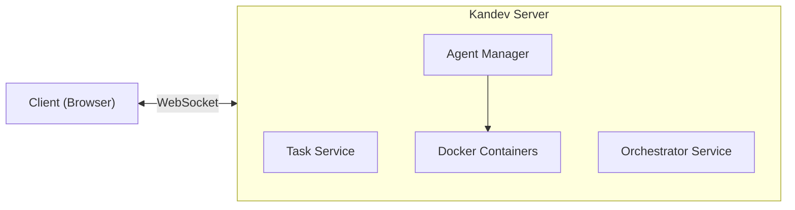

# Kandev WebSocket API Reference

This document provides a complete reference for all WebSocket API actions, their payloads, responses, and usage patterns.

## Overview

Kandev uses a **single WebSocket connection** for all API operations and real-time streaming. This eliminates the need for separate REST endpoints and enables full-duplex communication.

**Endpoint**: `ws://localhost:8080/ws`

### Message Envelope

All messages follow this JSON envelope format:

```json
{
  "id": "uuid",
  "type": "request|response|notification|error",
  "action": "action.name",
  "payload": {},
  "timestamp": "2026-01-10T12:00:00Z"
}
```

| Field | Type | Description |
|-------|------|-------------|
| `id` | string | UUID for request/response correlation. Omit for notifications. |
| `type` | string | Message type: `request`, `response`, `notification`, or `error` |
| `action` | string | The action to perform or that was performed |
| `payload` | object | Action-specific data |
| `timestamp` | string | ISO 8601 timestamp (optional) |

### Error Response Format

```json
{
  "id": "correlation-uuid",
  "type": "error",
  "action": "original.action",
  "payload": {
    "code": "ERROR_CODE",
    "message": "Human-readable message",
    "details": {}
  }
}
```

**Error Codes:**
- `BAD_REQUEST` - Invalid message format
- `VALIDATION_ERROR` - Missing or invalid fields
- `NOT_FOUND` - Resource not found
- `INTERNAL_ERROR` - Server error
- `UNKNOWN_ACTION` - Action not recognized

---

## System Flow



### Typical Workflow

1. **Connect** to `ws://localhost:8080/ws`
2. **Create Board** → `board.create`
3. **Create Column** → `column.create`
4. **Create Task** → `task.create`
5. **Subscribe to Task** → `task.subscribe` (receive real-time updates)
6. **Start Execution** → `orchestrator.start` (launches agent)
7. **Receive ACP Notifications** ← `acp.progress`, `acp.log`, etc.
8. **Send Follow-up Prompts** → `orchestrator.prompt` (multi-turn)
9. **Complete Task** → `orchestrator.complete`
10. **Unsubscribe** → `task.unsubscribe`

---

## Health Check

### `health.check`

**Purpose:** Verify the WebSocket connection and server status.

**Flow Position:** Can be called at any time to verify connectivity.

**Request:**
```json
{
  "id": "550e8400-e29b-41d4-a716-446655440000",
  "type": "request",
  "action": "health.check",
  "payload": {}
}
```

**Response:**
```json
{
  "id": "550e8400-e29b-41d4-a716-446655440000",
  "type": "response",
  "action": "health.check",
  "payload": {
    "status": "ok",
    "service": "kandev",
    "mode": "unified"
  }
}
```

| Response Field | Type | Description |
|---------------|------|-------------|
| `status` | string | Server health status (`ok`) |
| `service` | string | Service name |
| `mode` | string | API mode (`unified` = WebSocket-only) |

---

## Workspace Actions

Workspaces are the top-level organizational unit that contain boards and repositories.

### `workspace.list`

**Purpose:** List all workspaces.

**Request:**
```json
{
  "id": "uuid",
  "type": "request",
  "action": "workspace.list",
  "payload": {}
}
```

**Response:**
```json
{
  "id": "uuid",
  "type": "response",
  "action": "workspace.list",
  "payload": {
    "workspaces": [
      {
        "id": "workspace-uuid",
        "name": "My Project",
        "description": "Main development workspace",
        "owner_id": "user-uuid",
        "created_at": "2026-01-10T12:00:00Z",
        "updated_at": "2026-01-10T12:00:00Z"
      }
    ]
  }
}
```

### `workspace.create`

**Purpose:** Create a new workspace.

**Request:**
```json
{
  "id": "uuid",
  "type": "request",
  "action": "workspace.create",
  "payload": {
    "name": "My Project",
    "description": "Main development workspace",
    "owner_id": "user-uuid"
  }
}
```

| Payload Field | Type | Required | Description |
|--------------|------|----------|-------------|
| `name` | string | ✅ | Workspace name (max 255 chars) |
| `description` | string | ❌ | Workspace description |
| `owner_id` | string | ❌ | Owner user ID |

**Response:** Created workspace object

### `workspace.get`

**Purpose:** Get a workspace by ID.

**Request:**
```json
{
  "id": "uuid",
  "type": "request",
  "action": "workspace.get",
  "payload": {
    "id": "workspace-uuid"
  }
}
```

**Response:** Workspace object

### `workspace.update`

**Purpose:** Update a workspace.

**Request:**
```json
{
  "id": "uuid",
  "type": "request",
  "action": "workspace.update",
  "payload": {
    "id": "workspace-uuid",
    "name": "Updated Name",
    "description": "Updated description"
  }
}
```

| Payload Field | Type | Required | Description |
|--------------|------|----------|-------------|
| `id` | string | ✅ | Workspace ID |
| `name` | string | ❌ | New name |
| `description` | string | ❌ | New description |

**Response:** Updated workspace object

### `workspace.delete`

**Purpose:** Delete a workspace.

**Request:**
```json
{
  "id": "uuid",
  "type": "request",
  "action": "workspace.delete",
  "payload": {
    "id": "workspace-uuid"
  }
}
```

**Response:**
```json
{
  "id": "uuid",
  "type": "response",
  "action": "workspace.delete",
  "payload": {
    "deleted": true
  }
}
```

---

## Board Actions

Boards are containers within workspaces that organize columns and tasks.

### `board.create`

**Purpose:** Create a new Kanban board.

**Flow Position:** First step - create a board before adding columns and tasks.

**Request:**
```json
{
  "id": "uuid",
  "type": "request",
  "action": "board.create",
  "payload": {
    "name": "My Project",
    "description": "Project description"
  }
}
```

| Payload Field | Type | Required | Description |
|--------------|------|----------|-------------|
| `name` | string | ✅ | Board name |
| `description` | string | ❌ | Optional description |

**Response:**
```json
{
  "id": "uuid",
  "type": "response",
  "action": "board.create",
  "payload": {
    "id": "board-uuid",
    "name": "My Project",
    "description": "Project description",
    "created_at": "2026-01-10T12:00:00Z",
    "updated_at": "2026-01-10T12:00:00Z"
  }
}
```

### `board.list`

**Purpose:** List all boards.

**Flow Position:** Use to display available boards to the user.

**Request:**
```json
{
  "id": "uuid",
  "type": "request",
  "action": "board.list",
  "payload": {}
}
```

**Response:**
```json
{
  "id": "uuid",
  "type": "response",
  "action": "board.list",
  "payload": {
    "boards": [
      {
        "id": "board-uuid",
        "name": "My Project",
        "description": "...",
        "created_at": "2026-01-10T12:00:00Z",
        "updated_at": "2026-01-10T12:00:00Z"
      }
    ],
    "total": 1
  }
}
```

### `board.get`

**Purpose:** Get a specific board by ID.

**Flow Position:** Use to load board details before displaying columns and tasks.

**Request:**
```json
{
  "id": "uuid",
  "type": "request",
  "action": "board.get",
  "payload": {
    "id": "board-uuid"
  }
}
```

| Payload Field | Type | Required | Description |
|--------------|------|----------|-------------|
| `id` | string | ✅ | Board ID |

**Response:**
```json
{
  "id": "uuid",
  "type": "response",
  "action": "board.get",
  "payload": {
    "id": "board-uuid",
    "name": "My Project",
    "description": "Project description",
    "created_at": "2026-01-10T12:00:00Z",
    "updated_at": "2026-01-10T12:00:00Z"
  }
}
```

### `board.update`

**Purpose:** Update an existing board's properties.

**Flow Position:** Use when user edits board name or description.

**Request:**
```json
{
  "id": "uuid",
  "type": "request",
  "action": "board.update",
  "payload": {
    "id": "board-uuid",
    "name": "Updated Name",
    "description": "Updated description"
  }
}
```

| Payload Field | Type | Required | Description |
|--------------|------|----------|-------------|
| `id` | string | ✅ | Board ID |
| `name` | string | ❌ | New name (optional) |
| `description` | string | ❌ | New description (optional) |

**Response:** Same as `board.get`

### `board.delete`

**Purpose:** Delete a board and all its columns and tasks.

**Flow Position:** Use with caution - this is destructive.

**Request:**
```json
{
  "id": "uuid",
  "type": "request",
  "action": "board.delete",
  "payload": {
    "id": "board-uuid"
  }
}
```

| Payload Field | Type | Required | Description |
|--------------|------|----------|-------------|
| `id` | string | ✅ | Board ID |

**Response:**
```json
{
  "id": "uuid",
  "type": "response",
  "action": "board.delete",
  "payload": {
    "success": true
  }
}
```

---

## Column Actions

Columns organize tasks within a board and represent workflow states.

### `column.create`

**Purpose:** Create a new column in a board.

**Flow Position:** After creating a board, create columns for workflow stages.

**Request:**
```json
{
  "id": "uuid",
  "type": "request",
  "action": "column.create",
  "payload": {
    "board_id": "board-uuid",
    "name": "To Do",
    "position": 0,
    "state": "TODO"
  }
}
```

| Payload Field | Type | Required | Description |
|--------------|------|----------|-------------|
| `board_id` | string | ✅ | Parent board ID |
| `name` | string | ✅ | Column name |
| `position` | int | ❌ | Display order (0-indexed) |
| `state` | string | ❌ | Task state: `TODO`, `IN_PROGRESS`, `DONE` |

**Response:**
```json
{
  "id": "uuid",
  "type": "response",
  "action": "column.create",
  "payload": {
    "id": "column-uuid",
    "board_id": "board-uuid",
    "name": "To Do",
    "position": 0,
    "state": "TODO",
    "created_at": "2026-01-10T12:00:00Z"
  }
}
```

### `column.list`

**Purpose:** List all columns in a board.

**Flow Position:** After loading a board, get its columns.

**Request:**
```json
{
  "id": "uuid",
  "type": "request",
  "action": "column.list",
  "payload": {
    "board_id": "board-uuid"
  }
}
```

| Payload Field | Type | Required | Description |
|--------------|------|----------|-------------|
| `board_id` | string | ✅ | Board ID |

**Response:**
```json
{
  "id": "uuid",
  "type": "response",
  "action": "column.list",
  "payload": {
    "columns": [
      {
        "id": "column-uuid",
        "board_id": "board-uuid",
        "name": "To Do",
        "position": 0,
        "state": "TODO",
        "created_at": "2026-01-10T12:00:00Z"
      }
    ],
    "total": 1
  }
}
```

### `column.get`

**Purpose:** Get a specific column by ID.

**Request:**
```json
{
  "id": "uuid",
  "type": "request",
  "action": "column.get",
  "payload": {
    "id": "column-uuid"
  }
}
```

| Payload Field | Type | Required | Description |
|--------------|------|----------|-------------|
| `id` | string | ✅ | Column ID |

**Response:** Same structure as items in `column.list`

---

## Repository Actions

Repositories represent Git repositories linked to a workspace.

### `repository.list`

**Purpose:** List all repositories in a workspace.

**Request:**
```json
{
  "id": "uuid",
  "type": "request",
  "action": "repository.list",
  "payload": {
    "workspace_id": "workspace-uuid"
  }
}
```

**Response:**
```json
{
  "id": "uuid",
  "type": "response",
  "action": "repository.list",
  "payload": {
    "repositories": [
      {
        "id": "repo-uuid",
        "workspace_id": "workspace-uuid",
        "name": "my-project",
        "source_type": "local",
        "local_path": "/home/user/projects/my-project",
        "provider": "",
        "default_branch": "main",
        "created_at": "2026-01-10T12:00:00Z",
        "updated_at": "2026-01-10T12:00:00Z"
      }
    ]
  }
}
```

### `repository.create`

**Purpose:** Create a new repository link.

**Request:**
```json
{
  "id": "uuid",
  "type": "request",
  "action": "repository.create",
  "payload": {
    "workspace_id": "workspace-uuid",
    "name": "my-project",
    "source_type": "local",
    "local_path": "/home/user/projects/my-project",
    "default_branch": "main",
    "setup_script": "npm install",
    "cleanup_script": "npm run clean"
  }
}
```

| Payload Field | Type | Required | Description |
|--------------|------|----------|-------------|
| `workspace_id` | string | ✅ | Workspace ID |
| `name` | string | ✅ | Repository name |
| `source_type` | string | ❌ | `local` or `remote` |
| `local_path` | string | ❌ | Local filesystem path |
| `provider` | string | ❌ | Git provider (github, gitlab, etc.) |
| `provider_repo_id` | string | ❌ | Provider's repository ID |
| `provider_owner` | string | ❌ | Repository owner on provider |
| `provider_name` | string | ❌ | Repository name on provider |
| `default_branch` | string | ❌ | Default branch name |
| `setup_script` | string | ❌ | Script to run on setup |
| `cleanup_script` | string | ❌ | Script to run on cleanup |

**Response:** Created repository object

### `repository.get`

**Purpose:** Get a repository by ID.

**Request:**
```json
{
  "id": "uuid",
  "type": "request",
  "action": "repository.get",
  "payload": {
    "id": "repo-uuid"
  }
}
```

**Response:** Repository object

### `repository.update`

**Purpose:** Update a repository.

**Request:**
```json
{
  "id": "uuid",
  "type": "request",
  "action": "repository.update",
  "payload": {
    "id": "repo-uuid",
    "name": "updated-name",
    "default_branch": "develop"
  }
}
```

**Response:** Updated repository object

### `repository.delete`

**Purpose:** Delete a repository link.

**Request:**
```json
{
  "id": "uuid",
  "type": "request",
  "action": "repository.delete",
  "payload": {
    "id": "repo-uuid"
  }
}
```

**Response:**
```json
{
  "id": "uuid",
  "type": "response",
  "action": "repository.delete",
  "payload": {
    "deleted": true
  }
}
```

### `repository.script.list`

**Purpose:** List scripts for a repository.

**Request:**
```json
{
  "id": "uuid",
  "type": "request",
  "action": "repository.script.list",
  "payload": {
    "repository_id": "repo-uuid"
  }
}
```

**Response:**
```json
{
  "id": "uuid",
  "type": "response",
  "action": "repository.script.list",
  "payload": {
    "scripts": [
      {
        "id": "script-uuid",
        "repository_id": "repo-uuid",
        "name": "build",
        "command": "npm run build",
        "position": 0
      }
    ]
  }
}
```

### `repository.script.create`

**Purpose:** Create a repository script.

**Request:**
```json
{
  "id": "uuid",
  "type": "request",
  "action": "repository.script.create",
  "payload": {
    "repository_id": "repo-uuid",
    "name": "test",
    "command": "npm test",
    "position": 1
  }
}
```

| Payload Field | Type | Required | Description |
|--------------|------|----------|-------------|
| `repository_id` | string | ✅ | Repository ID |
| `name` | string | ✅ | Script name |
| `command` | string | ✅ | Command to execute |
| `position` | int | ❌ | Order position |

**Response:** Created script object

### `repository.script.get`

**Purpose:** Get a script by ID.

**Request:**
```json
{
  "id": "uuid",
  "type": "request",
  "action": "repository.script.get",
  "payload": {
    "id": "script-uuid"
  }
}
```

**Response:** Script object

### `repository.script.update`

**Purpose:** Update a script.

**Request:**
```json
{
  "id": "uuid",
  "type": "request",
  "action": "repository.script.update",
  "payload": {
    "id": "script-uuid",
    "name": "updated-name",
    "command": "npm run updated-command"
  }
}
```

**Response:** Updated script object

### `repository.script.delete`

**Purpose:** Delete a script.

**Request:**
```json
{
  "id": "uuid",
  "type": "request",
  "action": "repository.script.delete",
  "payload": {
    "id": "script-uuid"
  }
}
```

**Response:**
```json
{
  "id": "uuid",
  "type": "response",
  "action": "repository.script.delete",
  "payload": {
    "deleted": true
  }
}
```

---

## Task Actions

Tasks are work items that can be executed by AI agents.

### `task.create`

**Purpose:** Create a new task in a column.

**Flow Position:** Create tasks that agents will work on.

**Request:**
```json
{
  "id": "uuid",
  "type": "request",
  "action": "task.create",
  "payload": {
    "board_id": "board-uuid",
    "column_id": "column-uuid",
    "title": "Implement feature X",
    "description": "Detailed requirements...",
    "priority": 1,
    "agent_type": "auggie",
    "repository_url": "https://github.com/org/repo",
    "branch": "main",
    "metadata": {
      "labels": ["feature", "priority-high"]
    }
  }
}
```

| Payload Field | Type | Required | Description |
|--------------|------|----------|-------------|
| `board_id` | string | ✅ | Board ID |
| `column_id` | string | ✅ | Column ID |
| `title` | string | ✅ | Task title |
| `description` | string | ❌ | Detailed description |
| `priority` | int | ❌ | Priority level (higher = more important) |
| `agent_type` | string | ❌ | Agent to use: `auggie`, `gemini` |
| `repository_url` | string | ❌ | Git repository URL |
| `branch` | string | ❌ | Git branch |
| `metadata` | object | ❌ | Custom key-value data |

**Response:**
```json
{
  "id": "uuid",
  "type": "response",
  "action": "task.create",
  "payload": {
    "id": "task-uuid",
    "board_id": "board-uuid",
    "column_id": "column-uuid",
    "title": "Implement feature X",
    "description": "Detailed requirements...",
    "state": "TODO",
    "priority": 1,
    "agent_type": "auggie",
    "repository_url": "https://github.com/org/repo",
    "branch": "main",
    "position": 0,
    "created_at": "2026-01-10T12:00:00Z",
    "updated_at": "2026-01-10T12:00:00Z",
    "metadata": {}
  }
}
```

| Response Field | Type | Description |
|---------------|------|-------------|
| `id` | string | Unique task ID |
| `state` | string | `TODO`, `IN_PROGRESS`, `BLOCKED`, `COMPLETED`, `FAILED`, `CANCELLED` |
| `position` | int | Position within column |

### `task.list`

**Purpose:** List all tasks in a board.

**Flow Position:** Load tasks to display on the Kanban board.

**Request:**
```json
{
  "id": "uuid",
  "type": "request",
  "action": "task.list",
  "payload": {
    "board_id": "board-uuid"
  }
}
```

| Payload Field | Type | Required | Description |
|--------------|------|----------|-------------|
| `board_id` | string | ✅ | Board ID |

**Response:**
```json
{
  "id": "uuid",
  "type": "response",
  "action": "task.list",
  "payload": {
    "tasks": [ /* array of task objects */ ],
    "total": 5
  }
}
```

### `task.get`

**Purpose:** Get a specific task by ID.

**Request:**
```json
{
  "id": "uuid",
  "type": "request",
  "action": "task.get",
  "payload": {
    "id": "task-uuid"
  }
}
```

| Payload Field | Type | Required | Description |
|--------------|------|----------|-------------|
| `id` | string | ✅ | Task ID |

**Response:** Same structure as `task.create` response

### `task.update`

**Purpose:** Update task properties (not state or position).

**Request:**
```json
{
  "id": "uuid",
  "type": "request",
  "action": "task.update",
  "payload": {
    "id": "task-uuid",
    "title": "Updated title",
    "description": "Updated description",
    "priority": 2,
    "metadata": { "key": "value" }
  }
}
```

| Payload Field | Type | Required | Description |
|--------------|------|----------|-------------|
| `id` | string | ✅ | Task ID |
| `title` | string | ❌ | New title |
| `description` | string | ❌ | New description |
| `priority` | int | ❌ | New priority |
| `metadata` | object | ❌ | Updated metadata |

**Response:** Updated task object

### `task.delete`

**Purpose:** Delete a task.

**Request:**
```json
{
  "id": "uuid",
  "type": "request",
  "action": "task.delete",
  "payload": {
    "id": "task-uuid"
  }
}
```

**Response:**
```json
{
  "id": "uuid",
  "type": "response",
  "action": "task.delete",
  "payload": {
    "success": true
  }
}
```

### `task.move`

**Purpose:** Move a task to a different column and/or position.

**Flow Position:** Use for drag-and-drop on Kanban board.

**Request:**
```json
{
  "id": "uuid",
  "type": "request",
  "action": "task.move",
  "payload": {
    "id": "task-uuid",
    "column_id": "target-column-uuid",
    "position": 0
  }
}
```

| Payload Field | Type | Required | Description |
|--------------|------|----------|-------------|
| `id` | string | ✅ | Task ID |
| `column_id` | string | ✅ | Target column ID |
| `position` | int | ❌ | Position in column (0-indexed) |

**Response:** Updated task object with new `column_id` and `position`

### `task.state`

**Purpose:** Update a task's state directly.

**Flow Position:** Used by orchestrator to update task state during execution.

**Request:**
```json
{
  "id": "uuid",
  "type": "request",
  "action": "task.state",
  "payload": {
    "id": "task-uuid",
    "state": "IN_PROGRESS"
  }
}
```

| Payload Field | Type | Required | Description |
|--------------|------|----------|-------------|
| `id` | string | ✅ | Task ID |
| `state` | string | ✅ | New state: `CREATED`, `SCHEDULING`, `TODO`, `IN_PROGRESS`, `REVIEW`, `BLOCKED`, `WAITING_FOR_INPUT`, `COMPLETED`, `FAILED`, `CANCELLED` |

**Response:** Updated task object


---

## Task Subscription Actions

Subscriptions enable real-time streaming of agent output (ACP) to specific clients.

### `task.subscribe`

**Purpose:** Subscribe to receive real-time notifications for a specific task.

**Flow Position:** Call before `orchestrator.start` to receive agent output.

**Request:**
```json
{
  "id": "uuid",
  "type": "request",
  "action": "task.subscribe",
  "payload": {
    "task_id": "task-uuid"
  }
}
```

| Payload Field | Type | Required | Description |
|--------------|------|----------|-------------|
| `task_id` | string | ✅ | Task ID to subscribe to |

**Response:**
```json
{
  "id": "uuid",
  "type": "response",
  "action": "task.subscribe",
  "payload": {
    "success": true,
    "task_id": "task-uuid"
  }
}
```

**Effect:** After subscribing, you will receive notifications for this task:
- `acp.progress` - Progress updates
- `acp.log` - Agent log messages
- `acp.result` - Agent results
- `acp.error` - Agent errors
- `task.created` - Task created
- `task.updated` - Task properties changed
- `task.deleted` - Task deleted
- `task.state_changed` - Task state changed

### `task.unsubscribe`

**Purpose:** Stop receiving notifications for a task.

**Flow Position:** Call after task completes or when navigating away.

**Request:**
```json
{
  "id": "uuid",
  "type": "request",
  "action": "task.unsubscribe",
  "payload": {
    "task_id": "task-uuid"
  }
}
```

| Payload Field | Type | Required | Description |
|--------------|------|----------|-------------|
| `task_id` | string | ✅ | Task ID to unsubscribe from |

**Response:**
```json
{
  "id": "uuid",
  "type": "response",
  "action": "task.unsubscribe",
  "payload": {
    "success": true,
    "task_id": "task-uuid"
  }
}
```

---

## Comment Actions

Comments enable conversation between users and agents on tasks.

### `comment.add`

**Purpose:** Add a comment to a task. If an agent is running on the task, the comment is automatically forwarded as a prompt.

**Request:**
```json
{
  "id": "uuid",
  "type": "request",
  "action": "comment.add",
  "payload": {
    "task_id": "task-uuid",
    "content": "Please also add unit tests for the new function",
    "author_id": "user-uuid"
  }
}
```

| Payload Field | Type | Required | Description |
|--------------|------|----------|-------------|
| `task_id` | string | ✅ | Task ID |
| `content` | string | ✅ | Comment text |
| `author_id` | string | ❌ | Author user ID |

**Response:**
```json
{
  "id": "uuid",
  "type": "response",
  "action": "comment.add",
  "payload": {
    "id": "comment-uuid",
    "task_id": "task-uuid",
    "author_type": "user",
    "author_id": "user-uuid",
    "content": "Please also add unit tests for the new function",
    "requests_input": false,
    "created_at": "2026-01-10T12:00:00Z"
  }
}
```

### `comment.list`

**Purpose:** List all comments for a task.

**Request:**
```json
{
  "id": "uuid",
  "type": "request",
  "action": "comment.list",
  "payload": {
    "task_id": "task-uuid"
  }
}
```

**Response:**
```json
{
  "id": "uuid",
  "type": "response",
  "action": "comment.list",
  "payload": {
    "comments": [
      {
        "id": "comment-uuid-1",
        "task_id": "task-uuid",
        "author_type": "user",
        "author_id": "user-uuid",
        "content": "Please implement the login feature",
        "requests_input": false,
        "created_at": "2026-01-10T12:00:00Z"
      },
      {
        "id": "comment-uuid-2",
        "task_id": "task-uuid",
        "author_type": "agent",
        "author_id": "agent-instance-uuid",
        "content": "I've implemented the login feature. Should I also add password reset?",
        "requests_input": true,
        "created_at": "2026-01-10T12:05:00Z"
      }
    ]
  }
}
```

| Response Field | Type | Description |
|---------------|------|-------------|
| `author_type` | string | `user` or `agent` |
| `requests_input` | boolean | True if agent is asking for user input |

---

## Agent Actions

Agents are Docker containers running AI coding assistants.

### `agent.list`

**Purpose:** List all agent instances (running and completed).

**Request:**
```json
{
  "id": "uuid",
  "type": "request",
  "action": "agent.list",
  "payload": {}
}
```

**Response:**
```json
{
  "id": "uuid",
  "type": "response",
  "action": "agent.list",
  "payload": {
    "agents": [
      {
        "id": "agent-uuid",
        "task_id": "task-uuid",
        "agent_type": "auggie",
        "container_id": "docker-container-id",
        "status": "running",
        "progress": 45,
        "started_at": "2026-01-10T12:00:00Z",
        "finished_at": null,
        "exit_code": null,
        "error": null
      }
    ],
    "total": 1
  }
}
```

| Response Field | Type | Description |
|---------------|------|-------------|
| `status` | string | `starting`, `running`, `completed`, `failed`, `stopped`, `READY` |
| `progress` | int | 0-100 percentage |
| `exit_code` | int | Container exit code (when completed) |
| `error` | string | Error message (if failed) |

### `agent.launch`

**Purpose:** Launch an agent container directly (low-level).

**Flow Position:** Typically use `orchestrator.start` instead, which handles this automatically.

**Request:**
```json
{
  "id": "uuid",
  "type": "request",
  "action": "agent.launch",
  "payload": {
    "task_id": "task-uuid",
    "agent_type": "auggie",
    "workspace_path": "/path/to/workspace",
    "env": {
      "CUSTOM_VAR": "value"
    }
  }
}
```

| Payload Field | Type | Required | Description |
|--------------|------|----------|-------------|
| `task_id` | string | ✅ | Task ID this agent is for |
| `agent_type` | string | ✅ | Agent type: `auggie`, `gemini` |
| `workspace_path` | string | ✅ | Path to mount in container |
| `env` | object | ❌ | Additional environment variables |

**Response:**
```json
{
  "id": "uuid",
  "type": "response",
  "action": "agent.launch",
  "payload": {
    "success": true,
    "agent_id": "agent-uuid",
    "task_id": "task-uuid"
  }
}
```

### `agent.status`

**Purpose:** Get detailed status of a specific agent.

**Request:**
```json
{
  "id": "uuid",
  "type": "request",
  "action": "agent.status",
  "payload": {
    "agent_id": "agent-uuid"
  }
}
```

| Payload Field | Type | Required | Description |
|--------------|------|----------|-------------|
| `agent_id` | string | ✅ | Agent instance ID |

**Response:**
```json
{
  "id": "uuid",
  "type": "response",
  "action": "agent.status",
  "payload": {
    "id": "agent-uuid",
    "task_id": "task-uuid",
    "agent_type": "auggie",
    "container_id": "docker-container-id",
    "status": "running",
    "progress": 67,
    "started_at": "2026-01-10T12:00:00Z",
    "finished_at": null,
    "exit_code": null,
    "error": null
  }
}
```

### `agent.logs`

**Purpose:** Get agent container logs.

**Request:**
```json
{
  "id": "uuid",
  "type": "request",
  "action": "agent.logs",
  "payload": {
    "agent_id": "agent-uuid"
  }
}
```

| Payload Field | Type | Required | Description |
|--------------|------|----------|-------------|
| `agent_id` | string | ✅ | Agent instance ID |

**Response:**
```json
{
  "id": "uuid",
  "type": "response",
  "action": "agent.logs",
  "payload": {
    "agent_id": "agent-uuid",
    "logs": ["log line 1", "log line 2"],
    "message": "..."
  }
}
```

### `agent.stop`

**Purpose:** Stop a running agent container.

**Request:**
```json
{
  "id": "uuid",
  "type": "request",
  "action": "agent.stop",
  "payload": {
    "agent_id": "agent-uuid"
  }
}
```

| Payload Field | Type | Required | Description |
|--------------|------|----------|-------------|
| `agent_id` | string | ✅ | Agent instance ID |

**Response:**
```json
{
  "id": "uuid",
  "type": "response",
  "action": "agent.stop",
  "payload": {
    "success": true
  }
}
```

### `agent.types`

**Purpose:** List available agent types.

**Request:**
```json
{
  "id": "uuid",
  "type": "request",
  "action": "agent.types",
  "payload": {}
}
```

**Response:**
```json
{
  "id": "uuid",
  "type": "response",
  "action": "agent.types",
  "payload": {
    "types": [
      {
        "id": "auggie",
        "name": "Auggie CLI Agent",
        "description": "Augment Code CLI-based coding agent",
        "image": "ghcr.io/kandev/auggie-agent:latest",
        "capabilities": ["code-generation", "refactoring", "testing"],
        "enabled": true
      },
      {
        "id": "gemini",
        "name": "Gemini Agent",
        "description": "Google Gemini-based coding agent",
        "image": "ghcr.io/kandev/gemini-agent:latest",
        "capabilities": ["code-generation", "analysis"],
        "enabled": true
      }
    ],
    "total": 2
  }
}
```

---

## Orchestrator Actions

The orchestrator coordinates task execution, managing the workflow between tasks and agents.

### `orchestrator.status`

**Purpose:** Get overall orchestrator status.

**Request:**
```json
{
  "id": "uuid",
  "type": "request",
  "action": "orchestrator.status",
  "payload": {}
}
```

**Response:**
```json
{
  "id": "uuid",
  "type": "response",
  "action": "orchestrator.status",
  "payload": {
    "running": true,
    "active_tasks": 2,
    "queued_tasks": 5,
    "max_concurrent": 3
  }
}
```

### `orchestrator.queue`

**Purpose:** Get the current task queue.

**Request:**
```json
{
  "id": "uuid",
  "type": "request",
  "action": "orchestrator.queue",
  "payload": {}
}
```

**Response:**
```json
{
  "id": "uuid",
  "type": "response",
  "action": "orchestrator.queue",
  "payload": {
    "tasks": [
      {
        "task_id": "task-uuid",
        "priority": 1,
        "queued_at": "2026-01-10T12:00:00Z"
      }
    ],
    "total": 1
  }
}
```

### `orchestrator.trigger`

**Purpose:** Trigger a task for execution (adds to queue).

**Request:**
```json
{
  "id": "uuid",
  "type": "request",
  "action": "orchestrator.trigger",
  "payload": {
    "task_id": "task-uuid"
  }
}
```

| Payload Field | Type | Required | Description |
|--------------|------|----------|-------------|
| `task_id` | string | ✅ | Task ID to trigger |

**Response:**
```json
{
  "id": "uuid",
  "type": "response",
  "action": "orchestrator.trigger",
  "payload": {
    "success": true,
    "message": "Task triggered",
    "task_id": "task-uuid"
  }
}
```

### `orchestrator.start`

**Purpose:** Start executing a task immediately with an agent.

**Flow Position:** Main action to begin agent work on a task.

**Request:**
```json
{
  "id": "uuid",
  "type": "request",
  "action": "orchestrator.start",
  "payload": {
    "task_id": "task-uuid",
    "agent_type": "auggie",
    "priority": 1
  }
}
```

| Payload Field | Type | Required | Description |
|--------------|------|----------|-------------|
| `task_id` | string | ✅ | Task ID to start |
| `agent_type` | string | ❌ | Override default agent type |
| `priority` | int | ❌ | Execution priority |

**Response:**
```json
{
  "id": "uuid",
  "type": "response",
  "action": "orchestrator.start",
  "payload": {
    "success": true,
    "task_id": "task-uuid",
    "agent_instance_id": "agent-uuid",
    "status": "running"
  }
}
```

**Effect:**
1. Task state changes to `IN_PROGRESS`
2. Agent container is launched
3. ACP notifications begin streaming (if subscribed)

### `orchestrator.stop`

**Purpose:** Stop a running task execution.

**Request:**
```json
{
  "id": "uuid",
  "type": "request",
  "action": "orchestrator.stop",
  "payload": {
    "task_id": "task-uuid",
    "reason": "User cancelled",
    "force": false
  }
}
```

| Payload Field | Type | Required | Description |
|--------------|------|----------|-------------|
| `task_id` | string | ✅ | Task ID to stop |
| `reason` | string | ❌ | Reason for stopping |
| `force` | bool | ❌ | Force kill (default: false) |

**Response:**
```json
{
  "id": "uuid",
  "type": "response",
  "action": "orchestrator.stop",
  "payload": {
    "success": true
  }
}
```

### `orchestrator.prompt`

**Purpose:** Send a follow-up prompt to a running agent (multi-turn conversation).

**Flow Position:** Use during agent execution for clarifications or additional instructions.

**Request:**
```json
{
  "id": "uuid",
  "type": "request",
  "action": "orchestrator.prompt",
  "payload": {
    "task_id": "task-uuid",
    "prompt": "Also add unit tests for the new function"
  }
}
```

| Payload Field | Type | Required | Description |
|--------------|------|----------|-------------|
| `task_id` | string | ✅ | Task ID (must have running agent) |
| `prompt` | string | ✅ | Follow-up prompt text |

**Response:**
```json
{
  "id": "uuid",
  "type": "response",
  "action": "orchestrator.prompt",
  "payload": {
    "success": true
  }
}
```

**Effect:** The prompt is sent to the agent via `agentctl` HTTP sidecar.

### `orchestrator.complete`

**Purpose:** Mark a task as completed.

**Flow Position:** Called when agent finishes successfully or user approves the work.

**Request:**
```json
{
  "id": "uuid",
  "type": "request",
  "action": "orchestrator.complete",
  "payload": {
    "task_id": "task-uuid"
  }
}
```

| Payload Field | Type | Required | Description |
|--------------|------|----------|-------------|
| `task_id` | string | ✅ | Task ID to complete |

**Response:**
```json
{
  "id": "uuid",
  "type": "response",
  "action": "orchestrator.complete",
  "payload": {
    "success": true,
    "message": "task completed"
  }
}
```

---

## Permission Actions

Agents may request user permission for certain operations. The permission flow uses notifications and responses.

### `permission.requested` (Notification)

**Purpose:** Server notifies client that an agent is requesting permission.

**When:** Agent calls a tool that requires user approval.

```json
{
  "type": "notification",
  "action": "permission.requested",
  "payload": {
    "task_id": "task-uuid",
    "pending_id": "pending-request-uuid",
    "instance_id": "agent-instance-uuid",
    "session_id": "acp-session-uuid",
    "tool_call_id": "tool-call-uuid",
    "title": "Execute shell command",
    "description": "Agent wants to run: npm install express",
    "options": [
      {
        "option_id": "allow-once",
        "name": "Allow Once",
        "kind": "allow_once"
      },
      {
        "option_id": "allow-always",
        "name": "Always Allow",
        "kind": "allow_always"
      },
      {
        "option_id": "reject-once",
        "name": "Deny",
        "kind": "reject_once"
      }
    ],
    "created_at": "2026-01-10T12:00:00Z"
  },
  "timestamp": "2026-01-10T12:00:00Z"
}
```

| Payload Field | Type | Description |
|--------------|------|-------------|
| `task_id` | string | Task the agent is working on |
| `pending_id` | string | Unique ID for this pending request |
| `instance_id` | string | Agent instance ID |
| `session_id` | string | ACP session ID |
| `tool_call_id` | string | Tool call requesting permission |
| `title` | string | Human-readable title |
| `description` | string | Additional context |
| `options` | array | Available permission choices |

**Option Kinds:**
- `allow_once` - Allow this specific action
- `allow_always` - Allow this type of action permanently
- `reject_once` - Deny this specific action
- `reject_always` - Deny this type of action permanently

### `permission.respond`

**Purpose:** User responds to a permission request.

**Request:**
```json
{
  "id": "uuid",
  "type": "request",
  "action": "permission.respond",
  "payload": {
    "task_id": "task-uuid",
    "pending_id": "pending-request-uuid",
    "option_id": "allow-once"
  }
}
```

| Payload Field | Type | Required | Description |
|--------------|------|----------|-------------|
| `task_id` | string | ✅ | Task ID |
| `pending_id` | string | ✅ | Pending request ID from notification |
| `option_id` | string | ❌ | Selected option ID (required if not cancelled) |
| `cancelled` | boolean | ❌ | True to cancel the request |

**Response:**
```json
{
  "id": "uuid",
  "type": "response",
  "action": "permission.respond",
  "payload": {
    "success": true
  }
}
```

**Error Response (no pending request):**
```json
{
  "id": "uuid",
  "type": "error",
  "action": "permission.respond",
  "payload": {
    "code": "NOT_FOUND",
    "message": "No pending permission request for this task"
  }
}
```

---

## Server Notifications (ACP Streaming)

These are push notifications from the server to subscribed clients. They have `type: "notification"` and no `id` field.

### `acp.progress`

**Purpose:** Agent progress update.

**When:** Periodically during agent execution.

```json
{
  "type": "notification",
  "action": "acp.progress",
  "payload": {
    "task_id": "task-uuid",
    "agent_id": "agent-uuid",
    "progress": 45,
    "message": "Analyzing code structure...",
    "current_file": "src/main.go",
    "files_processed": 12,
    "total_files": 27
  },
  "timestamp": "2026-01-10T12:05:00Z"
}
```

### `acp.log`

**Purpose:** Agent log message (debug, info, warn, error).

**When:** As agent produces output.

```json
{
  "type": "notification",
  "action": "acp.log",
  "payload": {
    "task_id": "task-uuid",
    "agent_id": "agent-uuid",
    "level": "info",
    "message": "Starting code generation for feature X",
    "metadata": {
      "component": "code-generator"
    }
  },
  "timestamp": "2026-01-10T12:05:30Z"
}
```

| Payload Field | Type | Description |
|--------------|------|-------------|
| `level` | string | `debug`, `info`, `warn`, `error` |

### `acp.result`

**Purpose:** Agent produced a result artifact.

**When:** Agent completes a unit of work.

```json
{
  "type": "notification",
  "action": "acp.result",
  "payload": {
    "task_id": "task-uuid",
    "agent_id": "agent-uuid",
    "status": "success",
    "summary": "Created 3 new files",
    "artifacts": [
      { "type": "file", "path": "src/feature.go" },
      { "type": "file", "path": "src/feature_test.go" }
    ]
  },
  "timestamp": "2026-01-10T12:10:00Z"
}
```

### `acp.error`

**Purpose:** Agent encountered an error.

**When:** Error during agent execution.

```json
{
  "type": "notification",
  "action": "acp.error",
  "payload": {
    "task_id": "task-uuid",
    "agent_id": "agent-uuid",
    "code": "COMPILE_ERROR",
    "message": "Failed to compile: syntax error",
    "details": {
      "file": "src/main.go",
      "line": 42
    }
  },
  "timestamp": "2026-01-10T12:06:00Z"
}
```

### `acp.status`

**Purpose:** Agent status changed.

**When:** Agent starts, completes, or fails.

```json
{
  "type": "notification",
  "action": "acp.status",
  "payload": {
    "task_id": "task-uuid",
    "agent_id": "agent-uuid",
    "status": "completed",
    "previous_status": "running",
    "exit_code": 0
  },
  "timestamp": "2026-01-10T12:15:00Z"
}
```

### `acp.heartbeat`

**Purpose:** Keep-alive signal from agent.

**When:** Periodically while agent is running (prevents timeout).

```json
{
  "type": "notification",
  "action": "acp.heartbeat",
  "payload": {
    "task_id": "task-uuid",
    "agent_id": "agent-uuid"
  },
  "timestamp": "2026-01-10T12:05:00Z"
}
```

### `comment.added`

**Purpose:** New comment added to a task.

**When:** User or agent adds a comment.

```json
{
  "type": "notification",
  "action": "comment.added",
  "payload": {
    "task_id": "task-uuid",
    "comment_id": "comment-uuid",
    "author_type": "agent",
    "author_id": "agent-instance-uuid",
    "content": "I've completed the implementation. Would you like me to add tests?",
    "requests_input": true,
    "created_at": "2026-01-10T12:05:00Z"
  },
  "timestamp": "2026-01-10T12:05:00Z"
}
```

| Payload Field | Type | Description |
|--------------|------|-------------|
| `author_type` | string | `user` or `agent` |
| `requests_input` | boolean | True if agent is asking for user input |

### `task.updated`

**Purpose:** Task properties changed.

**When:** Task state, title, or other properties change.

```json
{
  "type": "notification",
  "action": "task.updated",
  "payload": {
    "task_id": "task-uuid",
    "board_id": "board-uuid",
    "column_id": "column-uuid",
    "title": "Implement user authentication",
    "description": "Add JWT validation and refresh tokens",
    "state": "IN_PROGRESS",
    "priority": 2,
    "position": 1,
    "created_at": "2026-01-10T12:00:00Z",
    "updated_at": "2026-01-10T12:05:00Z"
  },
  "timestamp": "2026-01-10T12:00:05Z"
}
```

### `task.created`

**Purpose:** Task created.

```json
{
  "type": "notification",
  "action": "task.created",
  "payload": {
    "task_id": "task-uuid",
    "board_id": "board-uuid",
    "column_id": "column-uuid",
    "title": "Implement user authentication",
    "description": "Add JWT validation and refresh tokens",
    "state": "CREATED",
    "priority": 2,
    "position": 0,
    "created_at": "2026-01-10T12:00:00Z",
    "updated_at": "2026-01-10T12:00:00Z"
  },
  "timestamp": "2026-01-10T12:00:00Z"
}
```

### `task.deleted`

**Purpose:** Task deleted.

```json
{
  "type": "notification",
  "action": "task.deleted",
  "payload": {
    "task_id": "task-uuid",
    "board_id": "board-uuid",
    "column_id": "column-uuid",
    "title": "Implement user authentication"
  },
  "timestamp": "2026-01-10T12:30:00Z"
}
```

### `task.state_changed`

**Purpose:** Task state changed.

```json
{
  "type": "notification",
  "action": "task.state_changed",
  "payload": {
    "task_id": "task-uuid",
    "board_id": "board-uuid",
    "column_id": "column-uuid",
    "title": "Implement user authentication",
    "state": "IN_PROGRESS",
    "old_state": "TODO",
    "new_state": "IN_PROGRESS",
    "updated_at": "2026-01-10T12:10:00Z"
  },
  "timestamp": "2026-01-10T12:10:00Z"
}
```

### `workspace.created` / `workspace.updated` / `workspace.deleted`

**Purpose:** Workspace lifecycle notifications.

```json
{
  "type": "notification",
  "action": "workspace.updated",
  "payload": {
    "id": "workspace-uuid",
    "name": "Kandev",
    "description": "Primary workspace",
    "owner_id": "user-uuid",
    "created_at": "2026-01-10T12:00:00Z",
    "updated_at": "2026-01-10T12:20:00Z"
  },
  "timestamp": "2026-01-10T12:20:00Z"
}
```

### `board.created` / `board.updated` / `board.deleted`

**Purpose:** Board lifecycle notifications.

```json
{
  "type": "notification",
  "action": "board.updated",
  "payload": {
    "id": "board-uuid",
    "workspace_id": "workspace-uuid",
    "name": "Dev",
    "description": "Default board",
    "created_at": "2026-01-10T12:00:00Z",
    "updated_at": "2026-01-10T12:25:00Z"
  },
  "timestamp": "2026-01-10T12:25:00Z"
}
```

### `column.created` / `column.updated` / `column.deleted`

**Purpose:** Column lifecycle notifications.

```json
{
  "type": "notification",
  "action": "column.updated",
  "payload": {
    "id": "column-uuid",
    "board_id": "board-uuid",
    "name": "In Progress",
    "position": 1,
    "state": "IN_PROGRESS",
    "color": "bg-blue-500",
    "created_at": "2026-01-10T12:00:00Z",
    "updated_at": "2026-01-10T12:30:00Z"
  },
  "timestamp": "2026-01-10T12:30:00Z"
}
```

### `repository.created` / `repository.updated` / `repository.deleted`

**Purpose:** Repository lifecycle notifications.

```json
{
  "type": "notification",
  "action": "repository.updated",
  "payload": {
    "id": "repo-uuid",
    "workspace_id": "workspace-uuid",
    "name": "kandev",
    "source_type": "local",
    "local_path": "/Users/cfl/Projects/kandev",
    "provider": "",
    "default_branch": "main",
    "updated_at": "2026-01-10T12:40:00Z"
  },
  "timestamp": "2026-01-10T12:40:00Z"
}
```

### `repository.script.created` / `repository.script.updated` / `repository.script.deleted`

**Purpose:** Repository script lifecycle notifications.

```json
{
  "type": "notification",
  "action": "repository.script.updated",
  "payload": {
    "id": "script-uuid",
    "repository_id": "repo-uuid",
    "name": "Setup",
    "command": "npm install",
    "position": 0,
    "updated_at": "2026-01-10T12:45:00Z"
  },
  "timestamp": "2026-01-10T12:45:00Z"
}
```

### `agent.updated`

**Purpose:** Agent status changed.

**When:** Agent starts, stops, or changes state.

```json
{
  "type": "notification",
  "action": "agent.updated",
  "payload": {
    "id": "agent-uuid",
    "task_id": "task-uuid",
    "status": "running",
    "progress": 0
  },
  "timestamp": "2026-01-10T12:00:03Z"
}
```

---

## Complete Usage Example

```javascript
const ws = new WebSocket('ws://localhost:8080/ws');
const pending = new Map();

// Handle incoming messages
ws.onmessage = (event) => {
  const msg = JSON.parse(event.data);

  if (msg.type === 'response' || msg.type === 'error') {
    // Resolve pending request
    const resolve = pending.get(msg.id);
    if (resolve) {
      pending.delete(msg.id);
      resolve(msg);
    }
  } else if (msg.type === 'notification') {
    // Handle real-time updates
    console.log(`[${msg.action}]`, msg.payload);
  }
};

// Helper to send requests
function request(action, payload) {
  return new Promise((resolve) => {
    const id = crypto.randomUUID();
    pending.set(id, resolve);
    ws.send(JSON.stringify({ id, type: 'request', action, payload }));
  });
}

// Full workflow example
async function runTask() {
  // 1. Create board
  const board = await request('board.create', { name: 'My Project' });

  // 2. Create column
  const column = await request('column.create', {
    board_id: board.payload.id,
    name: 'To Do',
    state: 'TODO'
  });

  // 3. Create task
  const task = await request('task.create', {
    board_id: board.payload.id,
    column_id: column.payload.id,
    title: 'Implement user authentication',
    agent_type: 'auggie'
  });

  // 4. Subscribe to updates
  await request('task.subscribe', { task_id: task.payload.id });

  // 5. Start execution
  await request('orchestrator.start', { task_id: task.payload.id });

  // 6. ACP notifications will now stream automatically...

  // 7. Send follow-up prompt (optional)
  await request('orchestrator.prompt', {
    task_id: task.payload.id,
    prompt: 'Also add JWT token validation'
  });

  // 8. When done, complete the task
  await request('orchestrator.complete', { task_id: task.payload.id });

  // 9. Unsubscribe
  await request('task.unsubscribe', { task_id: task.payload.id });
}
```

---

## Quick Reference

### Request Actions

| Action | Purpose |
|--------|---------|
| `health.check` | Server health status |
| **Workspace** | |
| `workspace.list` | List all workspaces |
| `workspace.create` | Create workspace |
| `workspace.get` | Get workspace by ID |
| `workspace.update` | Update workspace |
| `workspace.delete` | Delete workspace |
| **Board** | |
| `board.create` | Create board |
| `board.list` | List all boards |
| `board.get` | Get board by ID |
| `board.update` | Update board |
| `board.delete` | Delete board |
| **Column** | |
| `column.create` | Create column |
| `column.list` | List columns in board |
| `column.get` | Get column by ID |
| `column.update` | Update column |
| `column.delete` | Delete column |
| **Repository** | |
| `repository.list` | List repositories in workspace |
| `repository.create` | Create repository link |
| `repository.get` | Get repository by ID |
| `repository.update` | Update repository |
| `repository.delete` | Delete repository |
| `repository.script.list` | List repository scripts |
| `repository.script.create` | Create script |
| `repository.script.get` | Get script by ID |
| `repository.script.update` | Update script |
| `repository.script.delete` | Delete script |
| **Task** | |
| `task.create` | Create task |
| `task.list` | List tasks in board |
| `task.get` | Get task by ID |
| `task.update` | Update task properties |
| `task.delete` | Delete task |
| `task.move` | Move task to column/position |
| `task.state` | Change task state |
| `task.subscribe` | Subscribe to task notifications |
| `task.unsubscribe` | Unsubscribe from task |
| **Comment** | |
| `comment.add` | Add comment to task |
| `comment.list` | List comments for task |
| **Agent** | |
| `agent.list` | List agent instances |
| `agent.launch` | Launch agent (low-level) |
| `agent.status` | Get agent status |
| `agent.logs` | Get agent logs |
| `agent.stop` | Stop agent |
| `agent.types` | List available agent types |
| **Orchestrator** | |
| `orchestrator.status` | Get orchestrator status |
| `orchestrator.queue` | Get task queue |
| `orchestrator.trigger` | Queue task for execution |
| `orchestrator.start` | Start task execution |
| `orchestrator.stop` | Stop task execution |
| `orchestrator.prompt` | Send follow-up prompt |
| `orchestrator.complete` | Complete task |
| **Permission** | |
| `permission.respond` | Respond to permission request |

### Notification Actions (Server → Client)

| Action | Purpose |
|--------|---------|
| `acp.progress` | Agent progress update |
| `acp.log` | Agent log message |
| `acp.result` | Agent result artifact |
| `acp.error` | Agent error |
| `acp.status` | Agent status change |
| `acp.heartbeat` | Keep-alive heartbeat |
| `permission.requested` | Agent requesting permission |
| `comment.added` | New comment on task |
| `task.updated` | Task was updated |
| `task.created` | Task was created |
| `task.deleted` | Task was deleted |
| `workspace.created` | Workspace was created |
| `workspace.updated` | Workspace was updated |
| `workspace.deleted` | Workspace was deleted |
| `board.created` | Board was created |
| `board.updated` | Board was updated |
| `board.deleted` | Board was deleted |
| `column.created` | Column was created |
| `column.updated` | Column was updated |
| `column.deleted` | Column was deleted |
