# MCP Server Migration: Backend → agentctl

This document describes the architectural change to move the MCP server from the Kandev backend to agentctl, enabling remote agents to access MCP tools.

## Problem Statement

Currently, the MCP server runs embedded in the Kandev backend on the user's machine. When agents run remotely (Docker containers, VPS, Kubernetes), they cannot access the MCP server because it's not reachable from their network location.

## Solution

Move the MCP server into agentctl, which always runs co-located with the agent. API calls from MCP tools are tunneled back to the Kandev backend through the existing WebSocket connection.

---

## Current Architecture (MCP Server with Backend)

```mermaid
flowchart TB
    subgraph UserMachine["👤 USER'S MACHINE"]
        subgraph Backend["KANDEV BACKEND"]
            Orchestrator["Orchestrator"]
            Lifecycle["Lifecycle Manager"]
            Runtime["Runtime<br/>(Docker/Standalone)"]

            subgraph MCPServer["EMBEDDED MCP SERVER :9090"]
                SSE["/sse endpoint"]
                MCP["/mcp endpoint"]
                Tools["Tools:<br/>list_workspaces<br/>list_tasks<br/>create_task<br/>update_task"]
            end

            API["REST API :8080<br/>/api/v1/tasks<br/>/api/v1/boards"]

            Orchestrator --> Lifecycle
            Lifecycle --> Runtime
            MCPServer -->|"HTTP calls"| API
        end
    end

    subgraph Remote["🖥️ REMOTE SERVER / CONTAINER"]
        subgraph Agentctl["AGENTCTL"]
            InstanceMgr["Instance Manager<br/>Ports: 10000+"]
            Agent["Agent Process<br/>(Claude, Codex, etc)<br/>stdin/stdout ACP"]

            InstanceMgr --> Agent
        end

        NoMCP["🚫 NO MCP ACCESS<br/>Port 9090 unreachable"]
        Agent -.->|"❌ CANNOT CONNECT"| NoMCP
    end

    Runtime -->|"WS connection"| Agentctl
    NoMCP -.->|"❌ Network barrier"| MCPServer

    style NoMCP fill:#ffcccc,stroke:#cc0000
    style MCPServer fill:#ffffcc,stroke:#cccc00
```



---

## Proposed Architecture (MCP Server in agentctl)


---

## Sequence Diagram: Agent Using MCP (Proposed)

```mermaid
sequenceDiagram
    participant Agent as Agent Process
    participant MCP as MCP Server<br/>(in agentctl)
    participant Tunnel as WS Tunnel<br/>(in agentctl)
    participant Dispatcher as WS Dispatcher<br/>(in Backend)
    participant Handler as MCP Handler<br/>(in Backend)
    participant Service as Service Layer<br/>(in Backend)
    participant DB as Database

    Note over Agent,DB: Agent wants to create a task

    Agent->>MCP: POST /mcp<br/>tool: create_task
    MCP->>MCP: Parse MCP request

    MCP->>Tunnel: Forward request
    Tunnel->>Dispatcher: WS message<br/>{action: "mcp.create_task", ...}
    Dispatcher->>Handler: Dispatch to registered handler
    Handler->>Service: taskService.Create(...)
    Service->>DB: Insert task
    DB-->>Service: Task created
    Service-->>Handler: Task entity
    Handler-->>Dispatcher: Response message
    Dispatcher-->>Tunnel: WS message<br/>{action: "mcp.create_task", result: {...}}
    Tunnel-->>MCP: Response

    MCP-->>Agent: MCP tool result<br/>{task_id: "..."}

    Note over Agent,DB: ✅ Uses existing WS Dispatcher pattern
```



---

## Component Comparison

```mermaid
flowchart LR
    subgraph Current["❌ CURRENT"]
        direction TB
        B1["Backend"]
        M1["MCP Server"]
        A1["agentctl"]
        AG1["Agent"]

        B1 --- M1
        B1 -.->|"WS"| A1
        A1 --- AG1
        AG1 -.->|"❌ unreachable"| M1
    end

    subgraph Proposed["✅ PROPOSED"]
        direction TB
        B2["Backend"]
        A2["agentctl"]
        M2["MCP Server"]
        AG2["Agent"]

        B2 <-->|"WS + Tunnel"| A2
        A2 --- M2
        A2 --- AG2
        AG2 -->|"✅ localhost"| M2
    end

    Current -->|"Migration"| Proposed

    style Current fill:#ffeeee
    style Proposed fill:#eeffee
```



---

## Summary

| Aspect | Current | Proposed |
|--------|---------|----------|
| **MCP Location** | Backend (user's machine) | agentctl (co-located with agent) |
| **Remote Agent Access** | ❌ Cannot reach MCP | ✅ Always localhost |
| **Network Dependency** | Requires direct network path | Works over existing WS tunnel |
| **Deployment Flexibility** | Limited to local agents | Works anywhere (Docker, VPS, K8s) |
| **API Communication** | MCP → localhost API | MCP → WS Tunnel → Backend API |

---

## Implementation Notes

### Changes Required

**agentctl:**
1. Add embedded MCP server (adapt `internal/mcpserver` package)
2. Add WS client that connects back to Kandev backend
3. MCP tool handlers forward requests via WS client instead of HTTP

**Backend:**
1. Add MCP handlers package (`internal/mcp/handlers/`)
2. Register `mcp.*` actions with WS Dispatcher
3. Handlers call existing services (TaskService, BoardService, etc.)
4. Remove embedded MCP server from `cmd/kandev`

**Lifecycle Manager:**
1. Pass backend WS URL to agentctl during instance creation
2. agentctl connects back to backend on startup

### Backend Internal Architecture

The backend uses the existing **WS Dispatcher pattern** (not the event bus) for MCP requests. This is consistent with how other WS handlers work (tasks, messages, workflows, etc.):


**Why WS Dispatcher instead of Event Bus?**

| Aspect | WS Dispatcher | Event Bus |
|--------|---------------|-----------|
| **Pattern** | Request/Response | Pub/Sub (fire-and-forget) |
| **Use case** | Synchronous operations | Async notifications |
| **Existing usage** | All WS handlers (tasks, messages, etc.) | Agent lifecycle events, notifications |
| **MCP fit** | ✅ MCP tools need responses | ❌ Would need request-reply wrapper |

### WS Message Format

MCP requests use the standard Kandev WS message format with `mcp.*` action prefix:

```json
{
  "id": "req-123",
  "action": "mcp.create_task",
  "payload": {
    "workspace_id": "ws-1",
    "board_id": "board-1",
    "title": "New task"
  },
  "timestamp": "2024-01-15T10:30:00Z"
}
```

Response:

```json
{
  "id": "req-123",
  "action": "mcp.create_task",
  "payload": {
    "task_id": "task-456",
    "title": "New task"
  },
  "timestamp": "2024-01-15T10:30:01Z"
}
```

Error response:

```json
{
  "id": "req-123",
  "action": "mcp.create_task",
  "error": {
    "code": "NOT_FOUND",
    "message": "Board not found"
  },
  "timestamp": "2024-01-15T10:30:01Z"
}
```

### MCP Configuration for Agents

When configuring agents that support MCP, agentctl will provide the local MCP endpoint:

```json
{
  "mcpServers": {
    "kandev": {
      "url": "http://localhost:10001/mcp"
    }
  }
}
```

Where `10001` is the instance's allocated port.

