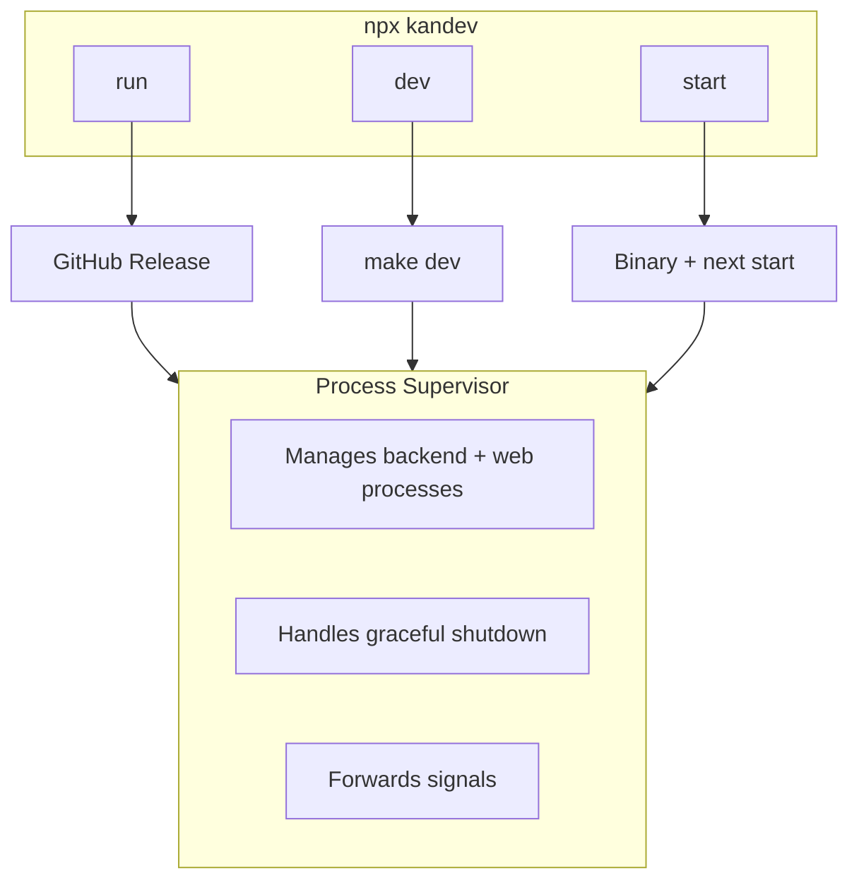

# Kandev CLI

## Architecture



## Overview

The Kandev CLI (`kandev`) is the primary way to run the Kandev application. It handles downloading release bundles, managing processes, and providing a unified interface for both end users and developers.

## Installation

No installation required. Use npx:

```bash
npx kandev
```

Or install globally:

```bash
npm install -g kandev
```

## Quick Start

```bash
# Run the latest release (recommended for users)
npx kandev

# Opens the app at http://localhost:3000 (or next available port)
```

## Commands

### `kandev` / `kandev run`

Downloads and runs the latest release bundle from GitHub. This is the default command and recommended for end users.

```bash
npx kandev
npx kandev run
npx kandev run --version v0.1.0
```

**What happens:**
1. Checks for CLI updates (prompts if newer version available)
2. Downloads the platform-specific release bundle from GitHub
3. Extracts to `~/.kandev/bin/<version>/<platform>/`
4. Starts the backend server
5. Waits for backend health check
6. Starts the web app
7. Prints URLs when ready

### `kandev dev`

Runs the application in development mode with hot-reloading. Requires a local repository checkout.

```bash
# From the repo root or any subdirectory
npx kandev dev
```

**What happens:**
1. Locates the repo root (looks for `apps/backend` and `apps/web`)
2. Runs `make dev` for the backend (Go with hot-reload)
3. Runs `pnpm dev` for the web app (Next.js dev server)
4. Both processes run with hot-reloading enabled

### `kandev start`

Runs the application using local production builds. Requires running `make build` first.

```bash
# Build first
make build

# Then start
npx kandev start
```

**What happens:**
1. Locates the repo root
2. Runs the compiled backend binary (`apps/backend/bin/kandev`)
3. Runs `pnpm start` for the web app (Next.js production server)
4. Both run in production mode without hot-reloading

## Options

| Option | Description | Example |
|--------|-------------|---------|
| `--version <tag>` | Use a specific release version | `--version v0.1.0` |
| `--backend-port <port>` | Override backend port | `--backend-port 8080` |
| `--web-port <port>` | Override web port | `--web-port 3000` |
| `--help`, `-h` | Show help | `--help` |

### Examples

```bash
# Use specific release
npx kandev --version v0.1.0

# Custom ports
npx kandev --backend-port 18080 --web-port 13000

# Dev mode with custom ports
npx kandev dev --backend-port 8080 --web-port 3000
```

## Port Selection

By default, the CLI automatically finds available ports:

| Service | Default Port | Fallback |
|---------|--------------|----------|
| Backend | 8080 | Auto-selects from 10000-60000 |
| Web | 3000 | Auto-selects from 10000-60000 |
| AgentCtl | 8081 | Auto-selects from 10000-60000 |
| MCP Server | 8082 | Auto-selects from 10000-60000 |

If the default port is in use, the CLI finds the next available port automatically.

## Environment Variables

| Variable | Description |
|----------|-------------|
| `KANDEV_GITHUB_OWNER` | Override GitHub repo owner for releases |
| `KANDEV_GITHUB_REPO` | Override GitHub repo name for releases |
| `KANDEV_GITHUB_TOKEN` | GitHub token for API rate limits |
| `KANDEV_NO_UPDATE_PROMPT=1` | Disable CLI update prompts |
| `KANDEV_HEALTH_TIMEOUT_MS` | Override health check timeout (ms) |

## Makefile Integration

The repo includes a Makefile that wraps the CLI for common operations:

```bash
# Install deps, build, and start in production mode
make start

# Run in development mode
make dev

# Build everything
make build
```

See `make help` for all available commands.

## Comparison: run vs dev vs start

| Feature | `run` | `dev` | `start` |
|---------|-------|-------|---------|
| Source | GitHub releases | Local repo | Local build |
| Hot-reload | No | Yes | No |
| Requires repo | No | Yes | Yes |
| Requires build | No | No | Yes |
| Use case | End users | Development | Testing production |

## Troubleshooting

### Port Already in Use

The CLI automatically finds available ports. If you need a specific port:

```bash
npx kandev --backend-port 8080 --web-port 3000
```

### Backend Takes Too Long to Start

Increase the health check timeout:

```bash
KANDEV_HEALTH_TIMEOUT_MS=60000 npx kandev
```

### GitHub Rate Limits

If you hit GitHub API rate limits, provide a token:

```bash
KANDEV_GITHUB_TOKEN=ghp_xxx npx kandev
```

### Dev Mode: "Unable to locate repo root"

Run from within the kandev repository:

```bash
cd /path/to/kandev
npx kandev dev
```

### Start Mode: "Backend binary not found"

Build the project first:

```bash
make build
npx kandev start
```

## Data Storage

| Path | Contents |
|------|----------|
| `~/.kandev/bin/` | Downloaded release bundles |
| `~/.kandev/data/` | SQLite database and app data |
