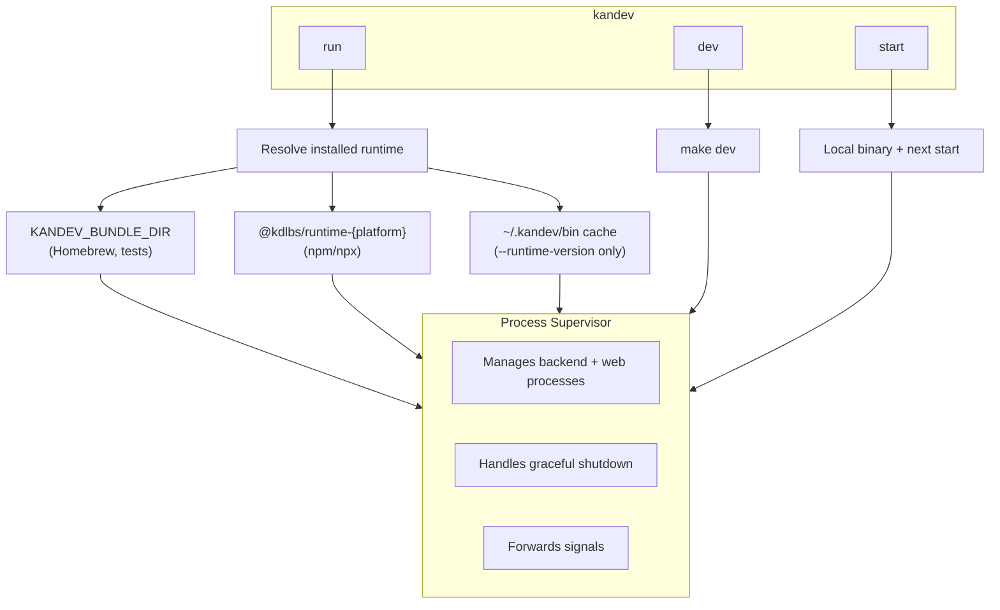

# Kandev CLI

## Architecture


```mermaid
flowchart TB
    subgraph CLI["kandev"]
        run["run"]
        dev["dev"]
        start["start"]
    end

    run --> resolve["Resolve installed runtime"]
    dev --> makedev["make dev"]
    start --> binary["Local binary + next start"]

    resolve --> envvar["KANDEV_BUNDLE_DIR<br/>(Homebrew, tests)"]
    resolve --> npmpkg["@kdlbs/runtime-{platform}<br/>(npm/npx)"]
    resolve --> cache["~/.kandev/bin cache<br/>(--runtime-version only)"]

    envvar --> supervisor
    npmpkg --> supervisor
    cache --> supervisor
    makedev --> supervisor
    binary --> supervisor

    subgraph supervisor["Process Supervisor"]
        direction LR
        s1["Manages backend + web processes"]
        s2["Handles graceful shutdown"]
        s3["Forwards signals"]
    end
```

## Overview

The Kandev CLI (`kandev`) is the primary way to run the Kandev application. It launches the backend and web processes from an installed runtime bundle and provides a unified interface for end users and developers.

The runtime bundle (Go backend, agentctl, Next.js standalone web) is installed by your package manager — there is no first-run download.

## Installation

### Homebrew (macOS, Linux)

```bash
brew install kdlbs/kandev/kandev
```

### NPX (requires npm 7+)

```bash
npx kandev@latest
```

`npx` installs the `kandev` CLI plus the matching `@kdlbs/runtime-{platform}` package via npm optional dependencies. Older npm versions silently skip optional deps and won't work — npm 7 is the floor.

### NPM (global)

```bash
npm install -g kandev@latest
```

## Quick Start

```bash
# Run the installed runtime
kandev

# Opens the app at http://localhost:38429 (or next available port)
```

## Updates

The package manager controls the runtime version:

```bash
brew upgrade kandev                  # Homebrew users
npm install -g kandev@latest         # global npm users
npx kandev@latest                    # npx users (always latest)
```

## Commands

### `kandev` / `kandev run`

Runs the installed runtime bundle. This is the default command.

```bash
kandev
kandev run
```

**What happens:**
1. Resolves the runtime bundle (KANDEV_BUNDLE_DIR → npm package → cache).
2. Starts the backend server.
3. Waits for backend health check.
4. Starts the web app.
5. Opens browser when ready.

### `kandev dev`

Runs the application in development mode with hot-reloading. Requires a local repository checkout.

```bash
# From the repo root or any subdirectory
kandev dev
```

**What happens:**
1. Locates the repo root (looks for `apps/backend` and `apps/web`).
2. Runs `make dev` for the backend (Go with hot-reload).
3. Runs `pnpm dev` for the web app (Next.js dev server).

### `kandev start`

Runs the application using local production builds. Requires running `make build` first.

```bash
make build
kandev start
```

## Options

| Option | Description | Example |
|--------|-------------|---------|
| `--version`, `-V` | Print CLI version and exit | `kandev --version` |
| `--port <port>` | Backend port (alias: `--backend-port`) | `--port 3000` |
| `--web-internal-port <port>` | Override internal Next.js port | `--web-internal-port 13000` |
| `--verbose`, `-v` | Show info logs from backend + web | `--verbose` |
| `--debug` | Show debug logs + agent message dumps | `--debug` |
| `--help`, `-h` | Show help | `--help` |
| `--runtime-version <tag>` | **Advanced/debug only**: download a specific runtime tag from GitHub releases instead of using the installed runtime | `--runtime-version v0.16.0` |

### Examples

```bash
# Print CLI version
kandev --version

# Custom ports
kandev --port 18080 --web-internal-port 13000

# Dev mode
kandev dev --port 18080

# Force a specific runtime version (debug)
kandev --runtime-version v0.16.0
```

## Port Selection

By default, the CLI automatically finds available ports:

| Service | Default Port | Fallback |
|---------|--------------|----------|
| Backend | 38429 | Auto-selects from 10000–60000 |
| Web | 37429 | Auto-selects from 10000–60000 |
| AgentCtl | 39429 | Auto-selects from 10000–60000 |

If the default port is in use, the CLI finds the next available port automatically.

## Environment Variables

| Variable | Description |
|----------|-------------|
| `KANDEV_BUNDLE_DIR` | Force the runtime bundle location (set by Homebrew wrapper) |
| `KANDEV_PORT` / `KANDEV_BACKEND_PORT` | Backend port (CLI flag wins) |
| `KANDEV_WEB_PORT` | Internal Next.js port |
| `KANDEV_HEALTH_TIMEOUT_MS` | Override health check timeout (ms) |
| `KANDEV_GITHUB_OWNER` / `KANDEV_GITHUB_REPO` | Override GitHub repo for `--runtime-version` downloads |
| `KANDEV_GITHUB_TOKEN` | GitHub token for `--runtime-version` API access |

## Makefile Integration

The repo includes a Makefile that wraps the CLI for common operations:

```bash
make start    # Production mode (after make build)
make dev      # Development mode
make build    # Build everything
```

See `make help` for all available commands.

## Comparison: run vs dev vs start

| Feature | `run` | `dev` | `start` |
|---------|-------|-------|---------|
| Source | Installed runtime | Local repo | Local build |
| Hot-reload | No | Yes | No |
| Requires repo | No | Yes | Yes |
| Requires build | No | No | Yes |
| Use case | End users | Development | Testing production |

## Troubleshooting

### "No Kandev runtime found for {platform}"

The CLI couldn't find an installed runtime. Install one:

```bash
# via npm (requires npm 7+ for optional dep resolution)
npx kandev@latest
# via Homebrew
brew install kdlbs/kandev/kandev
```

If you're on npm 6 or older, optional dependencies aren't installed by `npx`. Upgrade npm: `npm install -g npm@latest`.

### Port Already in Use

The CLI automatically finds available ports. If you need a specific port:

```bash
kandev --port 18080
```

### Backend Takes Too Long to Start

Increase the health check timeout:

```bash
KANDEV_HEALTH_TIMEOUT_MS=60000 kandev
```

### Dev Mode: "Unable to locate repo root"

Run from within the kandev repository:

```bash
cd /path/to/kandev
kandev dev
```

### Start Mode: "Backend binary not found"

Build the project first:

```bash
make build
kandev start
```

## Data Storage

| Path | Contents |
|------|----------|
| `~/.kandev/bin/` | Cached downloads from `--runtime-version` (debug only) |
| `~/.kandev/data/` | SQLite database and app data |
| Homebrew Cellar | Installed runtime (when installed via brew) |
| `<npm cache>/node_modules/@kdlbs/runtime-{platform}/` | Installed runtime (when installed via npm/npx) |
