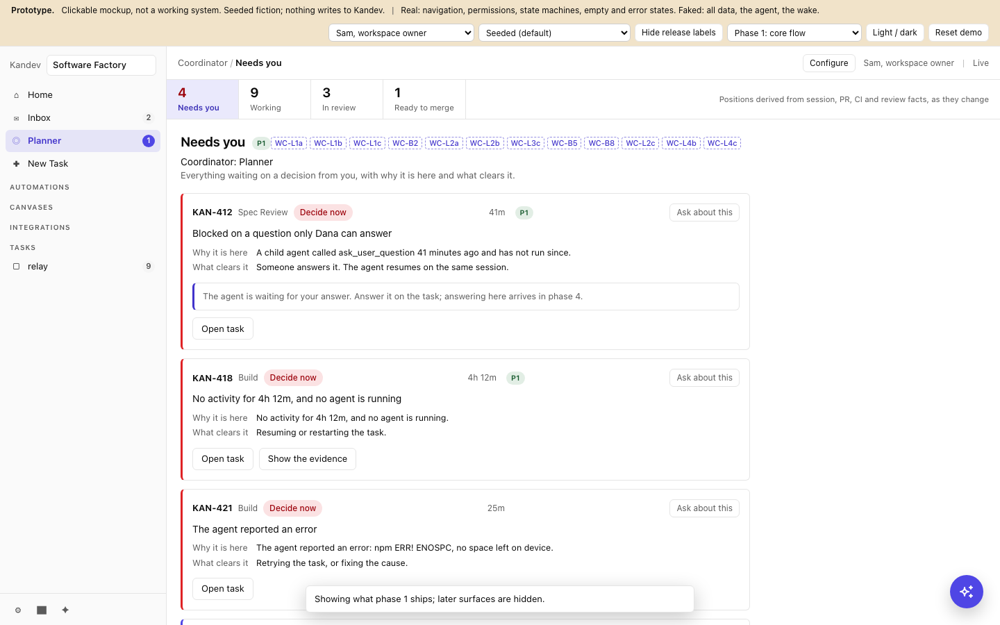

# ADR-2026-09-26-workspace-coordinator: Workspace coordinator as a core page

**Status:** proposed
**Date:** 2026-09-26
**Area:** backend, frontend, protocol, security, workflow

## Context

Kandev users who run several agents in one workspace need a single place that
says what needs them, why, and what clears it, plus a conversation that can
explain the board and suggest work. Kandev main has five pieces that point at
this without composing it: Office's coordinator role, the Needs-you Inbox, the
task-level `task.stalled` event, Configuration chat, and
ADR-2026-08-31's plan for a Coordinator plugin.

[ADR-2026-08-31-generic-plugin-host-boundary](2026-08-31-generic-plugin-host-boundary.md)
placed the Coordinator product in a separately released plugin and says core
must not gain a Coordinator table, field, profile, role, principal, grant,
setting, tool or audit vocabulary. The plugin needs Host contracts that are not
yet built. The feature described here needs none of them: it is a projection
of task facts Kandev already publishes, one ordinary Kandev session per
coordinator, and one write (a task proposal a person decides).

This decision places the workspace coordinator in core for Kanban workspaces,
behind `features.coordinator`, and records the phase plan. The phase 1
requirements and system designs live under
[`docs/specs/coordinator/`](../specs/coordinator/README.md); the delivery plan
is [`docs/plans/workspace-coordinator/plan.md`](../plans/workspace-coordinator/plan.md).

The phase 1 Needs you screen from the mockup (visual reference; the
requirements govern):

## Decision

### Decisions for phase 1

| # | Decision | Phase 1 answer | Status |
| --- | --- | --- | --- |
| D1 | Where the product lives | A core Coordinator page for Kanban workspaces. A coordinator plugin stays possible as an optional extension. | proposed, G0 |
| D2 | The runner | An ordinary Kandev session on an ephemeral task, started like Configuration chat, one per coordinator. It needs no automation, run queue or plugin, and has no wake. The wake is decided at G4. | proposed, G0 |
| D3 | Durable coordinator state | Its conversation task, its proposals and the stall records. No checkpoint, because nothing resumes it unattended. Revisited at G4. | proposed, G0 |
| D4 | May a coordinator move or archive cards? | No, in every phase. Moving, archiving, deleting and stopping are not on its surface, and it can never merge or move a task to Done. This is a rule about the coordinator actor only; people, workflows and other actors keep their contracts. `product-constraints.md` records the rule. | proposed, G0 |
| D5 | How it asks a person | Through proposals, in its chat and on Needs you. `ask_user_question_kandev` is not on its surface. | proposed, G0 |
| D6 | ADR 0004's coordination-task pattern | Not used, and left unchanged. | proposed, G0 |
| D7 | The plugin's interim path | The v1 fence stays as ADR-2026-08-31 defines it. Several open PRs touch `internal/mcp` (including #2756, #2841, #2909, #2974, #3048, #3155, #3165); this list is not exhaustive and each is left to its own review: phase 1 needs none and blocks none. Whichever lands second rebases. Before adding the `coordinator` surface, mode and origin names, the implementation checks main for a name already taken. | proposed, G0 |
| D8 | Scope and cardinality | Workspace scope. Several coordinators per workspace, each reading the whole workspace until Watches narrows it in phase 2. Each proposal belongs to one coordinator. | proposed, G0 |
| D9 | Autonomy and approval | Phase 1 is attended: every turn starts from a manager's message. The coordinator's Kandev surface can only read and propose, enforced by the MCP guard and by auto-approving exactly those tools. The agent CLI's own tools are governed by its profile and settings, as in any Kandev chat; see [Residual risk](#residual-risk-the-agents-own-tools). Enforced containment of those tools is a condition of G4, before any unattended turn. | proposed, G0 |
| D10 | External intake | Phase 4. | proposed, G4 |
| P | The mockup's phone "Teammate" persona | Not planned. `features.auth` is off in every shipped profile and clarifications have no addressee. | proposed, G0 |
| D14 | Kandev's Inbox | Keeps its row, count and tabs in every phase. The coordinator keeps its own count. | proposed, G0 |
| D15 | Approval never starts an agent | A proposal may target only an eligible step: one without an `auto_start_agent` on-enter action, and not a feeder (directly or transitively) of a step that has one, so an automatic queue/WIP promotion after the create cannot reach an auto-starting step either. | proposed, G0 |
| F | Flag | `features.coordinator`: `prod` and `dev` `"false"`, `e2e` `"true"`. Dogfooding uses the runtime override. Restart required. | proposed, G0 |
| N | Name | UI "Coordinator". Specifications say "workspace coordinator", and the Office glossary distinguishes it from Office's coordinator role. | proposed, G0 |

### Decisions for later phases

| # | Decision | Status |
| --- | --- | --- |
| D11 | Expand opens a Quick Chat tab of kind `"coordinator"`, an ordinary persisted session. | proposed, G3 |
| D12 | Page context is ids only (`{kind, id}`), validated to the workspace. | proposed, G3 |
| D13 | No `automatic` write class before the phase 2 "What it did" log; the first is chosen in phase 4 from recorded approvals. | proposed, G2 |
| D16 | Per-coordinator action tiers, or one policy per workspace. | open, G2 |

### Supersession of ADR-2026-08-31's placement clause

This ADR supersedes the product-placement clause of
[ADR-2026-08-31-generic-plugin-host-boundary](2026-08-31-generic-plugin-host-boundary.md):

- lines 9 to 12, up to "Kandev state." (the Coordinator product moving into a
  separately released plugin, with its state, tools and UI belonging there);
  the rest of line 12, "The current Host contract is too small for that use
  case...", starts a new sentence about the pre-existing Host contract and is
  not part of what this ADR supersedes;
- lines 32 to 34, up to "remain plugin-owned." (Coordinator identity, policy,
  scheduling, state, prompts, tools and UI remaining plugin-owned). The next
  sentence, lines 34 to 36 ("Kandev owns only generic Host contracts..."), is
  not superseded: it is the generic-Host-contract definition this ADR
  restates as unchanged below and in Consequences;
- lines 56 to 57, the sentence "Core must not gain a Coordinator table,
  field, profile, role, principal, grant, setting, tool, or audit vocabulary."
  (the only sentence of that paragraph this ADR supersedes; the plugin
  integration ban before it on lines 54 to 56 stands).

Core now owns the workspace coordinator: the `coordinator` store and routes,
the `coordinator` task origin, MCP surface and mode, the
`coordinator.propose_task` action, the settings tab and the Coordinator
screens.

The generic Host half of ADR-2026-08-31 stands unchanged: the sanctioned
plugin call chain, the capability approval ledger, exact writers, transition
guards, DTOs and result vocabulary. A coordinator plugin built on those
contracts remains possible as an optional extension. This ADR does not move
the plugin's v1 fence.

### Residual risk: the agent's own tools

Kandev enforces the coordinator's Kandev surface:

- the session registers only the read tools and `propose_task_kandev`;
- the backend guard refuses every other action from a coordinator principal
  and every id outside its workspace;
- Kandev auto-approves only those exact tool names, and forces the profile and
  environment auto-approve settings off for coordinator sessions;
- CLI-passthrough profiles, which skip Kandev's MCP wrapping, are refused at
  create, edit and session start.

Kandev does not control the agent CLI's own tools and settings. An agent may
have a shell on its executor, its own MCP servers, and its own permission
rules, for example a mode that approves commands without asking. With
`features.auth` off, Kandev's REST API and external `/mcp` endpoint accept any
local caller, so an agent with a shell could call them directly: create a task
on an auto-starting step without going through `propose_task_kandev` at all,
or call the approve route on its own pending proposal. Neither bypass needs
an unattended turn; both are reachable from inside an attended one, since
"attended" means a person started the turn, not that a person reviews every
tool call the agent's own CLI makes inside it. In phase 1 a coordinator is
therefore exactly as capable as any Kandev chat on the same profile, and no
more; its guarded MCP surface adds a proposal path with a person in the loop,
but does not remove the agent's pre-existing, larger capability on the same
host.

This residual is **accepted, unmitigated, for phase 1**: nothing in this
design or in phase 1's containment stops a coordinator's agent from calling
the Kandev API directly with a shell, and no phase-1 gate closes it. This is
distinct from gate G4's requirement, which is about a *different* axis:
before any turn can start **unattended** (no person present at all), G4 must
record enforced containment: an executor without a shell or network path to
the host, or `features.auth` on with a coordinator-scoped token, or an
equivalent decided there. G4's containment, once it lands, will also close
this attended-turn residual as a side effect, but until then this risk is
carried, not deferred to a gate that names it. The settings page says that
the profile's auto-approve is ignored for coordinators; that setting narrows
what the *Kandev-mediated* surface will auto-run, not what the agent's own
CLI can do outside it.

### Residual risk: untrusted board content read through the allowed tools

The residual above is about tools the coordinator is not supposed to have. A
second, distinct residual is about content reaching the tools it *is* supposed
to have: the coordinator's read tools return task titles, descriptions and
conversation text that any workspace member can write, and
`propose_task_kandev`'s containment argument — a person decides before
anything is created — assumes the manager can trust what the coordinator
shows them about that content. Neither assumption is enforced. A task title
or conversation message can contain text aimed at the coordinator's agent
rather than at a person (an instruction to propose a specific task, or to
describe a proposal's rationale in a misleading way), and nothing in this
design distinguishes board content written by a person from board content
written, or influenced, to steer the agent. The agent never gains a new
capability from this: every effect still routes through the same seven-tool
allowlist and the same manager approval. What is at risk is the trustworthiness
of what the manager is shown, not the containment boundary itself.

This residual is **accepted, unmitigated, for phase 1**, and is not closed by
G4: G4's containment is about what an unattended turn's tools can reach, not
about whether the content those tools read is trustworthy. Mitigating it
would mean treating board content as untrusted input to the coordinator's
proposal reasoning — for example, surfacing the source task link next to the
coordinator's paraphrase so a manager can check the claim against the
original text — which is not built in phase 1 and is left for a later phase
to decide.

## Phase plan

Each phase ships a subset of the final design; no phase redraws what an
earlier phase built. Every phase ships behind `features.coordinator` while it
is `prod: "false"`. If phase 1 is promoted before a later phase lands, that
phase adds its own release toggle (`features.coordinatorPhase<N>`) and ships
behind it.

| Phase | Ships | Work packages | Gate |
| --- | --- | --- | --- |
| 1. Core flow | Coordinators in workspace settings; a sidebar entry per coordinator beside the Inbox; Needs you and Queue with the count strip; item cards for stalls, questions and permissions, errors, and task proposals (Approve, Edit, Reject); Ask about this; the copilot popover on the Coordinator screens, which reads the workspace and proposes tasks | WP-0 to WP-5b (WP-0, WP-1, WP-1b, WP-2, WP-3, WP-4a, WP-4b, WP-5a, WP-5b) | G0 |
| 2. Config | Watches, May do and Standing orders per coordinator; the "What it did" log with undo; guided setup; Resume on stall cards; merge prompts; a second proposal class (message a running agent) | WP-6, WP-7 | G2 |
| 3. Copilot everywhere | The launcher on every page, the page context chip, one launcher with Configuration chat on `/settings`, Expand into a Quick Chat tab | WP-8, WP-9 | G3 |
| 4. Relay and intake | Wake on its tasks' events; questions and permissions answered in place; Came in (Jira, Linear); tracker write-back as a proposal | WP-10 to WP-12 | G4 |
| 5. Progress | Goal, baselines and cost against a ceiling; the goal note; improvement proposals | WP-13, WP-14 | G5 |

Gate N (G2 to G5) is met when all four hold:

1. Every work package of phase N-1 is merged with its exit met, and the repo
   ports of the mockup's phase N-1 view pass in CI.
2. Phase N's work packages are written to phase 1's depth and reviewed.
3. Phase N's requirements and ADR are posted on
   [#3752](https://github.com/kdlbs/kandev/issues/3752) with screenshots, and a
   kdlbs maintainer replies without objecting, or 10 working days pass with no
   reply and that ADR records "proceeding without maintainer reply" with the
   date.
4. That ADR records the gate's decision:

| Gate | Opens | Decision to record |
| --- | --- | --- |
| G2 | WP-6, WP-7 | D13; the log's storage and retention; D16 |
| G3 | WP-8, WP-9 | D11, D12 |
| G4 | WP-10 to WP-12 | The wake design (a level-triggered backstop, no replacement fork); enforced containment for unattended turns; D10; the first `automatic` class, from at least 30 days of log rows |
| G5 | WP-13, WP-14 | The goal and cost-ceiling model |

## G0 Status

**Status:** pending.

G0 gates opening upstream PRs, not building. Phase 1's work packages are
built and reviewed on their branches once WP-0 has passed Review; no upstream
PR for WP-1 or a later phase 1 package opens before G0 is met. The phase 1
requirements, this ADR, the plan's ASCII previews and the mockup's phase 1
screenshots are posted on [#3752](https://github.com/kdlbs/kandev/issues/3752).
G0 is met when a kdlbs maintainer replies without objecting to D1, D2 and D9,
or when 10 working days pass with no maintainer reply; in the second case this
section records "proceeding without maintainer reply" with the date. An
objection re-plans the affected work packages before their upstream PRs open.

## Prior art

- **Conductor loop (author's notes, `concepts/conductor-loop.md`, updated
  2026-09-06).** Separates admission, progress, learning and economy; a stall
  counter makes a missing inner loop visible to a person; warns against an
  outer loop without an inner one and against confusing the attention gate with
  the merge gate; deterministic gates hold authority while models draft and
  explain. Adopted: `task.stalled` is the progress signal, Needs you is an
  attention gate only (merging stays on the PR), and proposals are decided by
  a person.
- **Paperclip approvals and Inbox.** Strategy and hire approvals that do not
  expire, with "request revision"; an Inbox and a Blocked inbox of items
  needing a person; agents run on heartbeats. Adopted: approvals that stay
  until decided, and a list of blocked items with a reason. Differs: no
  heartbeat or wake in phase 1 (attended only, no idle spend), and no request
  revision; the manager edits instead.
- **Devin managed sessions.** A coordinating session proposes child sessions
  for approval before launching them. Adopted: propose before create. Differs:
  approval creates a task and never starts an agent (D15).
- What Kandev adds: approval is idempotent through a reserved external id, the
  coordinator count is separate from the Inbox count (D14), and the attention
  list is a projection of facts Kandev already publishes rather than a queue
  the agent maintains.

## Consequences

- Core gains a small coordinator vocabulary (store, origin, surface, mode,
  action, flag). It is reachable only when `features.coordinator` is on, and
  its data survives the flag being off.
- A coordinator plugin, if built, must coexist with this page; the generic
  Host contracts it would use are unaffected.
- The MCP guard's allowlist is the single place new coordinator abilities
  join, one decision at a time.
- The residual risk of the agent's own tools is accepted for attended turns
  only, and blocks unattended turns until G4.
- The Inbox, Office and Configuration chat keep their behaviour.

## Alternatives considered

- **Keep the product in the plugin (ADR-2026-08-31).** Blocks the feature on
  Host contracts it does not need, and makes the attention list depend on a
  separately released component. Rejected for phase 1; the plugin remains an
  option.
- **Build on Office.** Office's coordinator role routes autonomous agents with
  budgets and heartbeats; Kanban workspaces would inherit an autonomy model
  they did not ask for. Rejected.
- **Run the coordinator on the automation runner.** Adds a wake, run queue and
  unattended turns before containment exists. Deferred to the G4 wake design.
- **Let the coordinator create tasks directly.** Removes the person from the
  only write. Rejected; D13 governs any future automatic class.
