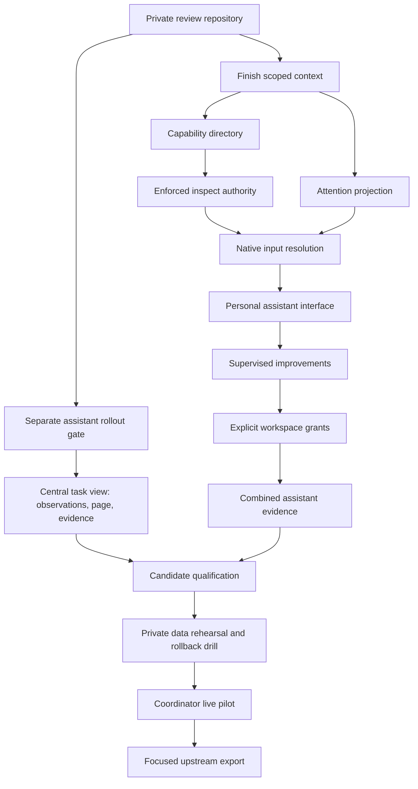

# Remaining orchestration delivery plan

## Outcome and current state

Maintain a private, reviewable Kandev workbench; finish the central workspace
Coordinator page; qualify a coordinator-only build for daily use; then complete
the larger personal assistant in independently verified increments. Export
focused contributions to upstream without exposing private operations or history.

The exact base remains v0.94.0, `bf819a0228e742d069c528293d848c985a4d1bd1`.
The imported prototype already implements coordinator roles/assignments/chat,
task delegation/callbacks, optional Automation delivery and backend assistant
ownership/intake/objectives. Context work is partial. No central task view,
assistant capability/authority/attention UI, live migration rehearsal or live
cutover is claimed as complete. See the [full scope audit](../../review/orchestration/scope-audit.md).

This plan includes all remaining work identified in that audit. The related
plugin contributes design ideas, not copied code or an installation dependency.
Typed report feeds and workflow monitoring policies remain explicitly deferred
until separately scoped; they are not hidden prerequisites for daily use.

## Repository and review model

Private repository: `Corey-Fogg/kandev-orchestration`. It is an independent
repository because public GitHub forks share public visibility. It retains the
public upstream history through the exact release, then a clean imported feature
commit and separate planning/review commits. Original local snapshots containing
installation notes remain local and must not be pushed as ancestor/backup refs.

Use `main` as the unchanged v0.94.0 comparison base initially, and
`feat/workspace-orchestration` as the default private review/integration branch. The
repository landing page and comparison links point to the review branch. Later
changes use focused topic branches and normal commits, with task IDs in bodies
where useful. Do not force-rewrite already reviewed work just to make its history
look smaller. Do not merge newer upstream main without an explicit base-update
decision; retain a baseline branch even after any later upgrade.

`origin` is the private repository; `upstream` is read-only `kdlbs/kandev`.
Public contribution export uses a separate checkout of the existing public fork.
Never push this private integration branch, all refs, backup refs or private
release artifacts to the public fork. Common ancestry supports normal cherry-picks
and patch extraction; a private repository does not directly open a PR into the
public fork network.

Inherited GitHub Actions are disabled for the initial import because upstream
contains scheduled publication, external review and registry workflows. Local
hooks/checks are active. Task 07 defines a narrowly reviewed private CI rollout;
no release credentials, production backups or private prompts belong in CI.

## Delivery milestones and dependencies

The diagram shows dependency opportunities, not authorization for subagents or
parallel resource-heavy tests. Implementation remains sequential in the primary
session unless the user explicitly chooses another arrangement.

| Milestone | Required work | Exit evidence | Enables |
| --- | --- | --- | --- |
| M0 Review | Delivery 00 | Private visibility, clean reachable history, source equivalence, scan/hook receipts, remote SHA verification | Review and continued implementation |
| M1 Coordinator UX | Delivery 01; view 01–03 | Independent assistant-off behavior plus task/chat desktop/mobile flow and fresh synthetic media | Candidate build |
| M2 Candidate | Delivery 02 | Exact clean commit, affected/full checks, versioned bundle and manifest, isolated synthetic smoke | Private-data rehearsal |
| M3 Rehearsal | Delivery 03 | Restorable backup, fixture/live-copy migration results, no external dispatch, tested matched rollback | Scheduled live cutover |
| M4 Daily use | Delivery 04 | Explicit cutover instruction, drained runs, verified bundle/service, smoke and initial observation | Coordinator dogfooding |
| M5 Assistant foundation | Assistant 03–07 | Context, scoped capability support matrix, enforced inspect, attention and native resolution | Assistant UI work |
| M6 Assistant product | Assistant 08–11 | UI, supervised improvements, explicit grants and combined mock/limited provider evidence | Another M2–M4 cycle with assistant opt-in |
| M7 Contribution | Delivery 05–06 | Recorded dogfood findings, focused public patch series, maintainer-agreed branch, synthetic media and PR checks | Upstream contribution |

## Exact next execution sequence

1. Complete and publish this planning/review package (delivery 00).
2. Implement delivery 01, the independent assistant toggle. Preserve all retained
   ownership guards with both toggles off. This is the prerequisite for using
   the whole private branch as a coordinator-only candidate.
3. Implement central-view tasks 01, 02 and 03. Task 01 resolves canonical
   filtering/paging/freshness, task 02 delivers the visible page, task 03 verifies
   and captures it. Do not label the old linked-task list as the new overview.
4. Run delivery 02 and 03, then perform delivery 04 only after an explicit live
   cutover instruction identifies the reviewed candidate. No new approval is
   needed for local implementation, tests, candidate builds or isolated rehearsal.
5. During the pilot, record delivery 05 findings against the exact candidate;
   routine review remains in the private repo. A live incident pauses rollout
   and uses the tested rollback, not unreviewed edits to the running installation.
6. Finish assistant task 03, then 04, 05, 06, 07, 08, 09, 10, 11 in order. Task 06
   is technically independent of 04/05 but shares store/runtime files; run it
   sequentially. Keep task 03 `in_progress` until its remaining contract is tested.
7. Repeat qualification/rehearsal for every schema or authority change before
   assistant enablement. Coordinator daily use need not wait for all assistant
   work; assistant rollout does wait for its enforcement and evidence.
8. Execute contribution extraction after maintainer scope/target agreement.
   Upstream submission can proceed alongside later private assistant work once
   its focused coordinator slice is independently valid.

## Work packages and ownership

### Private repository, candidate and live rollout

- [ ] [00 Private review publication](task-00-private-publication.md)
- [ ] [01 Independent assistant rollout gate](task-01-assistant-rollout-gate.md)
- [ ] [02 Candidate qualification](task-02-candidate-qualification.md)
- [ ] [03 Private migration rehearsal](task-03-migration-rehearsal.md)
- [ ] [04 Live coordinator pilot](task-04-live-pilot.md)
- [ ] [05 Dogfood evidence](task-05-dogfood-evidence.md)
- [ ] [06 Upstream contribution export](task-06-upstream-export.md)
- [ ] [07 Private CI opt-in](task-07-private-ci.md)

Repository/CI/operational work orders may have empty product requirement lists:
they deliver existing software and do not invent a product feature contract.
Their scope and acceptance still bind publication and rollout behavior.

### Central workspace view

The [existing view plan](../workspace-coordinator-view/plan.md) is the delivery
owner for its three work orders and 19 criteria. This plan references it rather
than creating duplicate task definitions. All three remain pending.

### Personal assistant

The [assistant plan](../personal-assistant/plan.md) owns its implementation records.
Tasks 01/02 are done backend work and must not be redone. Task 03's remaining work
and tasks 04–11 now have detailed continuation checklists, source boundaries,
criterion references and verification. Their authoritative
[requirements](../../specs/orchestration/requirements/personal-assistant.md) and
[design](../../specs/orchestration/system-design/personal-assistant.md) replace the
legacy generic specification.

## Commit and contribution slicing

The import is a reviewable snapshot, not an assertion that 476 paths form one
upstream PR. Keep subsequent logical results in separate commits:

1. Existing coordinator/runtime/compatibility snapshot with synthetic fixtures.
2. Scope inventory and complete remaining-work design package.
3. Assistant rollout gate.
4. Task-observation projection and Coordinator page/evidence, grouped by functional
   slices that keep the branch buildable.
5. Context completion, capabilities, authority, attention, resolution, UI,
   improvements and workspace grants as their own work-order commits.
6. Operational candidate/validation records and private-only docs separately.

For upstream, propose a dependency-ordered series: necessary core runtime/privacy
seams; coordinator roles/conversation/callbacks plus central view; optional
Automation destination; separately discussed assistant capabilities. A privacy
fix or required migration cannot be omitted merely to reduce diff size. If
foundation extraction still depends on assistant symbols, remove the dependency
through a tested port or retain the minimal invariant; do not delete guard calls.

## Verification strategy

Each work order names exact commands and expected test behaviors. New test
filters must execute named tests; `no tests to run` is not a pass. Record commit,
toolchain, command, exit status, test counts and artifact hashes. Existing baseline
checks can support unchanged code, but cannot prove a new view or enforcement path.

- Source changes: targeted red/green and race tests where concurrency/ownership
  matters, TypeScript/lint/i18n, normal pre-commit/commit-msg hooks.
- Durable changes: SQL guard, required-store completeness, fresh/replay/upgrade
  conformance on SQLite and PostgreSQL with disposable databases.
- User-facing changes: managed browser suite, real desktop/mobile rendering,
  stale-workspace and feature-off paths, fixture-owned cleanup.
- Release candidate: clean source SHA, complete runtime bundle, synthetic smoke,
  full repository checks before first live cutover, known baseline failures
  diagnosed rather than described as new passes.
- Live-copy rehearsal: private local evidence only; no model/provider calls or
  production schedules. Match binary/database/config backups for rollback.
- Public evidence: fictional workspace, generic requests, scripted replies,
  inspected screenshots/video. No production data or private prompts.

## Dogfooding policy

Yes: build and run this repository's verified runtime bundle in the actual Kandev
installation. GitHub source alone does not change the running binary. Use the
[runbook](dogfood-runbook.md), never point the production service at a development
server or replace its database with the prototype database.

Start with the coordinator feature on and the new assistant toggle off. Adopt one
deliberately selected workspace, profile and generic role through supported UI.
Do not create recurring schedules by default. Expand only after a complete work
cycle, restart/recovery check and no ownership/account/queue regressions. Retain
the known-good bundle until the replacement survives normal use. Live-provider
quality is observed separately from deterministic test success.

## Risks and decision points

- Actual upstream PR branch is not yet agreed. Local/private work stays at v0.94.0;
  no promise that upstream will accept a PR directly against a release tag.
- Provider/tool enforcement may be unavailable for a chosen account/executor.
  The result is an explicit unsupported inspect mode, not a prompt-only substitute.
- Canonical input handles can expire across restart. Attention persistence must
  not turn old records into current permissions.
- The backend already contains private ownership/context migrations. Candidate
  splitting, disablement and rollback must preserve their invariants.
- Broad assistant work has substantial security/persistence boundaries. Milestones
  advance on evidence, not a fixed calendar estimate or number of agent turns.
- Typed plugin reports and workflow monitoring fields are useful future options,
  not accepted requirements in this plan. They need a later focused design if desired.

## Results

Planning and private publication are in progress. Implementation work orders are
pending except historical assistant tasks 01/02 and the partial task 03. Live
Kandev has not been changed. Publication/validation receipts are linked from
[the review entry point](../../review/orchestration/README.md).
