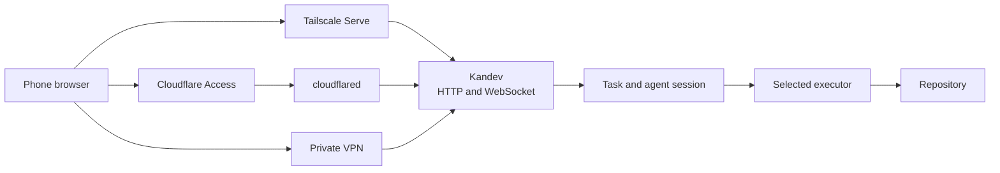

# Use Kandev from a Phone

This how-to guide connects a phone to Kandev through Tailscale, Cloudflare Tunnel, or a private VPN.

Anyone who can reach an unauthenticated Kandev origin has administrator access. This access includes the web app, API, WebSockets, terminals, previews, and MCP routes.

## How a phone request reaches an agent

Each protected path reaches the same Kandev origin. Kandev then sends task work to the selected executor.



The access path protects the Kandev origin. Kandev authentication remains a separate user and workspace boundary.

## Choose an access boundary

Use one of these boundaries:

| Use case | Network boundary | Kandev authentication |
| --- | --- | --- |
| One person, trusted phone and host | Private tailnet with a narrow Tailscale grant | Optional |
| One person, another private VPN | Private VPN address plus host firewall | Optional |
| One person, Cloudflare Tunnel | Cloudflare Access policy for one trusted identity | Optional |
| Multiple people or less-trusted devices | Private network or authenticated TLS proxy | Required |
| Public internet | Do not expose Kandev directly | Required behind a protected TLS proxy |

When authentication is disabled, Kandev gives every reachable client one synthetic administrator identity.

Enable [Authentication and Users](authentication.md) for accounts, private workspaces, sessions, or personal access tokens.

## Connect with Tailscale

This path keeps Kandev on loopback. Tailscale Serve provides the tailnet listener and HTTPS endpoint.

1. [Install Tailscale](https://tailscale.com/docs/install) on the Kandev host and phone.
2. Sign in to the same tailnet on both devices.
3. If the tailnet does not use [MagicDNS](https://tailscale.com/docs/features/magicdns), enable it.
4. Start Kandev on a fixed loopback port.

```bash
KANDEV_SERVER_HOST=127.0.0.1 KANDEV_BACKEND_PORT=38429 kandev
```

5. In another host terminal, publish that loopback service inside the tailnet.

```bash
tailscale serve --bg http://127.0.0.1:38429
tailscale serve status
```

6. Open the HTTPS URL that `tailscale serve` prints on the phone.

The URL uses the full MagicDNS name of the host, such as `https://kandev-host.example.ts.net`.

[Tailscale Serve](https://tailscale.com/docs/reference/tailscale-cli/serve) terminates HTTPS and keeps the endpoint inside the tailnet. Do not use Tailscale Funnel because Funnel publishes the endpoint to the internet.

If Kandev runs as a managed service, use the [service guide](run-as-a-service.md). Make sure that the backend port remains fixed before you keep a Serve rule.

### Restrict the tailnet connection

Tailscale recommends grants for new access-control policies. Legacy ACL rules continue to work.

Tag the Kandev host as `tag:kandev`. Then add a grant like this to the tailnet policy:

```json
{
  "tagOwners": {
    "tag:kandev": ["you@example.com"]
  },
  "grants": [
    {
      "src": ["you@example.com"],
      "dst": ["tag:kandev"],
      "ip": ["tcp:443"]
    }
  ]
}
```

Replace `you@example.com` with the identity that owns the phone. Keep other required rules in the same policy file.

The grant permits only that identity to reach HTTPS on tagged Kandev hosts. Read the [Tailscale grants reference](https://tailscale.com/docs/reference/syntax/grants) before you replace an existing policy.

## Connect with Cloudflare Tunnel

Cloudflare Tunnel gives Kandev a public HTTPS hostname without a public origin address. The `cloudflared` connector makes an outbound connection from the Kandev host.

The hostname is public unless Cloudflare Access protects it. Create the Access application before you add the tunnel route.

### Protect the hostname with Cloudflare Access

1. Add your domain to Cloudflare and create a Cloudflare Zero Trust organization.
2. In the Cloudflare dashboard, go to **Zero Trust > Access controls > Applications**.
3. Select **Create new application**.
4. Select **Self-hosted and private**.
5. Add a public hostname, such as `kandev.example.com`.
6. Add an **Allow** policy for the identity that can use Kandev.
7. Select the required identity provider or one-time PIN method.
8. Create the application.

Access denies requests that do not match an Allow policy. Read the [Cloudflare self-hosted application guide](https://developers.cloudflare.com/cloudflare-one/access-controls/applications/http-apps/self-hosted-public-app/) for policy details.

For one trusted person, Cloudflare Access can be the external access boundary. If the policy allows multiple people, also enable [Kandev authentication](authentication.md).

Cloudflare identities do not become Kandev accounts. Without Kandev authentication, all permitted Access users share the synthetic Kandev administrator.

### Start Kandev on loopback

Start Kandev on a fixed loopback port:

```bash
KANDEV_SERVER_HOST=127.0.0.1 KANDEV_BACKEND_PORT=38429 kandev
```

If Kandev runs as a service, configure the same loopback address and fixed port.

Follow [Bind safely](run-as-a-service.md#bind-safely) and the [fixed-port workaround](run-as-a-service.md#fixed-port-operator-workaround).

### Install and configure `cloudflared`

1. In the Cloudflare dashboard, go to **Networking > Tunnels**.
2. Create a tunnel and select the `cloudflared` connector.
3. Select the operating system and architecture of the Kandev host.
4. Copy the installation command that Cloudflare provides.
5. Run the command on the Kandev host.

The service command has this form:

```bash
sudo cloudflared service install <TUNNEL_TOKEN>
```

The tunnel token is a secret. Do not commit it or paste it into Kandev tasks, logs, or chat.

Only one `cloudflared` service can run on a host. If one exists, add the Kandev route to its tunnel.

6. Add a **Public hostname** route for `kandev.example.com`.
7. Select `HTTP` as the service type.
8. Enter `127.0.0.1:38429` as the service URL.
9. Enable **Protect with Access** for the route.
10. Save the route and wait for the connector to become healthy.
11. Open `https://kandev.example.com` on the phone.
12. Complete the Cloudflare Access sign-in.

Keep the HTTP Host header unchanged. Kandev compares the browser `Origin` hostname with the request `Host` hostname.

[Cloudflare Tunnel supports WebSockets](https://developers.cloudflare.com/cloudflare-one/faq/cloudflare-tunnels-faq/#does-cloudflare-tunnel-support-websockets). The web app, composers, live updates, and terminal connections can use the same protected hostname.

Read the [Cloudflare Tunnel guide](https://developers.cloudflare.com/cloudflare-one/networks/connectors/cloudflare-tunnel/) for connector installation and network requirements.

### Preserve the client IP display

By default, Kandev does not trust forwarded client-address headers. It can record the loopback connector address for authenticated sessions.

If `cloudflared` uses the configured IPv4 loopback URL, trust only that proxy address:

```yaml
server:
  trustedProxies:
    - "127.0.0.1"
```

Add this setting to the Kandev configuration file. Then restart Kandev.

Do not trust a broad subnet or every proxy. A broad trusted-proxy range lets an untrusted client spoof its address.

## Connect directly through a VPN

If the VPN gives the host a stable address, bind Kandev to that address:

```bash
KANDEV_SERVER_HOST=100.100.100.100 KANDEV_BACKEND_PORT=38429 kandev
```

Replace the example address with the private VPN address. Then open `http://100.100.100.100:38429` from the connected phone.

Some VPNs require an all-interface bind:

```bash
KANDEV_SERVER_HOST=0.0.0.0 KANDEV_BACKEND_PORT=38429 kandev
```

`0.0.0.0` also listens on LAN and public interfaces. A Tailscale grant does not control traffic that arrives outside Tailscale.

If you use this bind, permit port `38429` only on the VPN interface in the host firewall. Reject that port on every other interface.

For direct Tailscale access without Serve, change the grant port from `tcp:443` to `tcp:38429`. This path uses HTTP inside the encrypted tailnet. It skips the HTTPS endpoint provided by Tailscale Serve. Use it only for a trusted single-user tailnet. Then open `http://<magic-dns-name>:38429` on the phone.

If more than one person can reach the VPN endpoint, use [Kandev authentication](authentication.md) and TLS.

Kandev authentication does not replace HTTPS. For single-user access on an encrypted VPN, the VPN tunnel provides transport encryption. This includes WireGuard, OpenVPN, and Tailscale. Plain HTTP inside that tunnel is acceptable.

## Know which phone flows work

Private-network transport does not make a desktop flow phone-safe. This table describes the current web interface.

| Flow | Authentication required | Phone status |
| --- | --- | --- |
| Kanban read and write | No, for a trusted single-user network | Supported in the web app |
| ACP agent composer | No, for a trusted single-user network | Supported through the WebSocket composer |
| File tree, Git changes, diff, and file editor | No, for a trusted single-user network | Supported, with the layout history listed below |
| Passthrough composer | No, for a trusted single-user network | Limited. Basic prompts work. [#2809](https://github.com/kdlbs/kandev/issues/2809) tracks incomplete phone UX and device coverage |
| Passthrough terminal scrollback | No, for a trusted single-user network | Not phone-safe. [#2808](https://github.com/kdlbs/kandev/issues/2808) tracks touch scrolling |
| Accounts, users, browser sessions, and personal access tokens | Yes | Enable `KANDEV_FEATURES_AUTH=true` or **Authentication & users** |

The passthrough composer sends the submitted text to the agent PTY. The submission includes the Enter key. Kandev does not currently provide dedicated phone controls for `Ctrl+C` or `Esc`.

## Understand the session IP display

This limitation applies only when Kandev authentication is enabled.

Kandev records a session IP at sign-in. It refreshes the value when a request from a new address touches the session. The displayed value updates within the session touch interval.

The stored IP is display data. Kandev does not use it to bind the session to one address.

A roaming phone can continue to use its session. **Settings > Account > Security** can show the old address briefly. The value updates after the next throttled session touch.

Choose one workaround:

- Keep the same tailnet address.
- Accept the brief delay before the display updates.
- Sign out. Then sign in again to create a new session record.

Review [proxy configuration](authentication.md#multiple-instances-on-one-host) before you trust forwarded client addresses.

## Track known phone limitations

The linked issues are the source for current status. Closed issues remain useful regression history.

| Issue | Current issue state | What to expect |
| --- | --- | --- |
| [#1031](https://github.com/kdlbs/kandev/issues/1031) | Closed | A passthrough TUI could disappear after a mobile remount |
| [#1035](https://github.com/kdlbs/kandev/issues/1035) | Closed | Earlier touch-scroll work closed. [#2808](https://github.com/kdlbs/kandev/issues/2808) tracks the current limitation |
| [#1634](https://github.com/kdlbs/kandev/issues/1634) | Closed | The phone workspace picker was missing |
| [#1843](https://github.com/kdlbs/kandev/issues/1843) | Closed | The task layout could remain incorrect until a browser resize |
| [#2188](https://github.com/kdlbs/kandev/issues/2188) | Closed | Kanban could return to the first workflow step after task navigation |
| [#2808](https://github.com/kdlbs/kandev/issues/2808) | Open | Passthrough terminal scrollback does not support reliable touch scrolling |
| [#2809](https://github.com/kdlbs/kandev/issues/2809) | Open | Passthrough composer phone UX and real-device coverage are incomplete |

## Add Kandev to the home screen

Kandev includes an installable web-app manifest and standalone display mode. The installed shortcut opens Kandev without a normal browser tab bar.

Use an HTTPS Kandev URL for standalone installation. The Tailscale Serve and Cloudflare Tunnel paths provide HTTPS. Direct HTTP access may create only a home-screen shortcut, not an installable standalone web app.

On iPhone or iPad:

1. Open the Kandev URL in Safari.
2. Select **Share**.
3. Select **Add to Home Screen**.
4. Open Kandev from the new icon.

On Android:

1. Open the Kandev URL in Chrome.
2. Open the browser menu.
3. Select **Install app** or **Add to Home screen**.
4. Open Kandev from the new icon.

The shortcut does not add offline support. The Kandev host and VPN must remain reachable.

## Troubleshoot the connection

1. On the Kandev host, run `tailscale status`. On iOS or Android, check the Tailscale app instead.
2. If you use Serve, run `tailscale serve status` on the Kandev host.
3. For Cloudflare Tunnel, review the connector status in the Cloudflare dashboard.
4. Open `/ready` on the same Kandev origin.
5. Review the host firewall and the tailnet or Access policy.
6. Review the actual Kandev port in the startup output or service logs.

If the page loads but live updates fail, make sure that the proxy forwards the whole origin and supports WebSockets.

See [Security and Trust](security.md) for the complete boundary.
