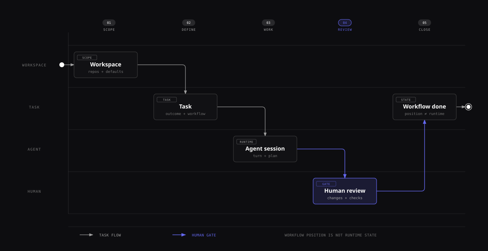

# Tasks and Workflows

A task is the work to deliver. A workflow is the sequence of steps it follows. Use a task for the outcome and a workflow for the review process.

## Quick path

1. Add a repository to a workspace.
2. Create a task with a clear outcome, a compatible agent, and an executor.
3. Start the agent, review its changes, and move the task through the human gate.



[Open full-size SVG diagram][tasks-and-workflows-diagram]

[tasks-and-workflows-diagram]: ../../docs/screenshots/tasks-and-workflows.svg

The task carries the outcome through the workflow. The repository and session provide the working context, while review remains an explicit human gate.

<details>
<summary>Browse this guide</summary>

**Create and start tasks**

- [Prepare a workspace](#prepare-a-workspace)
- [Create a task](#create-a-task)
- [Start a task](#start-a-task)

**Organize and review work**

- [Task dependencies](#task-dependencies)
- [Find and organize tasks](#find-and-organize-tasks)
- [Use the task plan](#use-the-task-plan)
- [Arrange task panels](#arrange-task-panels)
- [Archive, unarchive, and delete](#archive-unarchive-and-delete)

**Configure workflows**

- [Move tasks](#move-a-task-with-one-time-entry-options)
- [Configure a workflow](#configure-a-workflow)
- [Troubleshooting](#troubleshooting)

</details>

## Keep your view when creating tasks

In **Settings > Preferences > Task Behavior**, turn off **Open new tasks automatically**
and select **Save changes** to create tasks without leaving your current view.
The setting is on by default and is saved with your user preferences across
reloads. It works on desktop and mobile.

Tasks and agents still start as requested. You can open the new task manually
from the task list. This setting controls opening newly created tasks; it does
not change the separate preference for preventing agent auto-start on open.

## Understand the model

| Concept         | What it controls                                                                                                       |
| --------------- | ---------------------------------------------------------------------------------------------------------------------- |
| Workspace       | The scope containing repositories, workflows, tasks, integrations, and workspace defaults.                             |
| Workflow        | An ordered set of steps plus the rules that run when a task or agent turn reaches an event.                            |
| Workflow step   | The task's current process position, such as Backlog, Work, Review, or Done.                                           |
| Task            | The title, prompt, workflow position, repository attachments, sessions, and one shared plan.                           |
| Task repository | A repository, base branch, and optional checkout branch attached to a task. A task can have more than one.             |
| Session         | One agent conversation attached to a task. Several sessions can share the same task environment.                       |
| Plan            | The task's single editable Markdown plan, with version history. Consecutive writes can be coalesced into one revision. |

Workflow position and runtime state differ. Moving a task changes its step. It does not prove that an agent ran, code was committed, review passed, or a pull request merged.

**During a move:**

- Kandev shows a spinner while the destination agent prepares or starts.
- Open the step details to see the lifecycle status and agent profile. On touch devices, use the **Move to** drawer.
- A destination without auto-start stays ready for a later agent start.

**Before a move:**

- The preview shows the session, effective model, context reset, and prompt options for the destination.
- Use the info button or expand the step row for full transition details. The condensed top bar shows **Move here** beside each eligible step.
- The preview can change while a turn runs or another session becomes available. **Move here** checks routing, permissions, WIP, and session state again.

**After a move:**

- An open task follows the conversation selected for the destination after it becomes available.
- If routing is pending or fails, Kandev keeps your selected conversation. A later manual selection stays active.

## Move a task with one-time entry options

Normal **Move here** and next-step actions use the destination step's saved defaults. Choose **Move with options** in the workflow stepper, Chat status bar, or passthrough toolbar when one move needs an exception. The options apply to that entry only.

| Option | Effect |
| --- | --- |
| **Reset context** | Adds a reset. It cannot remove a reset required by the destination step. |
| **Instructions** | Adds one instruction block after the destination prompt. |
| **Skip step prompt** | Suppresses the destination prompt and task-description fallback. Without instructions, the task moves without starting a turn. |

For a keyboard move, press `Cmd/Ctrl+K`, search for **Move to**, and select a destination. Press `Cmd/Ctrl+Enter` to move with defaults, or `Enter` to open options. A failed move keeps your instructions so you can retry. On touch devices, move options open in a bottom drawer.

Moves keep the normal reachability, authorization, WIP, archive, workspace, and active-session rules. A move waits for a running agent to finish, and its options survive queueing and backend restarts. Instructions require an active target session or a destination that auto-starts an agent. Pull-request draft and review status use the PR step's automation. For the agent tool contract, see [Automation and MCP](automation-and-mcp.md#task-mcp).

## Task actions from the command palette

While a task is open, `Cmd/Ctrl+K` offers the task actions available from its sidebar
menu, including Pin/Unpin, Color, Priority, Edit, Rename, Create subtask, Nest under,
Link, Move to, Send to workflow, Archive, and Delete. Detach and plugin actions
appear when applicable. These commands target the open task, even when the search
also shows other tasks. Duplicate remains disabled.

Use arrow keys and Enter to choose an action or nested option. Back or Escape
returns to the previous choices. Archive and Delete retain their confirmations.
On phones, task overflow retains touch access; an attached keyboard can open the
palette, whose choices also support touch.

## Prepare a workspace

A new workspace created from **Settings → Workspaces** automatically receives a **Kanban** workflow
with the built-in Kanban steps, so it can accept tasks immediately.

1. Open **Settings → Workspaces** and select **Add Workspace**.
2. Enter the required workspace name.
3. Open the workspace's **Repositories** page and add its local repositories.
   - Create an empty local repository from **New Task** when needed.
   - Add remote URLs through **New Task → Remote**.
   - Use [Repository sets](#repository-sets) to select groups of repositories together.
4. Open its **Workflows** page to review the default **Kanban** workflow. Create, import, or synchronize another workflow when the workspace needs a different process.
5. On **Workspace Settings**, optionally choose a **Default Executor** and **Default Agent Profile**. Both default to **No default** unless configured.

The initial database bootstrap can include a **Default Workspace** and a **Development** workflow.
Later user-created workspaces receive **Kanban** instead; they do not inherit other workflows or
settings from the default workspace.

## Create a task

Use **New Task** in the sidebar. In an open task, the **Task** split button also opens task creation.

<DocsVideo
  webm="./media/feature-guides/task-create.webm"
  mp4="./media/feature-guides/task-create.mp4"
  poster="./media/feature-guides/task-create.webp"
  title="Create a task"
  caption="A focused task is entered while its repository, agent profile, worktree isolation, and start mode remain visible for review."
/>

1. **Set a title.** If the title field appears, enter up to 60 characters. With **Agent-generated task titles** enabled, Kandev uses the prompt's first six words as a provisional title. See [advanced task creation](#let-the-agent-name-new-tasks).
2. **Choose a workspace and workflow.** Kandev can infer them from the current view. A regular task must belong to a workflow. Use the arrow between the workflow and step names to see where each start action places the task.
3. **Choose a source:**

   | Source | Use it for | Notes |
   | --- | --- | --- |
   | **Repo** | A configured, discovered, or new local repository | Choose a branch or [branch policy](#branch-policies). Add more rows for a multi-repository task. |
   | **Remote** | A remote repository | Search GitHub, GitLab, or Azure DevOps, or paste a supported URL. Public GitHub reads and public `gitlab.com` branch discovery work without credentials. Private access and authenticated browse/write actions require provider credentials. |
   | **None** | Planning, research, or work outside Git | Use a scratch workspace or an optional folder on the Kandev host. Git worktree and repository-aware Changes, branch, and pull-request features are unavailable. |

4. **Choose an executor and agent profile.** Both profiles must be compatible. A workflow default agent profile locks the task-level selector.
5. **Add a description when needed.** Use the eye button beside **Enhance prompt with AI** to preview a step's prompt template. The preview does not resolve task IDs or saved-prompt references until the task exists.
6. **Choose how to start:**
   | Action | Result |
   | --- | --- |
   | **Start Plan Mode** | Creates an empty task in plan mode at the first positional step. Available only when agent-generated titles are off. |
   | **Start task** | Requires a description and starts the agent. Uses the first step with **Auto-start agent**, then **Start step**, then the first step. |
   | **Start task in plan mode** | Requires a description. Starts the agent in plan mode using the same step rules as **Start task**. |
   | **Create without starting agent** | Requires a description and uses **Start step**, or the first positional step if none is set. A structured ACP profile prepares the session; passthrough/TUI starts immediately to create its PTY. |

   On mobile, **Plan mode** and **Create only** provide the same behavior as the two non-primary actions.

### Reduce downloads for a large remote repository

In **New Task → Remote**, select a repository and open its gear (**Repository options**).
These settings apply only to that repository row in this task.

1. Choose **On demand** to download file contents as Git needs them while retaining
   full commit history. **Standard** keeps the existing download behavior.
2. Choose **Selected folders** and enter repository-relative directories, one per
   line, for example `extensions/my-extension`. Include shared packages your work
   needs. Up to 64 directories are supported; wildcards and parent paths are not.
3. Select **Apply**. A summary below the repository shows the applied choices.
   **Cancel** discards draft edits; **Reset** restores Standard and All folders.

Advanced options are available for GitHub repositories using **Worktree** or
**Local Docker** with the built-in preparation script and Kandev-managed Git
credentials. Other preparation paths
show an explanation and keep advanced controls disabled. On phones, the gear
opens a drawer with the same settings.

Selected folders use Git's directory-based sparse checkout: root and ancestor
files remain available, and omitted files are not reported as deleted. Git can
materialize additional files during conflict resolution. This is not an access
restriction. Settings cannot change after the task environment is created;
create a new task for a different scope. A new independent task starts with the
default settings.

These options reduce download and checkout work. They do not change the existing
clone timeout or guarantee that every repository will finish within it.

### Branch policies

Manage named branch policies in **Settings → Workspaces → _workspace_ → Repositories**. A policy
stores a base branch, a branch-name template, and a pull-request target for one repository. The
task picker shows policies before raw branches.

| Choice | Result |
| --- | --- |
| **Branch policy** | Starts a fresh branch from the saved base and applies its branch-name template. The saved pull-request target is the merge destination; open the information icon to review the values. |
| **Raw branch** | Continues to open the existing branch. |

When you create a task, Kandev saves the selected policy values on the task repository. Later edits
or deletion of the policy do not change the task. Kandev's pull-request dialog uses the saved target
by default. You can change it before creation. Kandev also adds the saved target to the agent's task
context. The instruction tells the agent to pass the target explicitly to its provider CLI.
Policies are not offered in **Quick Chat**, **Remote**, **Add Sources**, or **Add Branch** flows.

Kandev remembers draft or recently used repository, branch, executor, and profile choices. Review the restored values before submitting, especially after changing workspace.

When the selected profile is dynamic, the task keeps one logical profile and one
session tab while Kandev chooses a concrete candidate in the configured order.
Provider errors before a result may move execution to the next configured
candidate. Kandev does not switch candidates after an ambiguous started turn.
If the route has no eligible candidate, wait for the current turn to settle and
use the session's **Retry current agent** or **Try next agent** recovery action.

Every editable local repository row in **New Task** offers **Refresh repositories** and **Create new repository**, including populated lists and empty search results. Refresh updates the available repositories without changing your selections. It stays visible but disabled during the request.

Kandev rejects an existing target path and creates one empty initial commit with no project files. It registers the repository in the workspace and selects it in the originating row. For a single-row task, Kandev selects a direct **Local** profile. If no direct Local profile exists, single-row creation stays disabled. For multiple rows, creation preserves the selected executor and the other rows. It does not require a direct Local profile.

### Work with an empty remote repository

An existing local checkout or a repository selected from **Remote** can point to a remote with no refs. Kandev creates a local empty baseline so a normal **Worktree** task can start. The baseline contains no README, license, `.gitignore`, or other project files.

Task launch, resume, and worktree recovery do not write to the remote. When the work is ready, use the existing **Changes** action to **Push** or **Create pull request**. Kandev publishes the selected base branch first, then the task branch, with the task runtime's Git credentials. Read or clone access alone is not enough to publish.

If another person or tool initializes the remote before the first publication, Kandev stops without overwriting that history. Reconcile the remote and local task branch, then retry. When an existing contribution session resumes after the remote source branch advances, Kandev recognizes that history-only preflight result and lets the session continue without pulling, rebasing, resetting, or pushing. Inspect and reconcile the branch before publishing. Other contribution access or destination failures still stop the launch. If the base branch was published but the task branch failed, the task branch remains local and **Push** can be retried. On phones, use the same actions from the touch-sized **Changes** menu.

> **Local changes:** creating a fresh local branch can discard dirty files only after explicit consent. Save or commit important work before approving it.

<details>
<summary>Advanced task creation: agent-created tasks, long transcripts, multiple sources, and attachments</summary>

### Let the agent name new tasks

Open **Settings → Preferences → Task Behavior → Tasks → Agent-generated task titles** and choose **Save changes**.
The setting is enabled by default; an explicitly saved **off** value remains off. When enabled, new task
and subtask dialogs use the prompt as the source of the title: the prompt must contain text, and Kandev
immediately displays its first six normalized words as a provisional title. The first eligible task-mode
session to launch atomically claims the handoff, receives the `set_task_title_kandev` MCP tool, and is
instructed to call it before doing any other work. Ask for a short title phrase targeting about six words
in sentence case rather than a sentence or progress update. Later sessions do not receive the instruction
or tool, even if the owner fails before renaming the task. If the agent never renames the task, the
provisional title remains usable and can still be edited by a person.

The setting affects only new task/subtask creation. Existing task edits keep the title field, and
sessions for tasks created while the setting was disabled receive neither this instruction nor the
tool. Config and Office sessions never receive the title tool.

### Choose the profile for tasks created by agents

Open **Settings → Preferences → Task Behavior → Tasks → Profile for Tasks Created by Agents** to choose the fallback profile for new tasks and subtasks created by `create_task_kandev` without `agent_profile_id`. The choice also affects the first session's model, mode, and dynamic options.

| Preference | Profile and session behavior |
| --- | --- |
| **Creating session profile** | Uses the verified caller session's profile and current model, mode, and dynamic options. A workflow launch profile takes priority. This can reuse a more expensive setup. |
| **Workspace default profile** | Uses the workflow launch profile, then the target workspace's **Default Agent Profile**. Skips caller, source, parent, and current-task profiles. Does not copy the caller's model, mode, or dynamic options. Creation fails if neither profile is available. |

Select an option, then choose **Save changes**. Workflow-selected profiles always win when the new task lands on a workflow step. Away from a workflow step, an explicit `agent_profile_id` wins and prevents creator-session runtime inheritance. The only affected Kandev MCP tool is `create_task_kandev`. `spawn_session_kandev` adds a session to the current task, so it does not use this preference. Tasks you create in the UI are not affected.

External MCP calls have no verified creating session. With **Creating session profile**, those calls keep the compatibility fallback to the parent task when one exists, then workflow and target-workspace defaults. The preference applies across workspaces, but **Workspace default profile** resolves the default from each new task's target workspace. A resolved profile and runtime seed are stored even when `start_agent=false`, so a later manual start uses the same decision.

### Choose task-specific workflow profiles

When a workflow has fixed agent profiles on its steps, expand **Advanced
settings** while creating a task to replace one or more of them for that task.
Kandev groups steps that use the same fixed profile into one row and lists the
affected steps. Select an enabled profile from the replacement picker, or
choose **Use workflow profile** to keep the workflow choice.

These replacements belong to the task only. They do not change the workflow,
the profile definitions, or another task in the same workflow. Kandev also
keeps the choices out of recently used task settings. Use **Reset** to remove
all replacements. Closing and reopening **Advanced settings** keeps the current
choices, while changing the workflow or starting a new task clears them.

Explicit **Initial agent session** and earlier-step session targets keep their
existing conversation selection. A replacement applies when a fixed step
starts or reuses a session. If the session already exists, the workflow
disclosure shows its actual model and session. Before a session exists, it
shows the planned replacement model. A profile that becomes unavailable blocks
creation until you choose another profile or reset the row.

### Navigate long chat transcripts

When your latest prompt has fully left the transcript viewport, **Scroll to
last prompt** appears beside the Chat share control. Select it to return to
that prompt; it hides again after any part of the prompt is back in view. Its
arrow points the direction the transcript will actually scroll: upward once
you've scrolled further down past your prompt, or downward if you've scrolled
back up above it while browsing earlier history. **Scroll to start of
transcript** appears when the first prompt is no longer fully visible. You can
show or hide each action independently in **Settings → Preferences → Task
Behavior → Conversation and panels**.

For a compact reminder while you read later replies, enable **Show anchored
prompt bar** in the same settings section. On desktop, it pins a shortened
copy of your latest prompt below the session tabs once you've scrolled past
it further down the transcript. It stays hidden while you're browsing earlier
history above your prompt, even though the prompt itself is out of view.
use **Scroll to last prompt** to jump back to it instead. Expand the bar for
longer prompts, or use its scroll action to return to the full prompt; the
expanded view is capped at 40% of the transcript panel's height so it stays
proportionate whether the panel is a full-screen view or a small embedded
split. The anchored bar is desktop-only; phones use the scroll-to-last-prompt
action instead. Both scroll actions keep the transcript at your requested
position even if the agent streams new replies while the scroll is still in
progress.

### Multiple repositories

A task can include several local or remote repository rows. Multi-repository creation supports **Worktree**, **Local Docker**, **Kubernetes**, **SSH**, and **Sprites**. Local/Local PC creation remains unavailable until its initial-launch path can materialize sibling repositories, and Remote Docker is not implemented. Public GitHub and GitLab repositories can be cloned and fetched anonymously. Private repositories and authenticated browse/write features need credentials that can access the selected base branch.

If Kandev cannot resolve a pasted remote URL or its branch, the repository row keeps the URL and shows the provider error. Use **Retry** after correcting the URL or when a transient provider failure has cleared.

Changes and review are scoped by repository. State the expected deliverable, base branch, and pull-request target for every attachment. See [Coordinate work](coordination.md) for adding branches after creation and splitting multi-repository work.

</details>

### Repository sets

<details>
<summary>Repository set details</summary>

A **repository set** is a named, reusable group of a workspace's repositories: define **full-stack**
once, then fill the repository picker with all of its repositories in a single action every time that
combination of repositories is the one you need.

A set stores the repositories and order, plus an optional saved base branch for each member. When a
member has no saved base, applying the set uses the task form's normal defaulting. A saved base is
copied into the new task row, while the task branch or local checkout remains a separate choice.

Define a set in either place:

- **Settings → Workspaces → _workspace_ → Repositories**, in the **Repository sets** section: create,
  rename, add or remove repositories, set each member's base branch, reorder them, reset saved bases,
  and delete.
- **New Task → Sets → Save as set**, which captures the repositories currently selected in the form
  without disturbing the task you are creating.

Each set contains a repository only once. If the form contains several rows for one repository,
**Save as set** keeps the first row and its base choice. The dialog reports additional rows separately
from rows that are not workspace repositories. The task draft keeps all its rows.

Apply one from the **Sets** control beside **add repository** in **New Task** and **New subtask**.
Applying a set adds one row per repository, in the set's order. It is additive and repeatable:

- a repository already in the form is skipped, so applying the same set twice changes nothing and two
  overlapping sets give you the union;
- rows you already configured are never discarded or reordered;
- a repository that has since been removed from the workspace is skipped, and the dialog says how
  many were skipped.

Applying a set only fills the form. Nothing is saved until you create the task, so the repositories
the task ends up with are whatever the form holds when you submit.

Each set member's base selector includes **Task default**, with the repository's current default branch
shown as context when available. Open a selector to load its branch list. If a saved branch no longer
exists, the form keeps that value visible as unavailable and blocks task creation until you select an
available branch or **Task default**. For local execution, the saved base is used separately from the
repository's current checkout branch.

Sets are also available over the API for scripted setup:

```text
GET    /api/v1/workspaces/:id/repository-sets
POST   /api/v1/workspaces/:id/repository-sets   {"name","description","repositories"}
GET    /api/v1/repository-sets/:id
PATCH  /api/v1/repository-sets/:id              any of name, description, repositories
DELETE /api/v1/repository-sets/:id
```

`repositories` is an ordered list of objects. Each object has a `repository_id` and an optional
`base_branch`; an empty or omitted base uses task defaulting. A supplied list replaces the whole
membership list, which is also how you reorder one. Omit the field to leave membership untouched.
Existing clients may send ordered `repository_ids`; those members have no saved bases. Do not send both
member fields in one request. The same five operations exist as
`repository_set.list|create|get|update|delete` WebSocket actions, and
`repository_set.created|updated|deleted` notifications keep every open client current. See
[WebSocket API](websocket-api.md).

Sets are workspace-scoped and shared: everyone who can see the workspace sees and can apply its sets.
A set name is unique within its workspace, compared case-insensitively. Deleting a set removes the
grouping only, never a repository; deleting a repository removes it from every set and leaves the sets
themselves in place. Sets are not offered in **Remote** or **None** source mode. On an executor that
cannot run a multi-repository task the control still works; the executor picker marks that profile
unavailable once several repositories are selected, exactly as when you add the rows by hand.

</details>

### Add sources to an existing task

<details>
<summary>Adding sources details</summary>

For a non-archived, repository-backed task, open the **Files** panel and choose **Workspace actions → Add Repositories to workspace**. Use **Add repository** to choose a workspace repository, an existing local Git checkout, or a provider-backed/pasted remote URL. The workspace option shares task creation's saved/discovered selector, refresh, and create-repository actions. Use **Add folder** for an arbitrary local folder when the executor supports it. Add one or more rows in a single submission. Repository rows choose a base branch once; the flow does not ask for a second checkout branch. Local/Local PC uses the user-owned repository's current checkout and never switches it. The whole mixed batch succeeds or fails together.

The task must be idle: Kandev disables the action while a turn or tool call is active, and rejects a race without changing the task. Desktop opens a dialog; phones open the same flow in a full-height drawer. On success, repositories appear in Files and repository-aware Changes, branch, editor, and pull-request surfaces; folders are Files-only.

Before submission, the dialog or drawer summarizes the effect on the workspace, session context,
and running processes. **Cancel** or closing the surface sends no request and changes nothing. A
submitted batch remains all-or-nothing.

If adding a source promotes a Worktree or Local/Local PC workspace from one repository directory to
the task root, Kandev restarts the idle agent in the new root. Existing files, Git changes, task
state, messages, plan, attached sources, model, and mode remain. Native cross-directory resume is
retained where supported; otherwise Kandev starts a fresh provider session and supplies recorded
conversation context with the next prompt. Provider-private context not recorded by Kandev may not
carry over. The intentional restart is not shown as a previous agent error.

The host rebind stops open task terminals, dev servers, the task editor server, and other
agentctl-managed workspace processes, so save unsaved work and restart those processes afterward.
Local Docker, Kubernetes, SSH, and Sprites attach repository siblings to the current remote workspace and rescan
without restarting the agent or changing its CWD.

| Source | Supported use |
| --- | --- |
| **Repository** | Worktree, Local/Local PC, Local Docker, Kubernetes, SSH, or Sprites. Appears in Files and repository-aware Changes, branch, editor, and pull-request surfaces. |
| **Folder** | Local/Local PC or Worktree only. A live host path that appears in Files only. |

Local Git repositories need a cloneable origin on Local Docker, Kubernetes, SSH, and Sprites. Worktree and Local/Local PC can use the host repository directly. See [Executors](executors.md#workspace-sources) and [Coordinate work](coordination.md#add-sources-after-creation) for runtime limits and recovery behavior.

### Attachments and local-change consent

The task prompt supports image, audio, and resource attachments. Kandev accepts at most 10 files per submission, with a 100 MiB raw limit per file and a 100 MiB raw aggregate limit. Files are uploaded over authenticated HTTP before the task or message is submitted, so the task-create JSON and WebSocket frames carry attachment descriptors rather than base64 file contents. An upload that is still in progress or has failed must finish or be retried before the prompt can be sent. Removing a staged attachment discards its private upload; unclaimed uploads expire automatically after 24 hours. This prompt-attachment limit does not change the separate 10 MB task-document upload contract.

During workspace preparation, the initial message shows your uploaded screenshots and file labels. You can open image previews before the agent starts. The preview survives a page reload and remains visible if preparation fails. It does not indicate successful delivery to the agent.

Creating a fresh local branch is available only with the local executor. If the checkout is dirty, Kandev lists the affected paths and requires explicit consent before discarding those local changes. If another path becomes dirty after the warning, creation fails with a conflict and asks for consent again. Save or commit work before approving this operation.

</details>

## Start a task

A task created with **Create without starting agent** opens in a prepared workbench. Review its repository, branch, executor, profile, and initial prompt, then select **Start agent**. The run stays in the task conversation, where environment preparation, tool calls, permission requests, and the final response remain inspectable.

<DocsVideo
  webm="./media/feature-guides/task-start-agent.webm"
  mp4="./media/feature-guides/task-start-agent.mp4"
  poster="./media/feature-guides/task-start-agent.webp"
  title="Start an agent on a prepared task"
  caption="A prepared task starts its selected agent in the workbench and reaches a completed response."
/>

If the selected profile is unhealthy or incompatible with the executor, fix that configuration before launch. Starting an agent is separate from moving the task through its workflow; entry actions and turn-complete transitions can move or restart work afterward.

When you send a message from Chat before selecting **Start agent**, Kandev keeps the task description in the first user prompt and places your instruction after it. The combined prompt is stored and remains after reload. Later messages contain only their own text.

By default, a running session keeps the coarse **Generating** state and queues
another message even if Kandev detects background work. Operators can opt into
the high-risk **Claude background prompt handoff** feature toggle for controlled
testing. With that experiment enabled, a Claude Code session shows **Working in
background** after its foreground yields while a recognized async subagent,
`run_in_background` shell, or Monitor remains active. A follow-up is then sent
immediately and the child may continue streaming. Other providers and
foreground-generating Claude turns retain the coarse queueing behavior.

### Prevent auto-start on open

Under **Settings → Preferences → Task Behavior**, the **Prevent auto-start on open**
preference is off by default. When enabled, opening a task never launches or
resumes its agent on its own; it shows the **Start agent** button instead. The
preference applies in two situations:

- **Opening a task in the final step of its workflow.** The task opens with a
  prepared session and the agent stays stopped until you select **Start agent**.
  Opening the same task with the preference off keeps the workflow step's
  normal auto-start behavior.
- **Opening a task whose agent was interrupted by a Kandev restart.** Kandev
  restores the selected session when the task opens, unless this preference is
  enabled. It restores the existing conversation and workspace without
  replaying the previous prompt. A new message continues that conversation,
  including while the agent is starting. Opening the application does not
  resume every interrupted task; each task starts recovery when you focus it.

The preference only gates opening a task. Choosing **Start agent** (or a
workflow step transition) always starts the agent as usual, and a failed or
interrupted session still shows its recovery actions.

An interrupted task keeps a warning indicator until the agent confirms
recovery. Opening the task or starting a recovery attempt does not clear the
indicator; a failed attempt keeps it visible with the existing retry actions.

## Answer clarification questions

When an agent asks a clarification question, answer it from the question panel
while the session is waiting. If the question becomes inactive before you
answer, its entry remains in the conversation with **Answer as new message**.
That action includes the question and your answer in a normal conversation
message. It does not reopen the old tool request.

Normal message rules still apply. An idle session receives the message; a busy
session sends or queues it according to its current input mode. If delivery
fails, the form keeps your answer so you can retry. **Close question** removes
the answer surface without sending anything, while the question stays in the
conversation history.

## Task dependencies

A task can declare that it **depends on** one or more other tasks. This is a
peer relationship and is separate from the parent/child subtask hierarchy: a
subtask says "B is part of A", a dependency says "B cannot start until A
finishes". The two can be combined freely, including a dependency between a
task and its own child.

Dependencies form a graph, not just a line. A task can wait on several
predecessors and can itself block several dependents. A link that would close a
cycle is rejected when you try to create it, and the offending path is shown so
you can see which link to drop.

### Declare dependencies

Dependencies are declared in the **New Task** dialog under **Depends on**, or
by an agent over MCP. There is deliberately no editor in the open task: a
dependency records how the work was planned, so the surfaces that display it
stay read-only. To change one after the fact, use the MCP tools or delete and
recreate the task.

### What blocked means

A task with at least one unfinished predecessor is **blocked**. Blocked tasks
show a badge on their Kanban card and a dependency chip in the status row above
the chat box, next to the pull request chip. The chip reports both directions,
the tasks this one waits on and the tasks waiting on it, and each entry links
to that task.

While a task is blocked, no automated path starts it. That covers workflow
**On Enter** auto-start, promotion out of a WIP queue, integration watchers,
and dependency resolution itself. You can still press **Start agent**
yourself; a manual start is an explicit override, not an error.

### Chains that run themselves

A task created with dependencies and an agent start request does not launch
immediately. It records the start as an intent, and Kandev launches it once
every predecessor has completed successfully. Setting that up along a path
produces a chain:

1. Create task A normally.
2. Create task B with **Depends on** set to A.
3. Create task C with **Depends on** set to B.

Starting A is the only manual step. When A completes, B starts. When B
completes, C starts. A is never restarted.

Auto-start grants eligibility, never a bypass. If a task's dependencies have
resolved but the target step is at its WIP limit, the task stays queued and
launches when the queue promotes it, exactly as any other queued task would.

### When a predecessor does not succeed

Only successful completion resolves a dependency. A predecessor that ends in
**Failed** or **Cancelled** leaves its dependents blocked, and the blocked
reason names the failed task rather than reporting a generic wait. The chain
stops there and waits for you. Kandev never retries a failed predecessor on its
own and never quietly drops the link.

Three things clear it, all of them deliberate: retry the predecessor until it
succeeds, remove the link over MCP, or start the dependent manually.

An **archived** predecessor is treated as unfinished, not as failed and not as
resolved, so archiving a task does not release the work waiting on it.
**Deleting** a task does remove its links in both directions, and any dependent
that was waiting only on it becomes unblocked. That dependent is not started:
deletion is not success.

## Find and organize tasks

On desktop and tablet, the header switches between **Kanban**, **Pipeline**,
**Threads**, and **List**. Kanban and Pipeline show the same workflow steps in
different layouts. Threads shows agent conversations side by side. Kandev
remembers the last selected view in that browser on the current device. Phones
offer **Kanban**, **Threads**, and **List** under **View options**, with a native
Threads deck showing one conversation at a time. A saved desktop Pipeline
preference is kept but shown as Kanban on the phone.

Kanban and List share a compact phone header showing the workspace and current
mode. Tap the **Kanban**, **Threads**, or **List** title dropdown to open view options and change display settings, or tap the
Kanban/List context to open the same controls. The hamburger opens app
navigation, including the workspace picker and **Home**. In Threads, tap the
view name to choose a saved Threads view. Phone **Search tasks** lives under
**View options**: selecting it reveals and focuses the search field below the
header. Selecting it again hides the field and clears the query.

Under **Settings → Preferences → Appearance → Startup Page**, choose a destination, then select **Save changes**:

- **Task overview** (the default): open the last listing view used on this device, including Threads.
- **Last visited task**: resume the most recently opened task in the current workspace on this device when Kandev starts or you open the bare home address. If no matching task exists, open the remembered listing instead. Home navigation does not resume the task.
- **Threads**: always open Threads on startup and Home navigation in the selected workspace, even after using a different listing view. This saved choice follows your user across devices; changing a listing view does not change it.

Office workspaces keep their Office Home while Office is enabled. With Office disabled, Home keeps the workspace and uses the task-listing startup choice.

Explicit view selections (including Kanban, Pipeline, and List), task, session, workflow, overview, and focused Threads links keep their destination on reload instead of applying the saved Threads default. A task's **Task overview** or Back action still opens the overview family using the remembered listing; it does not apply the fixed Threads default.

By default, on desktop, hover over the collapsed sidebar for half a second to reveal its full navigation without moving the page. It closes when the pointer and focus leave the sidebar and its menus. Select **Expand sidebar** to keep it open. On phones, use the existing navigation menu by tapping its button.

In **Settings → Preferences → Appearance → Sidebar**, turn **Show sidebar on hover** on or off and set **Hover delay (ms)** from 0 to 5000 (default 500). Zero reveals immediately. Choose **Save changes** to apply the settings across your browsers. Turning hover off retains the delay and leaves explicit expansion available. You can edit these preferences on a phone, but hover activation requires a mouse or trackpad.

The **TASKS** list in the left sidebar has two time-based sort choices. These choices are separate from the sort choices in the task **List** view.

| Sort choice       | Meaning                                                                                                                 |
| ----------------- | ----------------------------------------------------------------------------------------------------------------------- |
| **Updated**       | The last task summary refresh. Background events, such as pull-request status changes, can change this time.            |
| **Last activity** | The last real user or agent action. Opening or focusing a task and background provider polling do not change this time. |

Choose **Last activity** when you want to review tasks by the least recent user or agent interaction.

- Search matches tasks without changing their state.
- The display menu groups its controls into collapsible **Filters**, **Sort**, **Preview panel**, and, in **List**, **List rows** sections. Each section shows its current values while collapsed. Filters cover **Workflow**, **Repository**, and, in Kanban, **Priority**; registered plugin filters appear there when available. In Kanban/Pipeline, each workflow lane has a **Columns** menu outside these groups to hide individual steps. Unticking a step hides its column and tasks on that board, scoped to its own workflow, until you re-tick it. The optional **Auto-hide empty columns** setting collapses unoccupied steps without changing those manual choices; auto-hidden empty steps return as move destinations while a task is being moved, while manually hidden steps remain unavailable for pointer and bulk moves. On phones, tap the listing-title dropdown to open **View options** and expand the same display groups and change columns for the focused workflow.
- In **List**, the display menu can enable **Show task details** to include available repository, description, pull-request, session, parent, review, and archive context in each row. This option is off by default and follows the user across devices.
- **List** can group by **State**, **Workflow**, **Repository**, or **None**.
- **List** can sort by updated time, created time, or title in either direction.
- **Show archived** reveals archived tasks in List.
- List page sizes are 10, 25, or 50; the default is 25.
- Parent tasks and direct subtasks are indented as a tree.
- A subtask's action menu can detach it into a top-level task. Detaching preserves its workflow position and descendants; an inherited workspace remains shared with the former parent.

On desktop and tablet, drag a card up or down within its column to reorder it relative to the other cards in that step. You can also focus a card and press **Space** or **Enter** to pick it up, **Arrow Up**/**Arrow Down** to move it, **Space**/**Enter** again to drop it, or **Escape** to cancel. The new order is saved immediately and shown to other viewers of the same board.

On phones, Kanban focuses one workflow and one step at a time. The board navigator always names both; open it to choose either level, or use the previous/next controls and horizontal swipe to move between steps. Choosing a workflow makes it the active workflow for board actions and task creation. Tap a card to open that task directly. Its **More options** menu opens as a touch-sized bottom surface; **Move to** changes the task's workflow or step. **Edit** can still rename a task after work starts, while its original prompt remains locked.

### Color several tasks

Use a bulk color when a group of tasks should share the same personal marker:

1. On desktop, select sidebar rows with `Cmd/Ctrl`-click or select cards on the board. On a phone, choose **Select tasks** above the Kanban board, then tap the cards.
2. Open **Color** from the menu for a selected sidebar row or from the board selection bar.
3. Choose one of the seven colors. Choose **None** to clear existing manual colors from the selection.

The selection and active task remain in place, and the colors persist across reloads. Automatic color rules still take precedence over a manual color in the visible sidebar marker; the picker explains this while preserving the saved manual choice. If part of a large selection cannot be saved, Kandev keeps the completed changes, restores the unsaved tasks, and leaves the selection available to retry.

Regular Kanban does not currently expose label editing or label filters. Do not design a supported Kanban process around labels.

<details>
<summary>Configure a workflow</summary>

## Configure a workflow

A workflow sets task steps, prompts, agent profiles, session rules, and automatic transitions. Configure it in **Settings → Workspaces → _workspace_ → Workflows**.

- Start with **Kanban** for basic task tracking.
- Choose **Custom** to set step prompts, agent profiles, session behavior, auto-start actions, transitions, and WIP limits.
- Keep a **Review** or **Do nothing** step when a person must approve the work.

[Workflow Tips](workflow-tips.md#build-a-custom-workflow) explains templates, step settings, transitions, and safe authoring. For reset recovery, see [Workflow Tips](workflow-tips.md#recover-from-a-context-reset-failure). Use [Workflow import and export](workflow-import-export.md) to copy definitions, or [Workflow sync](workflow-sync.md) to keep them in a GitHub repository.

### Queue and session limits

Workflow WIP limits and the instance-wide session limit control different things:

| Limit | Scope and effect |
| --- | --- |
| **WIP limit** | Caps active, non-archived, non-ephemeral tasks in one step. Kandev keeps overflow visible and queued. See [Workflow Tips](workflow-tips.md#build-a-custom-workflow) for feeder behavior. |
| **Session limit** | Caps automatic agent starts across the instance. When reached, Kandev keeps the selected destination and retries later. |

The session limit is off by default. Manual **Start**, **Resume**, or sending a message can override it. Set a positive limit in **Settings → Preferences → Task Behavior → Runtime**. `KANDEV_MAX_CONCURRENT_SESSIONS` overrides the saved value; `0` disables the limit. Change the environment variable and restart Kandev.

If session capacity blocks a start, Kandev keeps the selected destination and retries automatically. See [Agents and profiles](agents-and-profiles.md) for profile compatibility and recovery.

Parked sessions share the task workspace. Resuming one while a destination session is active can create concurrent writers. Wait until the active session finishes first.

### Change session options by workflow step

When a workflow keeps the same conversation across steps, it can change that session's model and provider options:

- Add one rule for each agent family that needs an override. Kandev ignores rules for other families.
- Use **Set**, **Keep**, or **Restore original** to select each step's behavior.
- Kandev applies the rule before the step's automatic prompt. A rejected field shows a warning; accepted fields remain active.
- A fixed agent profile creates a separate session and cannot use these rules.
- Synced workflows show the rules but cannot edit them.

For event actions, completion signals, and human gates, see [Workflow Tips](workflow-tips.md#events-and-actions).

</details>

## Use the task plan

Regular tasks have one shared Markdown plan, not a collection of named documents.

<DocsVideo
  webm="./media/feature-guides/plan-review-implement.webm"
  mp4="./media/feature-guides/plan-review-implement.mp4"
  poster="./media/feature-guides/plan-review-implement.webp"
  title="Review a plan before implementation"
  caption="A plan step receives human feedback before the approved plan moves into implementation."
/>

1. In the task workbench, select **Add panel (+) → Plan**.
2. Write the plan or let an agent write it through task MCP.
3. Edit it directly. The panel autosaves after 1.5 seconds.
4. Use plan history to preview, compare, or restore a revision. Restore creates a new revision and keeps earlier history.
5. Select plan text to add feedback. Comments appear above every session composer.
   - **Send** includes visible comments in a message to the selected session.
   - **Run** sends only that comment in plan mode to the task's primary session.
   - After Kandev accepts either action, it removes the delivered comments from the plan and every composer.
6. Choose **Implement** for the current session or **Implement in fresh agent**. Kandev saves the draft and marks it as sent for implementation. The button is then disabled for that plan.

Each plan comment supports up to 64 KiB of feedback and 256 KiB of selected
text. A plan supports up to 100 pending comments and 1 MiB of combined feedback
and selected text. The complete message, including formatted comments, must
also fit within 1 MiB. If a limit is exceeded, shorten the feedback, selection,
or message and retry; rejected changes and deliveries do not remove pending
comments.

Kandev retries temporary connection issues in the background.

- If saved feedback needs attention, an inline notice offers **Retry**.
- Your message stays in the composer while Kandev restores feedback. Recovery does not send it.
- **Run** stays available when the selected comment and primary session are eligible.
- A recovered comment must finish browser-draft cleanup before you can run it.

Agents use `create_task_plan_kandev`, `get_task_plan_kandev`, `update_task_plan_kandev`, and `delete_task_plan_kandev`. Human edits are therefore visible to the next agent that reads the plan. A plan records intent; verify that code and review still match it. For safe agent corrections, see [Protect task plan writes](automation-and-mcp.md#protect-task-plan-writes).

### Protect agent plan writes

Every agent plan read returns an opaque `version`. The version changes after a
title or content write. Comment and implementation-marker changes do not change
the version.

Use `expected_version` for a whole-document replacement. Kandev rejects the
write when the stored version differs. The rejection happens before Kandev
changes the title, content, history, or events.

Kandev also rejects a replacement that looks like accidental truncation. Use
`edit_task_plan_kandev` for a local text change. Set `allow_truncation` only
when the reduction is intentional and the current version matches. Kandev
keeps the previous snapshot in plan history.

Use `update_task_plan_kandev` with `mode="append"` to add a section without
reading the plan first. The server adds one blank line before the new section.
Append is not idempotent, so a repeated call adds the section again.

If an agent loses a write response, read the plan before retrying. Use the
returned version as the next `expected_version`. Do not repeat a whole-document
replacement with an old version.

## Arrange task panels

On desktop and tablet, use the right-panel button in the task header to hide or
restore the rightmost workbench pane. In the Default layout, this pane contains
**Files**, **Changes**, and **Terminal**. In Plan Mode it contains **Plan**; in
Preview Mode it contains **Browser**; and in VS Code mode it contains the editor.
Custom layouts follow their current rightmost split. The button stays beside
**Layouts**, and the conversation keeps the released width while the pane is
hidden. Kandev restores the same pane, tabs, and internal split arrangement in
the current task environment on the current device.

If the workbench has one region, the button is disabled because there is no
separate right pane to hide. Kandev does not create a default sidebar in this
state. Selecting a preset, applying a custom layout, or resetting the layout
clears the previous hidden-pane target.

On phones, use the bottom navigation to open **Chat**, **Files**, or
**Terminal** as a full-screen surface. Phone navigation keeps its existing
layout and does not change the wider task-panel choice.

Revision history is not an immutable record of every autosave. Consecutive writes from the same author name and author kind coalesce into the latest revision for five minutes by default. Operators can set `KANDEV_PLAN_COALESCE_WINDOW_MS`; `0` disables coalescing, while an invalid or negative value falls back to five minutes.

## Office documents, labels, and blockers

> [!EXPERIMENTAL]
> Office is feature-flagged, disabled in the production profile by default, and still in progress. Its named documents, labels, and blocker controls are not stable regular-Kanban features.

| Capability                            | Regular Kanban                                         | Office                                              |
| ------------------------------------- | ------------------------------------------------------ | --------------------------------------------------- |
| One versioned task plan               | Available                                              | Available in Office-specific surfaces where enabled |
| Multiple named task documents         | Not exposed                                            | In-progress Office capability                       |
| Task label editor and label filters   | Not exposed                                            | In-progress Office capability                       |
| Blocked-by / blocking property editor | Set at task creation or over MCP; read-only afterwards | In-progress Office capability                       |

Regular Kanban reads and enforces blocker relationships (see [Task dependencies](#task-dependencies)) but has no blocker filter and no in-place editor: dependencies are declared when the task is created or over MCP. Office additionally exposes named documents, labels, and its own blocker property editor. Do not treat those Office surfaces as a stable public contract yet.

## Archive, unarchive, and delete

On a phone, archive uses a confirmation step in the open Tasks sheet or a
bottom sheet. See [Phone confirmation controls](mobile-remote-access.md#confirm-an-action-on-a-phone)
to review an action and return to your list.

**Archive**

- Kandev removes archived tasks from active views. Saved views that include archived tasks still show them.
- While the request is pending, the task stays visible with a spinner and an **Archiving in progress** toast. On failure, it returns to its normal state.
- Runtime stop and cleanup run in the background with a 60-second timeout. Cleanup failure does not undo the archive. Kandev preserves a runtime or environment when it cannot stop a nonterminal session, or while another active task uses a shared environment or worktree.

| Executor      | Archive cleanup                                                                                                                                                                                                       |
| ------------- | --------------------------------------------------------------------------------------------------------------------------------------------------------------------------------------------------------------------- |
| Local         | Attempts to stop the agent runtime; leaves the local folder, files, and branch untouched.                                                                                                                             |
| Git worktree  | Attempts to remove the Kandev-owned worktree directory. It removes a managed local branch only when its exact head is already integrated; unpublished, external, ambiguous, shared, or borrowed work remains. Remote branches are untouched. |
| Local Docker  | Attempts to stop and remove the container; the host repository remains.                                                                                                                                               |
| Kubernetes    | Deletes only the recorded Pod and Kandev-managed PVC after exact UID and ownership checks. An existing claim is retained.                                                                                             |
| Remote Docker | Runtime create and stop are not implemented. This executor is in progress and cannot currently start a task, so it has no supported archive-cleanup flow.                                                             |
| Sprites       | Attempts to destroy the sandbox; if cleanup succeeds, uncommitted sandbox work is lost.                                                                                                                               |
| SSH           | Attempts to stop the remote session runtime, but the remote task directory remains. Audit and remove retained task directories manually after confirming that no session needs them.                                  |

The archive confirmation is on by default in **Settings → Preferences → Task Behavior → Tasks → Archiving**.

- **Also archive _N_ subtasks** is off by default. Without it, the children remain active.
- Task MCP archive and delete actions affect only the selected task. They do not offer the cascade option.
- MCP delete does not reparent a parent's children. Use the UI to delete a parent that still has children.

**Restore**

1. Open **List**, enable **Show archived**, and choose **Unarchive**. You can also unarchive an open task on desktop or phone.
2. If the parent was archived with its children, Kandev restores those children too.
3. After unarchive, Kandev checks the existing session once and follows the normal start preference. It can resume that session or restore the worktree while keeping the session and environment identity.

If **Prevent auto-start on open** is on, select **Start agent** to begin recovery.

While archived, a task keeps its history. Kandev does not start its agent or restore its workspace. If unarchive fails, the task stays archived.

If task or workspace preparation fails, select **Show details** in the error strip above the session tabs. It opens the available recovery actions. The strip stays visible when you switch sessions and disappears after recovery succeeds. Archiving during recovery stops that recovery path without starting a fallback restore. For session recovery behavior, see [Sessions and review](sessions-and-review.md).

<details>
<summary>Worktree recovery after archive</summary>

For worktree tasks, Kandev keeps the environment identity and either retains the local branch or records its exact integrated head before safe compaction. A later session restores a missing managed branch from that head, then tries `origin`. If neither source has the branch, it starts from the base branch. Recovery does not rewrite ambiguous multi-row repository attachments. Kandev recreates removed worktree directories, containers, and sandboxes on a later launch.

</details>

**Delete**

- Delete is permanent. If **Also delete _N_ subtasks** is off, direct children become root tasks. If it is on, Kandev deletes the descendants.
- Executor cleanup follows the same asynchronous retry and restart-reconciliation rules as archive.
- When a task has a `RUNNING` agent, the dialog warns that deletion discards in-progress work. Delete always shows this warning. Archive shows it only when confirmation is on.

## Troubleshooting

- **No workflow is available:** open the workspace's **Workflows** page. Newly added workspaces have none by default.
- **No agent starts:** the empty-description **Start Plan Mode** path does not use the normal start-agent submission. To begin an agent immediately, enter a description and use **Start task** or **Start task in plan mode**; also confirm the selected profiles are healthy and compatible.
- **Task starts in the wrong step:** the destination depends on whether an agent starts immediately. **Create without starting agent** uses **Start step** with first-step fallback. **Start task** and **Start task in plan mode** use the first **Auto-start agent** step, then fall back to **Start step**. An explicit `workflow_step_id` from the creator outranks these defaults.
- **A task moves unexpectedly:** inspect **On Turn Start**, **On Turn Complete**, child completion, entry actions, and the destination step's entry actions.
- **A task stays after a cancel:** check for a pending clarification, the cancelled-turn completion policy, an absent or blocked transition, a queued WIP card, or an invalid target left by an older definition.
- **Move rejected:** check the target WIP limit and whether the task is already counted there.
- **Pull does nothing:** configure a nonzero WIP limit, remove cycles, and confirm feeder candidates are not running or starting.
- **Child completion does not move the parent:** confirm every active direct child is terminal and the parent still has a session in `CREATED`, `STARTING`, `RUNNING`, or `WAITING_FOR_INPUT`.
- **Completion signal appears ignored:** it is asynchronous; also check whether a user message canceled it or whether the task already left the step.
- **Remote source cannot clone or fetch:** verify provider credentials and access to every repository and base branch.
- **Attachment is rejected below the picker limit:** encoded size is subject to the backend's stricter 10 MB item/batch checks.
- **Resources remain after archive or delete:** physical cleanup is asynchronous and retryable. Check for an active task sharing the environment, a failed runtime stop, and server cleanup logs before removing anything manually. Restarting Kandev lets queued cleanup work resume; do not manually remove a shared environment while another active task uses it.
- **An unarchived worktree starts fresh:** an external action or an older Kandev version removed the branch, and no matching branch exists on `origin`.
- **A synchronized workflow is read-only:** edit the workflow file in its GitHub source and let sync apply the change.

Related: [Coordinate work](coordination.md), [Sessions and review](sessions-and-review.md), [Agents and profiles](agents-and-profiles.md), and [Automation and MCP](automation-and-mcp.md).
