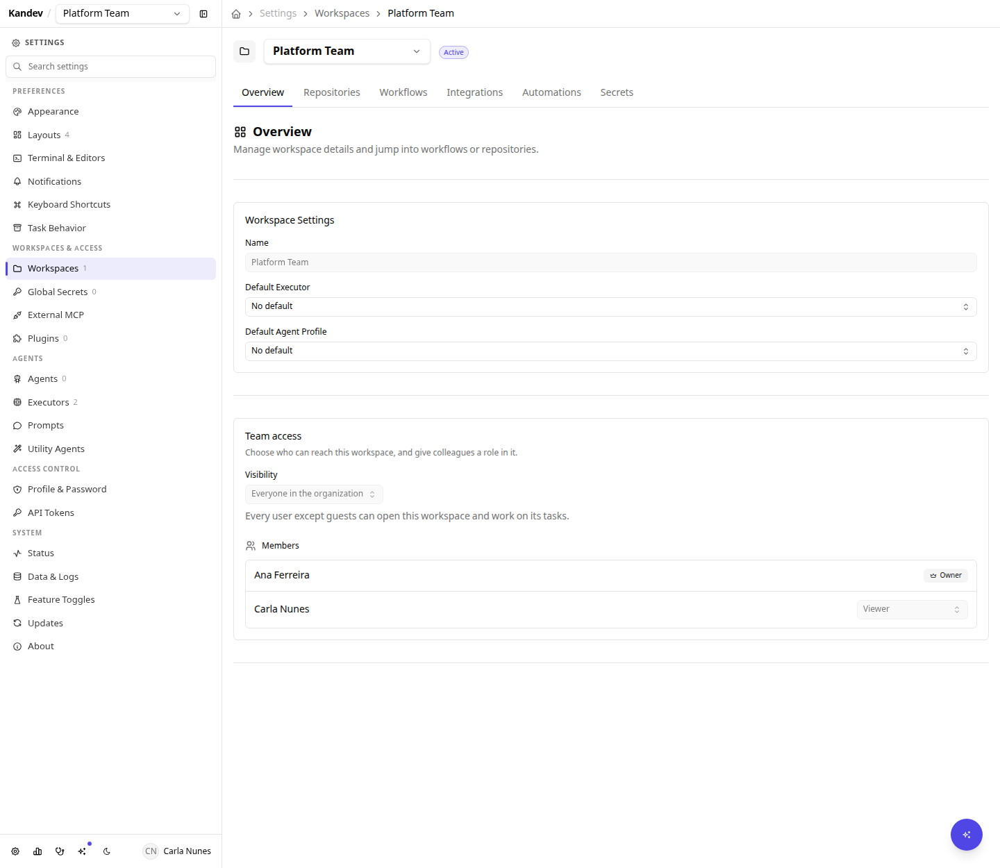
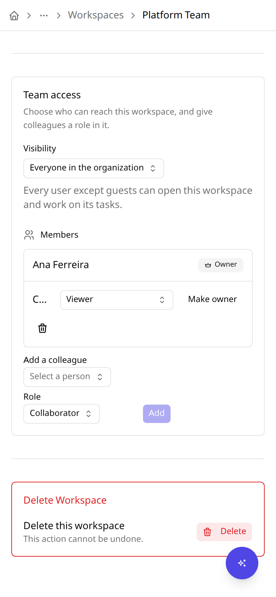

# Team Access

Kandev starts private: with [authentication](authentication.md) enabled, each person sees only the workspaces they own. **Team access** is how a team on a shared server gets a shared board instead, without falling back to a single login everyone knows.

There are two controls, and they answer different questions:

- **Visibility** answers *who can reach this workspace*. This is the main control.
- **Member roles** answer *what they can do once they are in*, and are the exception path for the cases visibility alone cannot express.

> Team access requires authentication. On a single-user install with authentication off, none of this appears and nothing changes.

## Quick checklist

1. Enable [authentication](authentication.md) and create the admin account.
2. Decide the default for new workspaces: `Settings > Workspaces > New workspace defaults`.
3. Flip existing workspaces you want shared: `Settings > Workspaces > (workspace) > Team access`.
4. Add members only for the exceptions: private workspaces, contractors, or someone who should read but not run agents.
5. Remember that secrets, integration credentials, and workspace deletion stay with the owner.

## The one-time decision: new workspace defaults

A Kandev workspace is coarse. It owns the default executor, environment and agent profile, the task prefix, and its Kanban workflow, so a team usually has one or two. That is why sharing is a default rather than an invitation list: setting it once is the whole setup.

Set **New workspaces are** to *Everyone in the organization* and every workspace anyone creates from then on is a shared board. Set it to *Private* and the instance behaves exactly as it does today: one owner, 404 for everyone else.

**Changing this default never changes an existing workspace.** Turning it on must not retroactively publish work that was private a moment ago, so existing workspaces keep whatever they have and are changed one at a time.

## Sharing one workspace

Open `Settings > Workspaces`, pick the workspace, and find the **Team access** card.

**Visibility**

| Value | Who can reach the workspace |
|---|---|
| `Private` | The owner, plus anyone with an explicit member row |
| `Everyone in the organization` | Every user on the instance except guests, plus explicit member rows |

**Members** are the exception path. You do not need to add anyone to an org-visible workspace; the list exists to:

- populate a **private** workspace with specific colleagues,
- let a **guest** into exactly one workspace, and
- **narrow** someone to `Viewer` on a workspace that is otherwise open.

## What a colleague sees

Once a workspace is visible to the organization, it simply appears. No invitation, no acceptance step.

They can open a colleague's task, read the agent conversation, test the preview, reassign it to themselves, and continue the session in the same worktree. **Takeover is reassign plus continue**: no lock is taken and no session is torn down.

Every human action is recorded against the person who took it, which is what a shared login cannot give you: message attribution comes from the authenticated session, not from the browser, so nobody can post as somebody else.

## Roles

Two role tiers combine. Your **org role** is on your account; your **workspace role** applies to one workspace.

**Org roles**

| Role | Can |
|---|---|
| `admin` | Manage users and invites, org settings, and shared configuration (executors, agent profiles, environments, editors, prompts, notification providers) |
| `member` | Contribute; no management rights |
| `guest` | Reach **only** workspaces they hold an explicit member row on, including none of the org-visible ones |

An admin is a **management role, not a visibility role**. An admin sees an org-visible workspace because it is org-visible, exactly like any member, and never sees a private workspace they are not a member of.

**Workspace roles**

| Role | Read board & transcripts | Edit tasks | Prompt / stop agents | Terminal, shell, previews | Manage members, secrets, settings, delete |
|---|---|---|---|---|---|
| `owner` | yes | yes | yes | yes | yes |
| `collaborator` | yes | yes | yes | yes | no |
| `viewer` | yes | no | no | no | no |

On an org-visible workspace, `admin` and `member` both act as `collaborator` unless an explicit row says otherwise.

### Viewer

A viewer reads the board and the agent conversations and can do nothing else. Terminal and shell access is deliberately a **separate permission** from prompting an agent: prompting is bounded by what that agent is allowed to do, but a shell in the worktree is not, so being able to read a transcript never implies being able to run commands.

The UI hides what you cannot do, and the API refuses it independently, so a viewer who calls the endpoint directly gets `403`.

### Transferring ownership

Every workspace has exactly one accountable owner. Use **Make owner** on a member row: the new owner takes over and the previous owner becomes a collaborator. You cannot remove the owner's row; transfer first.

## Mobile

The same card works on a phone, including the role pickers and the add-member flow.

## What stays with the owner

These are shared credentials and destructive actions, so they do not follow membership:

- Workspace **secrets** and **integration credentials**
- Adding and removing **repositories**
- Renaming, changing defaults, changing visibility, and **deleting** the workspace
- Adding, re-roling and removing **members**

A member acts under their **own** GitHub connection wherever per-user identity is supported, so "Approve as ..." on a pull request is that person, not the workspace owner.

## Upgrading an existing server

Every workspace that already exists becomes **`Private`**. An upgrade never widens access to data that was private the moment before, so nothing becomes visible until an owner opts in, either by flipping one workspace's visibility, or by setting the new-workspace default and creating new ones.

## Permission reference

Every guarded action names a scope. These strings appear in the API and are what the UI gates on.

| Scope | Grants |
|---|---|
| `workspace.read` | See the workspace, its board, tasks, and transcripts |
| `workspace.manage` | Rename, change defaults and visibility, delete |
| `task.write` | Create, edit, move, assign, archive, delete tasks |
| `session.prompt` | Start or resume a session and message an agent |
| `session.control` | Stop or cancel a running agent |
| `session.exec` | Terminal, shell, file writes, port previews, VS Code, LSP |
| `repository.manage` | Add or remove workspace repositories |
| `secret.manage` | Workspace secrets and integration credentials |
| `member.manage` | Add or remove members, transfer ownership |
| `org.members.manage` | Invite, create, disable and re-role users |
| `org.settings.manage` | Org-wide settings and defaults |
| `org.config.manage` | Executors, agent profiles, environments, editors, prompts, notification providers |

`GET /api/v1/authz/scopes` returns this list with descriptions.

## Current limits

- **"Organization" means one tenant.** With the Organizations feature off there is exactly one, implicitly, and "Everyone in the organization" means everyone on the server. To run one server for several independent teams or customers, see [Organizations](organizations.md).
- **The `guest` role has no UI yet.** `Settings > Users` is not ported to the SPA, so a guest is assigned through the API: `PATCH /api/v1/users/{id}` with `{"role": "guest"}`.
- **Roles are fixed.** There is no custom-role builder; scopes are the extension point and adding one is a code change.
- **Membership is per person.** There are no groups or teams to add at once.
- **No presence.** There are no cursors, typing indicators, or "who else is viewing" markers.
- **Concurrent prompting is serialized, not blocked.** If two people prompt the same session at once, both messages queue in arrival order and both are attributed. Kandev deliberately does not lock a session to one human: a lock would strand the session when someone closes their laptop.
- **Filesystem and agent credentials are not isolated per user.** As with authentication generally, application-layer scoping is the boundary between users' Kandev data; it does not sandbox the filesystem or per-user agent logins. See the limits in [Authentication & Users](authentication.md).
