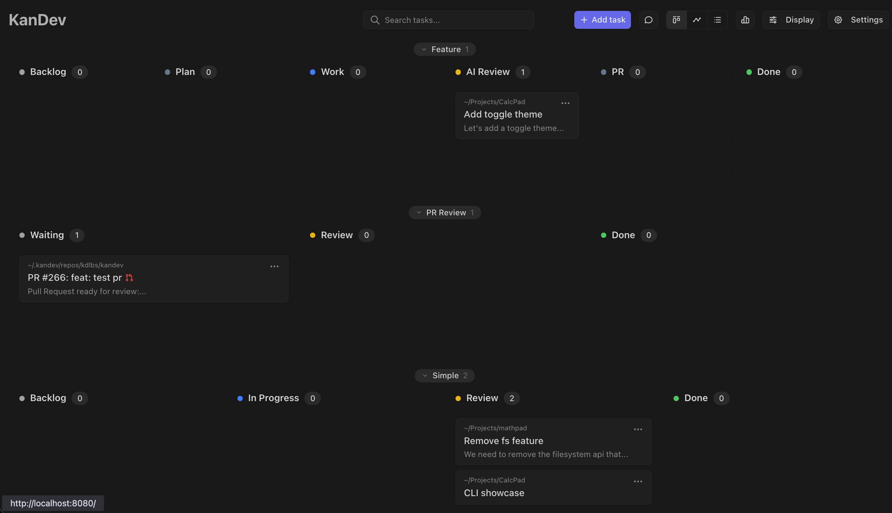
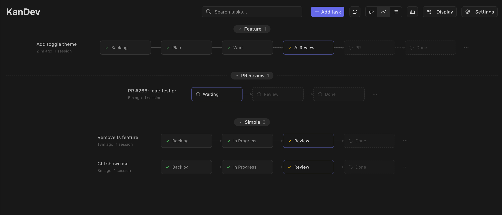
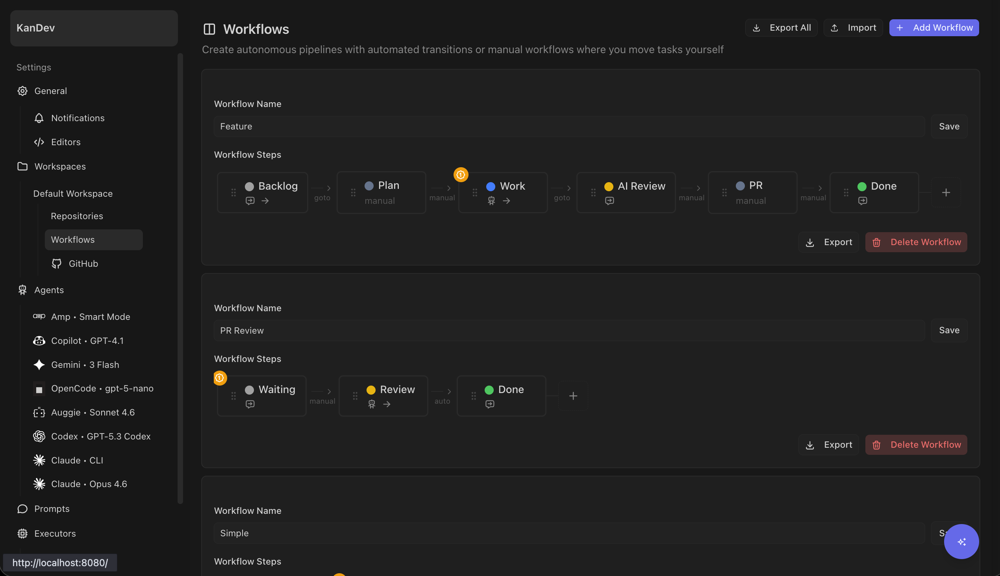
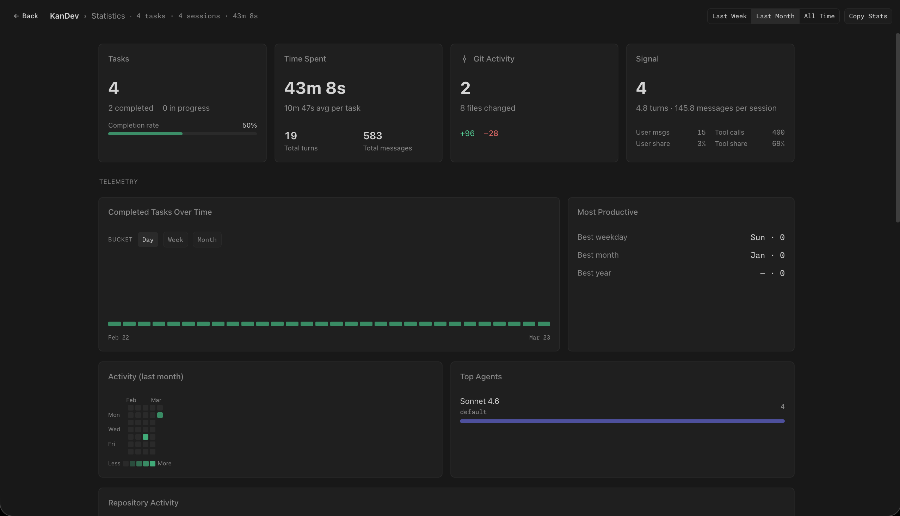

# Screenshots

<table>
  <tr>
    <td align="center"><strong>Kanban</strong> </td>
    <td align="center"><strong>Task Session</strong> </td>
  </tr>
  <tr>
    <td align="center"><strong>Pipeline</strong> </td>
    <td align="center"><strong>Plan Mode</strong> </td>
  </tr>
  <tr>
    <td align="center"><strong>Workflows</strong> </td>
    <td align="center"><strong>Plan Comments</strong> </td>
  </tr>
  <tr>
    <td align="center"><strong>CLI Agent</strong> </td>
    <td align="center"><strong>Quick Chats</strong> </td>
  </tr>
  <tr>
    <td align="center"><strong>File Editor</strong> </td>
    <td align="center"><strong>Git Operations</strong> </td>
  </tr>
  <tr>
    <td align="center"><strong>Embedded VS Code</strong> </td>
    <td align="center"><strong>Review PRs</strong> </td>
  </tr>
  <tr>
    <td align="center"><strong>Review Dialog</strong> </td>
    <td align="center"><strong>Stats</strong> </td>
  </tr>
  <tr>
    <td align="center"><strong>Add Task</strong> </td>
    <td align="center"><strong>Workflow Details</strong> </td>
  </tr>
</table>
